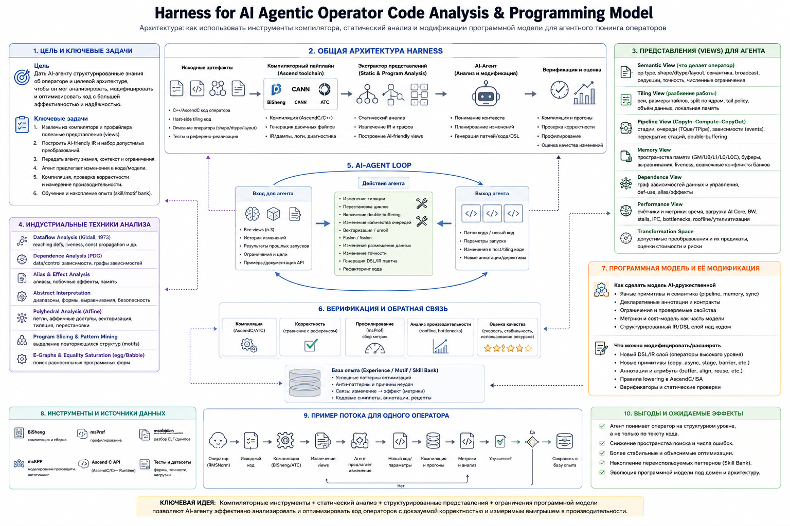
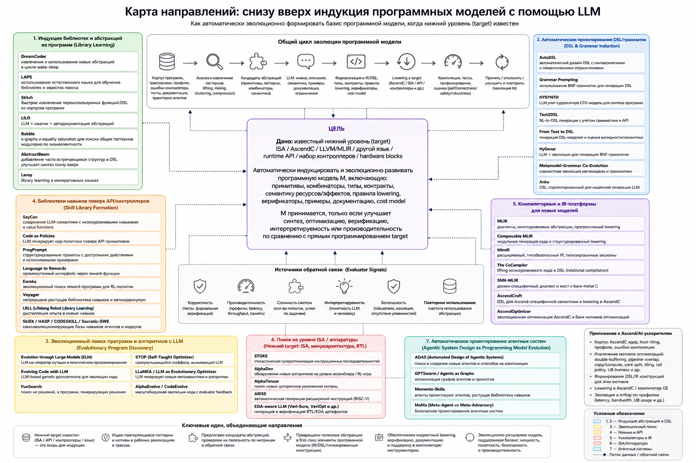
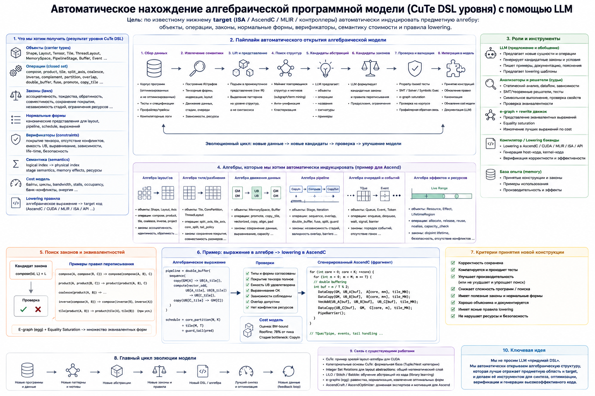

# Visual roadmaps

This document collects high-level visual maps for the research direction around compiler-derived operator views, target-grounded programming-model induction, and CuTe-like algebraic DSL discovery.

## 1. Harness for AI Agentic Operator Code Analysis & Programming Model

**Purpose.** Show the architecture of a harness that gives an AI agent structured operator knowledge views instead of raw source code only.

**Core message.** Compiler tools, static analysis, structured views, constrained transformation spaces, profiling, verification, and reusable motif banks should form one feedback loop.

## 2. Bottom-up programming-model induction with LLMs

**Purpose.** Map the literature and design space for automatically evolving a programming-model basis when the lower target is already known.

**Core message.** The result is not just a DSL syntax. It is an evolving basis of primitives, combinators, types, contracts, lowering rules, verifiers, examples, documentation, and cost models.

## 3. Automatic discovery of a CuTe-level algebraic programming model

**Purpose.** Show the stronger formulation: automatically induce the algebraic structure of the domain, not merely a command-style DSL.

**Core message.** A CuTe-like outcome requires carrier objects, closed operations, laws, equivalence rules, normal forms, verifiers, cost semantics, and lowering rules.

## How to use these figures

Use these figures as orientation maps for papers, talks, proposals, and internal notes. They are intentionally high-level: they show the research structure and expected system architecture rather than a final implementation API.
