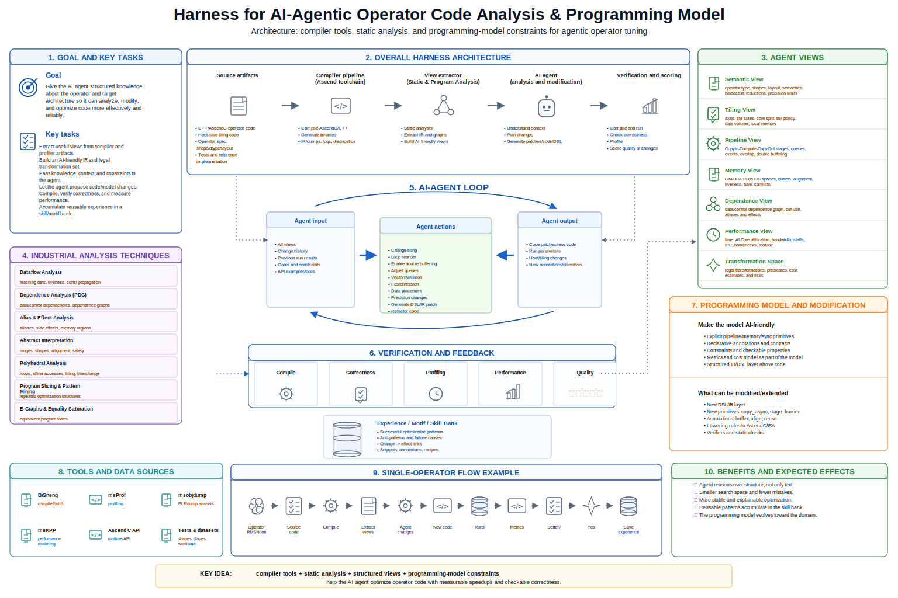

<!--
Editable source diagrams:
python3 tools/render_editable_figure_variants.py

Build:
marp presentations/01-harness-operator-code-analysis-programming-model.en.marp.md \
  --theme-set presentations/harness_3x2_theme.css \
  --allow-local-files \
  --pdf \
  -o dist/01-harness-operator-code-analysis-programming-model.en.pdf
-->

