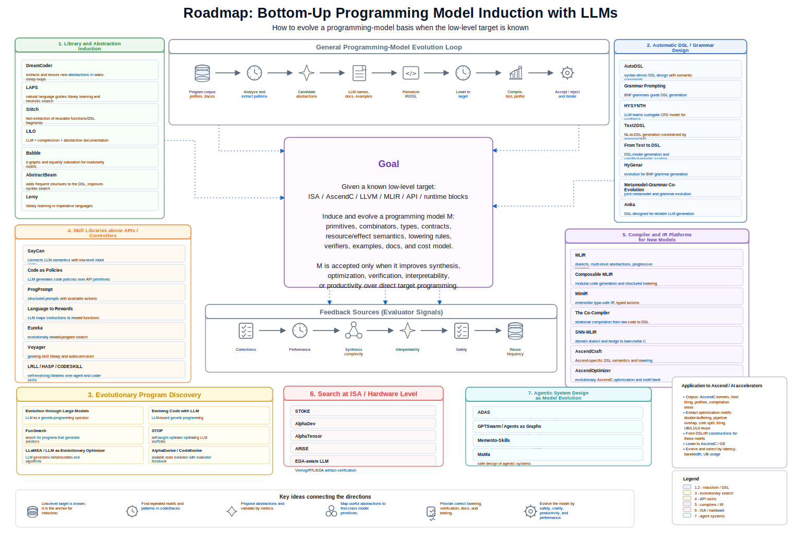

<!--
Editable source diagram:
python3 tools/render_editable_figure_variants.py

Build:
marp presentations/02-bottom-up-programming-model-induction-map.en.marp.md \
  --theme-set presentations/harness_3x2_theme.css \
  --allow-local-files \
  --pdf \
  -o dist/02-bottom-up-programming-model-induction-map.en.pdf
-->

