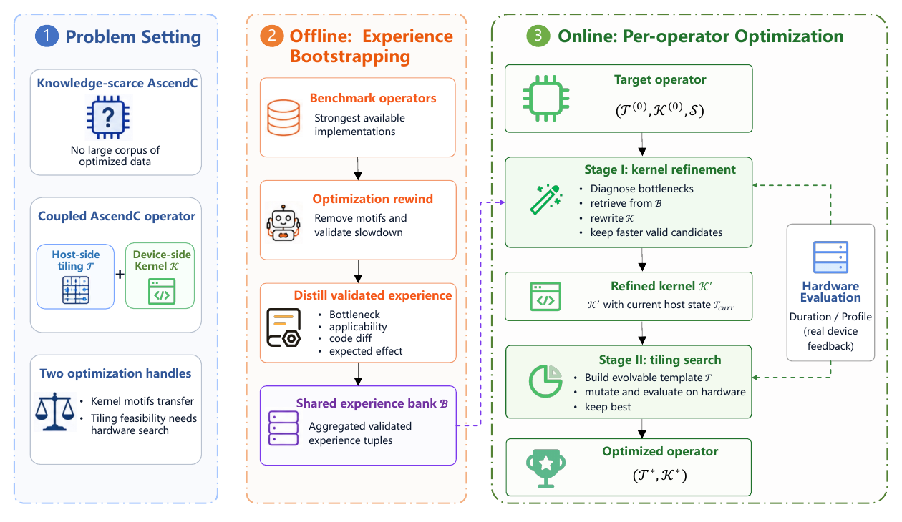
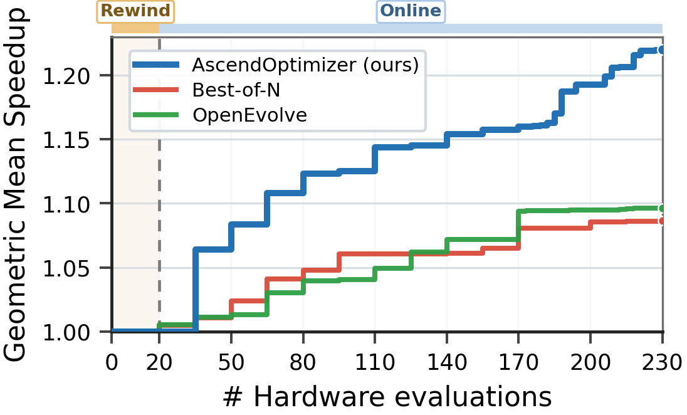
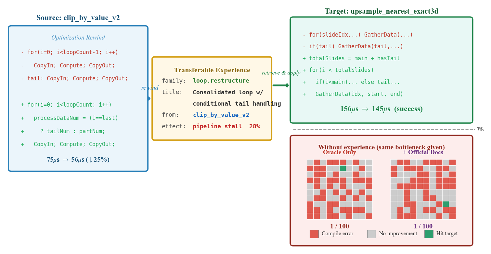
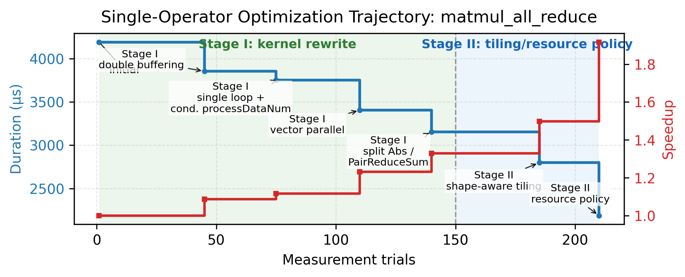
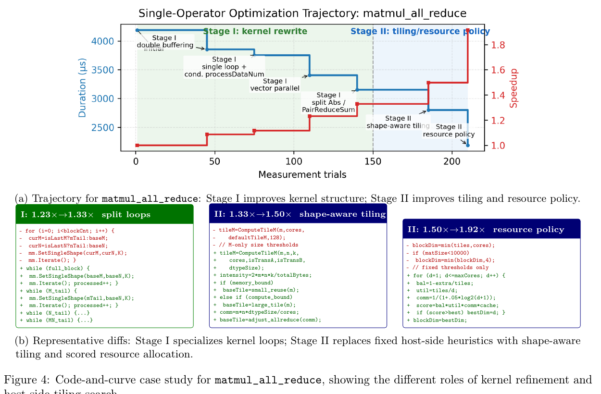
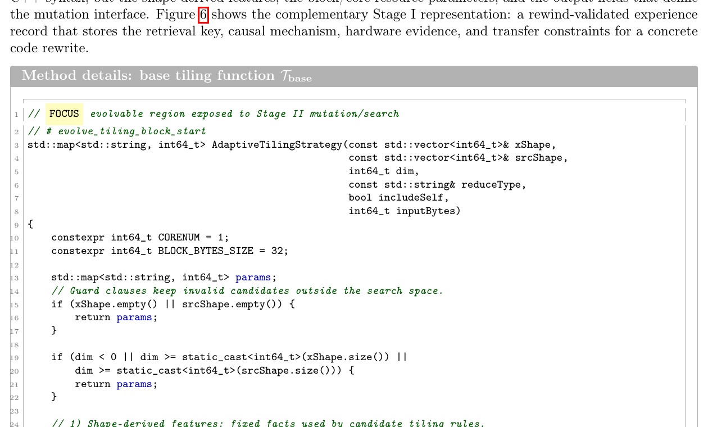
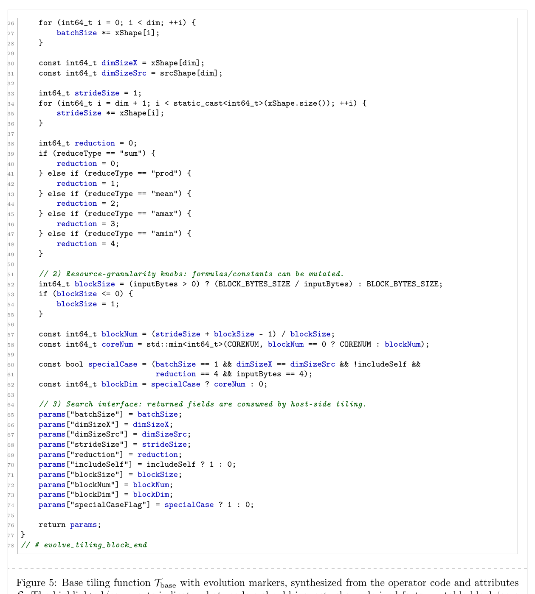
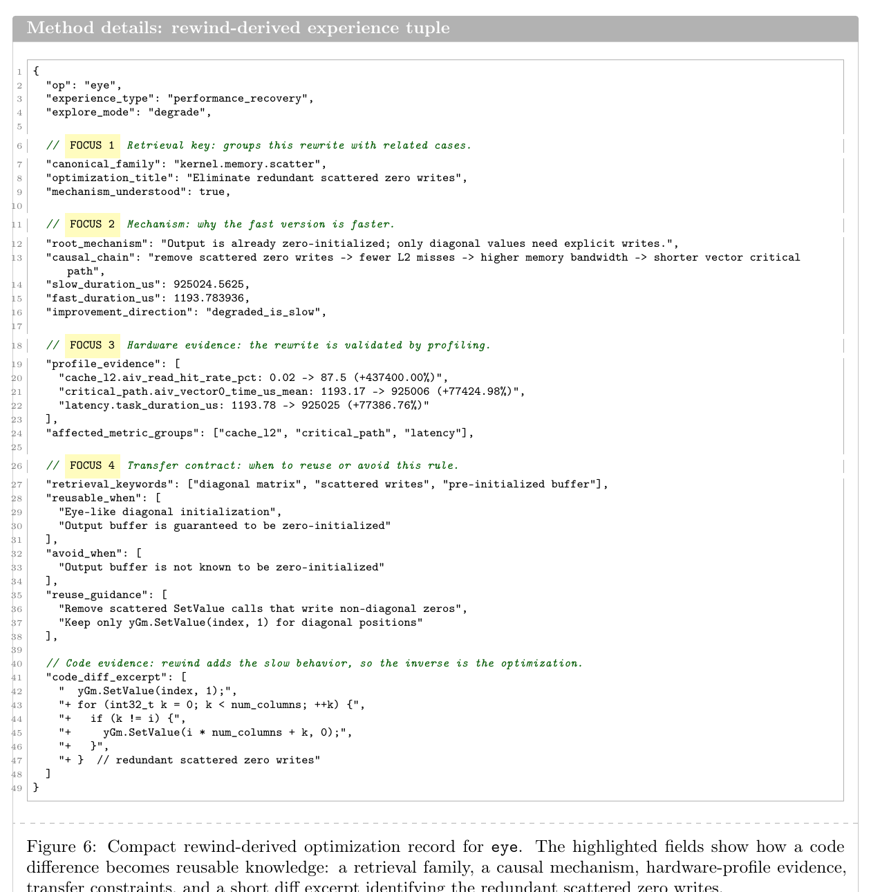

# AscendOptimizer: агент с эпизодическим опытом для оптимизации операторов Ascend NPU

Jiehao Wu (1, *), Zixiao Huang (1, *), Wenhao Li (2), Chuyun Shen (3), Junjie Sheng (1, †), Xiangfeng Wang (4, 5, 6, †)

arXiv:2603.23566v2 [cs.LG], 16 мая 2026 г.

Аффилиации:

1. School of Computer Science and Technology, East China Normal University
2. School of Computer Science and Technology, Tongji University
3. Shanghai University of International Business and Economics
4. Key Lab of Mathematics and Engineering Applications (MoE), East China Normal University
5. School of Mathematical Sciences, East China Normal University
6. Shenzhen Loop Area Institute (SLAI)

`*` Равный вклад. `†` Корреспондирующий автор.

Сайт проекта: <https://github.com/KernelHive>

Примечание к переводу: изображения и рендеры страниц извлечены из PDF в каталог [`assets/ascendoptimizer-2026`](assets/ascendoptimizer-2026). Именованные изображения для рецензирования лежат в [`assets/ascendoptimizer-2026/figures`](assets/ascendoptimizer-2026/figures).

## Аннотация

Оптимизировать операторы AscendC (Ascend C) для Ascend NPU трудно по двум причинам. Во-первых, в отличие от CUDA, в этой экосистеме мало открытых ядер, на которых можно учиться. Во-вторых, производительность зависит от связанной реализации из двух частей: хостовой программы тайлинга, которая управляет перемещением данных, и программы ядра, которая планирует вычисления и выстраивает их конвейерное выполнение.

Мы представляем AscendOptimizer: агента с эпизодическим опытом, который строит недостающие знания об оптимизации непосредственно из выполнения. Для оптимизации ядер AscendOptimizer применяет Optimization Rewind: контролируемо удаляет оптимизации из сильных реализаций, а затем сохраняет те изменения, удаление которых измеримо ухудшает производительность, как переиспользуемый опыт для последующего переписывания кода.

Для оптимизации на стороне хоста он запускает эволюционный поиск с профилированием в контуре, чтобы по обратной связи от оборудования находить корректные и быстрые конфигурации тайлинга и перемещения данных. Такое сочетание позволяет агенту совместно улучшать структуру ядра и хостовое планирование.

На бенчмарке из 101 реального оператора AscendC AscendOptimizer достигает геометрического среднего ускорения 1,21x относительно открытой базовой реализации, а 53,47% операторов работают быстрее своих эталонных версий. При одинаковом бюджете оценок на оператор AscendOptimizer стабильно превосходит Best-of-N sampling и OpenEvolve по геометрическому среднему ускорению, долям хвостового ускорения $\operatorname{fast}_p$ и общему прогрессу оптимизации при разных бюджетах.

## 1. Введение

Оптимизация ядер на основе LLM недавно показала сильные результаты на платформах с богатыми open-source экосистемами, особенно CUDA и Triton [24, 17]. Эти успехи частично обеспечены зрелостью экосистемы CUDA/Triton. Современные языковые модели для кода часто обучаются на больших корпусах открытого кода, а предыдущие работы показывают, что такие модели могут запоминать или воспроизводить фрагменты кода из обучающих данных [9, 14, 40]. В то же время CUDA/Triton предоставляют множество открытых оптимизированных реализаций и переиспользуемых идиом производительности, включая тайлинг, иерархическое перемещение данных и эффективные по памяти слитые ядра [31, 23, 11]. Поэтому LLM-агенты оптимизации могут выигрывать не только от рассуждения о программах, но и от адаптации реализационных паттернов, уже видимых в экосистеме.

На новом или ограниченно доступном оборудовании эта поддержка намного слабее. Предыдущие исследования сообщают о резко более низкой успешности генерации ядер LLM для AscendC по сравнению с CUDA и частично объясняют этот разрыв слабой представленностью специфичных для AscendC синтаксиса, моделей выполнения и принципов оптимизации в открытых корпусах или корпусах предобучения [37, 8]. Поэтому платформенно-специфичные паттерны оптимизации менее доступны текущим моделям, а обратная связь компилятора или профайлера часто указывает симптомы, но не задает напрямую структурное переписывание, необходимое для исправления.

В такой ситуации недостаточно полагаться только на предобученные знания о коде или одношаговую генерацию. Возникает центральный вопрос: если внешние примеры ограничены, как агент оптимизации может сам построить недостающую экспертизу?

Более широкий класс методов работает с ограниченной разметкой, конструируя обучающие сигналы из взаимодействия или из самого артефакта. В исправлении программ самосупервизорные подходы, такие как BugLab [2] и SelfAPR [41], синтезируют ошибочные программы из корректного кода и учатся восстанавливать исходную программу по обратной связи компилятора или тестов. В агентных системах Reflexion [29] выносит обратную связь проб и ошибок во внешнюю эпизодическую память, а Voyager [32] хранит переиспользуемые исполняемые навыки в растущей библиотеке навыков. Обучение с подкреплением в стиле hindsight также показывает, что разреженную обратную связь можно сделать полезной, если переинтерпретировать траектории постфактум [4]. Эти работы показывают, что при дефиците внешних демонстраций полезный надзор можно построить из самого артефакта или из обратной связи взаимодействия. Следуя этому принципу, мы рассматриваем оптимизированные ядра как скрытые источники знаний об оптимизации: кодовый мотив, удаление которого измеримо ухудшает производительность оборудования, становится свидетельством переиспользуемого паттерна оптимизации.

Мы реализуем эту идею как Optimization Rewind. Вместо предположения о точной обратимости мы строим семантически корректные деоптимизированные соседние версии сильных ядер, удаляя распознаваемые оптимизационные мотивы, и оставляем только те удаления, которые проходят валидацию, но измеримо ухудшают производительность на оборудовании. Каждая подтвержденная деградация становится свидетельством, что удаленный мотив был полезен в исходном контексте, и сводится в переиспользуемый опыт прямой оптимизации для последующего переписывания кода. Этот механизм связан с более ранней деоптимизацией [13] и самосупервизией в стиле rewind [42], но здесь используется для извлечения практического оптимизационного знания при дефиците внешних демонстраций.

Мы изучаем эту проблему на Ascend NPU, которые дают особенно строгий стенд для оптимизации в условиях дефицита знаний. Недавние результаты MultiKernelBench [37] показывают большой разрыв обобщения: в то время как современные модели достигают 44,2-52,6% Pass@1 для одношаговой генерации операторов CUDA, доля успешных AscendC остается ниже 2,1%. Как видно из таблицы 1, это не просто синтаксическая проблема. AscendC предоставляет явно управляемую иерархию памяти и требует, чтобы разработчики оркестрировали перемещение данных и синхронизацию через внутрикристальный Unified Buffer (UB) [47]. Оператор AscendC - это не одно ядро, а артефакт из двух частей: хостовая программа тайлинга решает, как данные разбиваются и перемещаются, а программа ядра на стороне устройства решает, как планируются и конвейеризуются вычисления. Поэтому производительность зависит и от того, как подаются данные, и от того, как работает ядро. Это делает Ascend сильным примером связанной оптимизации при дефиците знаний.

**Таблица 1.** Доля успешной одношаговой генерации операторов (Pass@1) по аппаратным платформам, по данным MultiKernelBench [37]. Результаты подтверждают серьезный дефицит знаний на Ascend.

| Модель | CUDA (Pass@1) | AscendC (Pass@1) |
| --- | ---: | ---: |
| DeepSeek-R1 | 52,6% | 1,4% |
| Claude-Sonnet-4 | 47,0% | 2,1% |
| Qwen3-235B (think) | 44,2% | 0,7% |

Исходя из этой постановки, мы предлагаем AscendOptimizer: двухстадийный фреймворк оптимизации для разработки операторов в условиях дефицита знаний. Две стадии нацелены на разные рычаги оптимизации. Стадия I фокусируется на улучшении ядра: она запускает Optimization Rewind по всему бенчмарку на самых сильных доступных реализациях, сводит подтвержденные траектории в общий банк опыта, а затем использует retrieval-augmented rewriting, чтобы направлять последующие правки ядра по обратной связи компилятора и профайлера. Эта стадия нацелена на ту часть, которую разреженная обратная связь сама по себе плохо обучает: как именно должен быть переписан код.

Стадия II решает другую проблему на стороне хоста. Пространство тайлинга сильно разрывно, и небольшие изменения размеров тайлов или расписаний перемещения данных могут превратить корректную быструю конфигурацию в некорректную. Вместо попытки заранее закодировать эти правила AscendOptimizer использует направляемый эволюцией программный поиск с оборудованием в контуре, чтобы находить сильные конфигурации тайлинга непосредственно из результатов выполнения. Две стадии дополняют друг друга, но асимметричны: стадия I дает основные структурные выигрыши внутри ядра, а стадия II добавляет улучшения хостового тайлинга и политики ресурсов после того, как улучшенное ядро открывает лучшие возможности выполнения.

Наши вклады таковы:

1. Мы вводим Optimization Rewind: самосупервизорный способ bootstrap-построения опыта оптимизации ядер при дефиците знаний за счет контролируемой деградации сильных реализаций и извлечения тех удалений, которые проверяемо важны для производительности.
2. Мы формулируем оптимизацию AscendC как связанную задачу хостового тайлинга и улучшения ядра на стороне устройства и реализуем эту точку зрения в AscendOptimizer, который сочетает guided-by-retrieval переписывание ядер с guided-by-hardware поиском тайлинга.
3. На 101 реальном операторе AscendC AscendOptimizer достигает геометрического среднего ускорения 1,21x относительно открытой базовой реализации, показывая эффективность подхода в реалистичной ситуации дефицита знаний.

## 2. Связанные работы

**Традиционная компиляция операторов и оптимизация под доменно-специфичные архитектуры.** Системы операторов, такие как TVM [10], Halide [25], Triton [31], TileLang [34], полиэдральные компиляторы [7, 5, 44] и компиляторы на основе поиска [45, 46, 39], уменьшают трудоемкость ручной настройки через DSL, IR, модели стоимости и поиск расписаний. Но высокоуровневые по сложности ядра, такие как FlashAttention [11, 27], все равно требуют архитектурно-специфичного проектирования, и этот разрыв острее на Ascend NPU, где иерархия памяти и модель инструкций делают оптимизацию сильно зависящей от аппаратной экспертизы [47, 1]. Существующие анализаторы и профайлеры Ascend дают полезные сигналы [48, 22], но по-прежнему требуют человеческой интерпретации.

**Генерация операторов LLM-агентами и итеративная оптимизация.** KernelBench [24], TritonBench [17], Astra [35], PRAGMA [15], CudaForge [43], KernelEvolve [21], Geak [33], EvoEngineer [12], TritonForge [16], GPU Kernel Scientist [3] и StitchCUDA [19] показывают, что LLM-агенты могут генерировать и улучшать ядра CUDA или Triton с использованием обратной связи компилятора, профайлера, многоагентных схем и оборудования в контуре. Однако их успех связан с экосистемами, где много открытых ядер и оптимизационных идиом. Прямой перенос на DSA затруднен, потому что выровненные корпуса и доступные архитектурные знания скудны [37, 8].

**Интернализация оптимизации через обучение.** Kevin [6], TritonRL [38], AutoTriton [18], CUDA-L1/L2 [20, 30] и Seed-Coder [26] вместо этого сохраняют опыт оптимизации в параметрах модели через RL, SFT или крупномасштабную контрастивную выборку. Эти подходы могут быть эффективными, но требуют множества доменно-специфичных пар код-производительность и существенных затрат на обучение. В незрелых аппаратных экосистемах такая зависимость от данных часто становится узким местом [37], поэтому AscendOptimizer ориентирован на режим без дообучения.

**Генерация кода NPU с помощью LLM.** AscendKernelGen [8], AscendCraft [36] и MultiKernelBench [37] напрямую изучают генерацию кода Ascend или NPU, в основном из высокоуровневых спецификаций или DSL. AscendOptimizer решает дополнительную задачу: улучшение уже существующих функционально корректных реализаций AscendC с совместной оптимизацией хостового тайлинга и ядер на стороне устройства при построении недостающего доменного знания из обратной связи выполнения.

## 3. Агент AscendOptimizer

### 3.1. Обзор метода

Дефицит знаний влияет на разные части оптимизации AscendC неодинаково. Код ядра содержит структурированные мотивы, такие как конвейеризация, векторизация, управление буферами, обработка хвостов и устранение синхронизаций. Поскольку эти мотивы композиционны, их можно извлекать из сильных существующих реализаций. Хостовый тайлинг устроен иначе. Он жестко ограничен формами входов, правилами выравнивания, емкостью буфера и решениями о выделении ресурсов, поэтому его допустимая область дискретна и сильно разрывна. В результате перенос между операторами для тайлинга намного слабее, чем для структуры ядра. Поэтому мы рассматриваем две части по-разному, а не пытаемся загнать их в один оптимизатор.

Конкретно, у AscendOptimizer есть офлайн-фаза bootstrap-построения опыта по всему бенчмарку и онлайн-фаза оптимизации для каждого оператора. Офлайн каждый оператор исследуется с помощью Optimization Rewind при фиксированном бюджете rewind. После завершения rewind по всему бенчмарку аппаратно подтвержденные пары деоптимизации сводятся в общий банк опыта. Онлайн стадия I использует этот банк для улучшения целевого ядра, а стадия II затем ищет конфигурации хостового тайлинга для уже улучшенного ядра.



**Рисунок 1.** Обзор AscendOptimizer. Офлайн мы откатываем оптимизации операторов бенчмарка и сводим подтвержденные оптимизационные мотивы в общий банк опыта. Онлайн банк направляет стадию I улучшения ядра, после чего стадия II ищет конфигурации хостового тайлинга для улучшенного ядра.

### 3.2. Формулировка задачи

В гетерогенной вычислительной архитектуре Ascend NPU мы представляем оптимизируемый оператор как кортеж $O = \langle T, K, S \rangle$, где:

- $T \in \mathcal{C}_{\text{tiling}}$: хостовая функция тайлинга, определяющая разбиение данных, перемещение данных и политики ресурсов;
- $K \in \mathcal{C}_{\text{kernel}}$: код ядра на стороне устройства, определяющий планирование инструкций, буферизацию и структуру синхронизации;
- $S$: статические атрибуты оператора, например форма входа, тип данных и layout.

При заданных аппаратных ограничениях $H$ (например, емкость буфера, стадии конвейера и правила выравнивания) наша цель - найти функцию тайлинга $T^*$ и реализацию ядра $K^*$, которые минимизируют сквозную задержку на реальном оборудовании:

$$
(T^*, K^*) = \arg\min_{T,K} \mathcal{L}\bigl(\operatorname{Exec}(T, K, S) \mid H\bigr). \tag{1}
$$

Здесь $\operatorname{Exec}(\cdot)$ обозначает аппаратную компиляцию и выполнение, а $\mathcal{L}$ - измеренную задержку. Для краткости, когда $H$ и $S$ фиксированы, мы пишем $\mathcal{L}(K \mid T_{\text{curr}})$ как сокращение для $\mathcal{L}(\operatorname{Exec}(T_{\text{curr}}, K, S) \mid H)$ и опускаем $\operatorname{Exec}(\cdot)$ и $H$.

Хотя $T$ и $K$ связаны, они играют разные роли. Переписывания ядра меняют планирование инструкций, выделение буферов и топологию синхронизации, что, в свою очередь, меняет то, какие стратегии тайлинга допустимы или выгодны. Тайлинг, напротив, ищет более удачные способы разбиения данных и политики ресурсов при фиксированной структуре ядра. В нашей реализации улучшение ядра оценивается при текущей функции тайлинга $T_{\text{curr}}$, давая $K_{\text{curr}}$, а поиск тайлинга затем запускается под этим улучшенным ядром. Поскольку $H$ содержит множество недифференцируемых black-box ограничений (например, конфликты банков, отказы выравнивания и cache thrashing), а пространство кода $\mathcal{C}_{\text{tiling}} \times \mathcal{C}_{\text{kernel}}$ сильно дискретно и невыпукло, прямая градиентная оптимизация неприменима.

### 3.3. Офлайн bootstrap-построение опыта через Optimization Rewind

**Почему Rewind работает.** Высокопроизводительные ядра содержат слоистые оптимизационные мотивы, такие как конвейеризация, векторизация, управление буферами, обработка хвостов и устранение барьеров. Эти мотивы взаимодействуют, поэтому Optimization Rewind не предполагает точной обратимости. Вместо этого многие мотивы оставляют распознаваемые локальные сигнатуры в коде или профилях. Поэтому мы удаляем по одному целевому мотиву за раз, оставляем только сохраняющие семантику кандидаты, которые становятся измеримо медленнее на оборудовании, и сводим удаленный мотив в переиспользуемый опыт прямой оптимизации. В приложении B.1 мы формализуем эту точку зрения как локальный one-factor-at-a-time скрининг на дискретном пространстве мотивов.

**Теорема 3.1 (принятие rewind является аппаратно подтвержденным скрининговым сигналом).** Пусть $K_A$ - ядро, активное множество мотивов которого равно $A \subseteq \Omega$, и пусть $r_m$ обозначает действие rewind для мотива $m \in A$ при фиксированном тайлинге $T$. Определим локальный one-factor-at-a-time эффект как:

$$
\hat{\Delta}_m(K_A; T) = \mathcal{L}(K_{A \setminus \{m\}} \mid T) - \mathcal{L}(K_A \mid T).
$$

Если $r_m(K_A) \neq \bot$ (то есть деоптимизированный кандидат компилируется и семантически эквивалентен) и $\hat{\Delta}_m(K_A; T) > \tau_{\text{noise}}$, то удаление мотива $m$ в базовой точке $K_A$ ухудшает измеренную задержку строго больше, чем шум профилирования. Эквивалентно, мотив $m$ положительно влияет на производительность в $K_A$, а обратное переписывание $K_{A \setminus \{m\}} \to K_A$ является аппаратно подтвержденным шагом оптимизации.

**Построение rewind-траектории для каждого оператора.** До любой онлайн-оптимизации мы запускаем офлайн-фазу bootstrap-построения опыта по всему бенчмарку. Для каждого оператора $o$ в бенчмарке мы начинаем с его сильнейшей доступной реализации и выделяем бюджет rewind $B_r$. В каждом раунде обратный агент предлагает семантически осмысленную деоптимизацию, например удалить double buffering, разрушить векторизованные пути данных или снова ввести ненужную синхронизацию, а не случайно портить код. Это дает подтвержденную траекторию деоптимизации:

$$
\mathcal{T}_o = \left(K_o^{(0)}, K_o^{(1)}, \ldots, K_o^{(T_o)}\right), \quad T_o \le B_r. \tag{2}
$$

**Аппаратно подтвержденное извлечение опыта.** Затем каждый rewind-кандидат проходит проверки компиляции, корректности и профилирования на оборудовании Ascend. Мы оставляем только пары, у которых задержка значимо ухудшается после семантической деоптимизации; это показывает, что удаленный мотив действительно помогал производительности, а не просто менял стиль кода. Для каждой подтвержденной пары агент извлекает структурированный кортеж опыта:

$$
M = \langle \text{Title}, \text{Bottleneck}, \text{Applicability}, \text{Expected Effect}, \text{Code Diff} \rangle. \tag{3}
$$

Здесь $\text{Bottleneck}$ и $\text{Applicability}$ описывают, когда паттерн следует извлекать, а $\text{Expected Effect}$ и $\text{Code Diff}$ описывают, какое изменение нужно сделать и почему оно должно помочь. После завершения rewind-фазы для всех операторов подтвержденные кортежи агрегируются в общий аппаратно подтвержденный банк опыта $B$.

### 3.4. Онлайн-улучшение ядра с retrieval-guidance

После построения общего банка каждый целевой оператор входит в онлайн-оптимизацию. Офлайн-фаза rewind и онлайн-фаза улучшения ядра вместе образуют путь стадии I на стороне ядра.

**Диагностика узкого места.** Для текущего состояния оператора $(T_{\text{curr}}, K_{\text{curr}}, S)$ агент анализирует диагностику компилятора и трассы профилирования, а затем резюмирует основное структурное узкое место как запрос $q$.

**Извлечение опыта.** Используя $q$, dense retriever извлекает Top-k кортежей $\{M_i\}_{i=1}^k$ из общего банка опыта $B$. Извлечение зависит от симптомов узкого места и структурной применимости, а не от идентичности оператора.

**Переписывание и отбор с опорой на опыт.** LLM-refiner переписывает $K_{\text{curr}}$, используя извлеченные кортежи как структурированное руководство. Каждый переписанный кандидат компилируется, проверяется на численную корректность и профилируется при текущей функции тайлинга $T_{\text{curr}}$. Мы принимаем только кандидатов, которые одновременно проходят валидацию и улучшают измеренную задержку, обновляя $K_{\text{curr}}$. Поэтому стадия I - это больше, чем обычный RAG, и больше, чем слепые пробы и ошибки: она сочетает bootstrap-построенный общий опыт с аппаратно обоснованным отбором кандидатов.

### 3.5. Поиск тайлинга с оборудованием в контуре

Стадия II нацелена на другой объект оптимизации. В отличие от мотивов ядра, допустимость тайлинга намного сильнее зависит от shape-specific ограничений, выравнивания, емкости буфера и взаимодействий аппаратных ресурсов. Небольшая правка может превратить корректного быстрого кандидата в некорректного. Поэтому retrieval здесь не является основным механизмом. Вместо этого мы опираемся на поиск с оборудованием в контуре под текущим улучшенным ядром.

**Построение пространства поиска.** Начиная с исходной хостовой реализации и атрибутов $S$, агент синтезирует эволюционируемый шаблон $T_{\text{base}}$, содержащий маркеры мутации (приложение B.4, рисунок 5). Шаблон открывает места, где можно менять размер тайлов, выделение ядер, политику буферов и легковесную управляющую логику.

**Мутация.** На каждом шаге поиска LLM мутирует текущего кандидата тайлинга. Мутации включают изменения размеров тайлов, числа ядер, политик буферов и легковесной ветвящейся логики для перемещения данных и конфигурации запуска.

**Аппаратная оценка и обновление выжившего.** Каждый мутированный кандидат тайлинга компилируется и выполняется с текущим улучшенным ядром $K_{\text{curr}}$. Кандидаты, которые не проходят компиляцию или проверки корректности, сразу отбрасываются. Среди выживших самый быстрый становится родителем для следующего шага поиска. Это удерживает поиск внутри неявной допустимой области, заданной аппаратными ограничениями, и одновременно использует структуру выполнения, уже установленную стадией I.

## 4. Эксперименты

Мы строим оценку вокруг четырех вопросов:

1. При фиксированном бюджете аппаратных оценок превосходит ли AscendOptimizer сильные поисковые baseline?
2. Каков вклад каждого компонента системы?
3. Может ли Optimization Rewind восстанавливать оптимизационные знания, редкие для модели, то есть структурные переписывания, которые модель редко обнаруживает или применяет только по описанию узкого места?
4. Как улучшение ядра и поиск тайлинга влияют на оптимизационную производительность?

Приложение A дает дополнительные сведения о бенчмарке и полный список операторов.

### 4.1. Экспериментальная постановка

**Настройка и корректность.** Эксперименты выполняются на Ascend 910B2 NPU с CANN 8.3. Во всех экспериментах, использующих LLM, применяется DeepSeek-V3.2, включая генерацию rewind-кандидатов, переписывание ядра и мутацию тайлинга в AscendOptimizer. Для retrieval опыта используется embedding-модель `text-embedding-3-small`. Все методы используют один и тот же toolchain, настройки stream, синхронизацию и harness корректности. Мы сравниваем выходы NPU с CPU-эталонами с помощью проверок абсолютного/относительного допуска, следуя политикам официальных примеров CANN.

**Бенчмарк и стратификация.** Мы строим бенчмарк из официального репозитория AscendC `cann-ops` и используем его реализации как baseline. Мы оставляем операторы, которые компилируются, выполняются, проходят проверки относительно CPU-эталона и демонстрируют стабильную baseline-задержку при повторном профилировании. В результате получается 101 оператор для всех экспериментов. Затем мы стратифицируем эти операторы на три уровня по инженерной сложности, исходя из вычислительного пути, входно-выходных зависимостей, оркестрации данных и параллельного планирования, а не функциональной категории или измеренной скорости.

Level 1 содержит 25 элементарных математических операторов, операторов логического сравнения и простого построения тензоров с регулярным доступом к памяти, например `add_custom`, `sqrt` и `logical_or`. Level 2 содержит 63 оператора семейств `foreach`, активаций, нормализаций, fused-операторов, pooling и upsampling, например `foreach_pow_scalar_and_tensor`, `gelu`, `avg_pool3_d` и `add_layer_norm_grad`. Level 3 содержит 13 операторов со сложной параллелизацией, нерегулярным доступом к памяти, сложной оркестрацией данных или сильной зависимостью от низкоуровневых примитивов оптимизации, например `flash_attention_score_with_large_head_dim`, `matmul_all_reduce`, `bev_pool` и `scatter_reduce`. Основные результаты приводятся по этому уровню инженерной сложности; полный список операторов дан в приложении A.

**Метрики и бюджет.** Мы сообщаем задержку, геометрическое среднее ускорение относительно `cann-ops`:

$$
\operatorname{speedup}(\operatorname{op}) =
\frac{T_{\text{baseline}}(\operatorname{op})}{T_{\text{gen}}(\operatorname{op})}. \tag{4}
$$

и $\operatorname{fast}_p$, долю операторов с ускорением больше $p$:

$$
\operatorname{fast}_p =
\frac{\left|\{\operatorname{op} \mid \operatorname{speedup}(\operatorname{op}) > p\}\right|}{|\mathcal{O}|}. \tag{5}
$$

Каждая аппаратная оценка - это одна попытка компиляция-корректность-профилирование; отказы и timeout учитываются в бюджете, но не обновляют текущего лидера. В нашей среде каждая такая аппаратная оценка занимает в среднем около двух минут, поэтому бюджет оценок также отражает практическую wall-clock стоимость оптимизации. Все методы в основном сравнении получают 230 оценок на оператор. Для AscendOptimizer 20 оценок относятся к построению опыта на rewind-стадии, а 210 - к онлайн-оптимизации.

### 4.2. Общая производительность

Таблица 2 отвечает на первый вопрос, сравнивая AscendOptimizer с Best-of-N sampling (BoN) и OpenEvolve [28] при одинаковом бюджете 230 оценок на оператор. Для каждого уровня инженерной сложности, определенного в разделе 4.1, мы сообщаем геометрическое среднее ускорение (GM) и доли $\operatorname{fast}_x$ для $x \in \{1.2, 1.4, 1.8, 2.0\}$, где больше - лучше. На всех трех уровнях AscendOptimizer достигает лучшего GM и лучших или разделенных лучших долей хвостового ускорения. Преимущество наиболее велико на level3, где GM достигает 1,89 против 1,38 у BoN и 1,45 у OpenEvolve; 53,85% этих наиболее сложных операторов превышают 1,2x, а 30,77% превышают 2,0x. Эта тенденция показывает, что переписывание ядра с опорой на опыт и поиск тайлинга/ресурсов наиболее ценны, когда у операторов более богатые управляющие потоки, оркестрация памяти и ограничения планирования.

Рисунок 2 дает дополнительное подтверждение, показывая геометрическое среднее ускорение по мере роста бюджета аппаратных оценок. Мы используем его как проверку согласованности основного сравнения, а не как самостоятельный вывод об использовании бюджета: в пределах оцениваемого диапазона бюджетов AscendOptimizer остается впереди BoN и OpenEvolve. В целом эти результаты показывают, что AscendOptimizer превосходит оба baseline при одинаковом бюджете оценок, причем самое явное преимущество наблюдается на операторах более высокой сложности.

**Таблица 2.** Основная производительность. GM - геометрическое среднее ускорение относительно `cann-ops`; $\operatorname{fast}_p$ - доля операторов, превышающих ускорение $p$x.

| Уровень | Задач | Метод | GM ↑ | fast1.2 ↑ | fast1.4 ↑ | fast1.8 ↑ | fast2.0 ↑ |
| --- | ---: | --- | ---: | ---: | ---: | ---: | ---: |
| level1 | 25 | BoN | 1,04 | 8,00% | 4,00% | 4,00% | 0,00% |
| level1 | 25 | OpenEvolve | 1,11 | 8,00% | 8,00% | 4,00% | 4,00% |
| level1 | 25 | AscendOptimizer | 1,24 | 12,00% | 12,00% | 12,00% | 8,00% |
| level2 | 63 | BoN | 1,05 | 6,35% | 3,17% | 3,17% | 1,59% |
| level2 | 63 | OpenEvolve | 1,03 | 4,76% | 0,00% | 0,00% | 0,00% |
| level2 | 63 | AscendOptimizer | 1,10 | 14,29% | 6,35% | 6,35% | 6,35% |
| level3 | 13 | BoN | 1,38 | 46,15% | 38,46% | 23,08% | 15,38% |
| level3 | 13 | OpenEvolve | 1,45 | 38,46% | 30,77% | 23,08% | 23,08% |
| level3 | 13 | AscendOptimizer | 1,89 | 53,85% | 46,15% | 30,77% | 30,77% |



**Рисунок 2.** Прогресс оптимизации при росте бюджета аппаратных оценок. AscendOptimizer остается впереди Best-of-N sampling и OpenEvolve на всех оцененных бюджетах.

**Таблица 3.** Абляция компонентов. Результаты посчитаны по всем 101 операторам. Каждый вариант запускается независимо с тем же бюджетом 230 оценок на оператор. Колонки $> p$ показывают $\operatorname{fast}_p$, долю операторов с ускорением больше $p$x. Больше - лучше.

| Вариант | Rewrite | Experience | Tiling | GM ↑ | > 1.2 ↑ | > 1.4 ↑ | > 1.8 ↑ | > 2.0 ↑ |
| --- | :---: | :---: | :---: | ---: | ---: | ---: | ---: | ---: |
| Stage I only | ✓ | ✓ | ✗ | 1,16 | 18,81% | 12,87% | 9,90% | 7,92% |
| Stage I w/o Experience | ✓ | ✗ | ✗ | 1,09 | 12,62% | 8,74% | 5,83% | 3,88% |
| Stage II only | ✗ | ✗ | ✓ | 1,02 | 2,97% | 1,98% | 0,00% | 0,00% |
| AscendOptimizer | ✓ | ✓ | ✓ | 1,21 | 18,81% | 12,87% | 10,89% | 9,90% |

### 4.3. Анализ компонентов

Таблица 3 отвечает на второй вопрос, сравнивая независимо запущенные варианты при одинаковом бюджете 230 аппаратных оценок на оператор; строки не являются последовательными стадиями, наследующими промежуточные результаты друг друга. Стадия I - самый сильный отдельный компонент: она достигает 1,16 GM и показывает, что guided-by-retrieval улучшение ядра является основным источником структурного улучшения. Удаление Experience снижает GM с 1,16 до 1,09 и уменьшает $\operatorname{fast}_{2.0}$ с 7,92% до 3,88%, что показывает: извлеченный rewind-опыт не является просто вспомогательным контекстом prompt. Стадия II сама по себе достигает только 1,02 GM, что указывает на ограниченное пространство для поиска хостового тайлинга, когда исходная структура ядра остается неизменной. Полная система достигает 1,21 GM и увеличивает $\operatorname{fast}_{2.0}$ до 9,90%, показывая, что поиск тайлинга наиболее полезен после того, как стадия I улучшила ядро. Следовательно, улучшение ядра дает доминирующий выигрыш, retrieval важен внутри стадии I, а поиск тайлинга добавляет дальнейшую пользу поверх улучшенного ядра.

### 4.4. Rewind извлекает редкие для модели знания об оптимизации

Далее мы отвечаем на третий вопрос с помощью конкретного примера переноса между операторами, показывая, что Optimization Rewind извлекает знания, которые модель редко порождает только из текста узкого места (рисунок 3).

**Извлечение опыта из исходного оператора.** Во время rewind-исследования `clip_by_value_v2` AscendOptimizer обнаруживает оптимизацию консолидации цикла, наблюдая, что происходит при ее удалении. Высокопроизводительная реализация сворачивает отдельную обработку хвоста в основной цикл: `for(i<loopCount-1){...}; tail: CopyIn; Compute; CopyOut;` превращается в единый `for(i<loopCount)` с `(i==last) ? tailNum : partNum`. Аппаратная валидация подтверждает, что этот мотив важен: он снижает pipeline stalls на 28,6% и задержку с 75 мкс до 56 мкс, то есть дает улучшение 25%. Полученный паттерн, озаглавленный "Consolidated loop structure with conditional tail handling", сохраняется вместе с причинным механизмом, условиями применимости и шаблоном переписывания на уровне кода.

**Извлечение и применение между операторами.** Для структурно несвязанного оператора `upsample_nearest_exact3d`, начальная задержка которого равна 156 мкс, профилирование локализует узкое место в hot path `GatherData`, где отдельная обработка main-slide и tail-slide вызывает stalls векторного конвейера и низкую утилизацию вектора. Диагностика определяет, где проблема, но не структурное переписывание. Используя ее как retrieval-запрос, AscendOptimizer извлекает паттерн, добытый из `clip_by_value_v2`, и применяет аналогичную трансформацию: отдельный цикл `for(slideIdx)` плюс постцикловое `if(tail) GatherData(tail,...)` превращаются в один цикл `for(i<totalSlides)` с внутренней условной диспетчеризацией. Это дает первое крупное снижение производительности по времени: с 156 мкс до 145 мкс.

**Контрфактический сценарий: знание редко для модели.** Чтобы изолировать эффект извлеченного опыта, мы даем оптимизатору то же oracle-описание узкого места, указывающее на stall конвейера `GatherData`, но не даем извлеченного опыта. В 100 независимых попытках только 1 достигает целевого результата 145 мкс. Более сильный baseline, который также получает официальную документацию Ascend C Best Practices, все равно имеет hit rate 1/100. Без retrieval оптимизатор обычно предлагает более широкие, но неэффективные правки, такие как Vector Pipeline Barrier Reduction или обобщенная очистка scalar-кода, и лишь редко приходит к конкретному переписыванию структуры цикла.



**Рисунок 3.** Перенос между операторами для `upsample_nearest_exact3d`. Паттерн консолидации цикла, добытый из `clip_by_value_v2`, переносится на целевой оператор; без retrieval oracle-guidance по узкому месту редко находит то же переписывание.

Ключевой момент не в том, что полная система обнаруживает другое узкое место. Абляция без опыта также выявляет связанные проблемы, такие как scalarized gather или обработка offset и плохая утилизация вектора. Retrieval, производный от rewind, добавляет недостающее звено от диагностики к действенной структурной трансформации: точное переписывание консолидации цикла, которое unguided LLM generation и статическая документация вендора порождают редко. В этом смысле Optimization Rewind превращает скрытую структуру существующих ядер в явное, извлекаемое знание, которое редко доступно модели при прямой оптимизации.

### 4.5. Разные роли оптимизации ядра и тайлинга

Наконец, мы рассматриваем `matmul_all_reduce`, чтобы ответить, что именно делают улучшение ядра и поиск тайлинга в оптимизированной системе. Первый проход внешнего цикла стадии I снижает score с 4192 до 3154, переписывая сам путь выполнения ядра. Основные правки структурные: ядро отделяет full-block работу от хвостовых случаев, перестраивает reduction-style циклы, корректирует глубину конвейера и решения о буферизации, а также открывает больше параллелизма vector-core с меньшими накладными расходами синхронизации. Иными словами, стадия I меняет то, как hot path выполняется внутри ядра.

Начиная с ядра, оптимизированного стадией I, последующий проход стадии II дополнительно снижает обновленный score с 3144 до 2187, меняя хостовые политики, которые подают данные в ядро. На этой стадии фокус уже не на control flow ядра, а на запуске и выборе ресурсов: tiler выбирает `tileM` с учетом формы матрицы, compute intensity, флагов transpose и стоимости all-reduce коммуникации; выбирает `blockDim` с учетом балансировки нагрузки и штрафов коммуникации; иерархически задает размеры UB/L1 буферов и workspace; а также выдает подсказки pipeline, prefetch и double-buffer. Рисунок 4 связывает эту траекторию с репрезентативными фрагментами diff и ясно показывает разделение: улучшение ядра меняет внутреннюю структуру выполнения, а поиск тайлинга настраивает окружающий тайлинг и политику ресурсов для этого улучшенного ядра.





**Рисунок 4.** Code-and-curve case study для `matmul_all_reduce`, показывающий разные роли улучшения ядра и поиска хостового тайлинга.

## 5. Заключение

В этой статье изучается оптимизация операторов AscendC без дообучения в условиях серьезного дефицита экспертных знаний и парных обучающих данных. AscendOptimizer строит общий банк опыта через контролируемый Optimization Rewind, использует его для guided-by-retrieval улучшения ядра, а затем выполняет поиск тайлинга с оборудованием в контуре под улучшенным ядром. На 101 операторе такой дизайн стабильно превосходит сильные поисковые и агентные baseline; ограничения и более широкие эффекты обсуждаются в приложении C.

## Список литературы

[1] Xin Ai, bing zhang, Qiange Wang, Yanfeng Zhang, Hao Yuan, Shufeng Gong, and Ge Yu. NeutronAscend: Optimizing GNN training with Ascend AI processors. ACM Transactions on Architecture and Code Optimization, 22(4):1-26, 2025.

[2] Miltiadis Allamanis, Henry Jackson-Flux, and Marc Brockschmidt. Self-supervised bug detection and repair. Advances in Neural Information Processing Systems, 34:27865-27876, 2021.

[3] Martin Andrews and Sam Witteveen. GPU Kernel Scientist: An LLM-driven framework for iterative kernel optimization. arXiv preprint arXiv:2506.20807, 2025.

[4] Marcin Andrychowicz, Filip Wolski, Alex Ray, Jonas Schneider, Rachel Fong, Peter Welinder, Bob McGrew, Josh Tobin, OpenAI Pieter Abbeel, and Wojciech Zaremba. Hindsight experience replay. Advances in neural information processing systems, 30, 2017.

[5] Riyadh Baghdadi, Jessica Ray, Malek Ben Romdhane, Emanuele Del Sozzo, Abdurrahman Akkas, Yunming Zhang, Patricia Suriana, Shoaib Kamil, and Saman Amarasinghe. Tiramisu: A polyhedral compiler for expressing fast and portable code. In 2019 IEEE/ACM International Symposium on Code Generation and Optimization (CGO), 2019.

[6] Carlo Baronio, Pietro Marsella, Ben Pan, Simon Guo, and Silas Alberti. Kevin: Multi-turn RL for generating CUDA kernels. arXiv preprint arXiv:2507.11948, 2025.

[7] Uday Bondhugula, Albert Hartono, J Ramanujam, and P Sadayappan. A practical automatic polyhedral parallelizer and locality optimizer. In The ACM SIGPLAN Conference on Programming Language Design and Implementation (PLDI), 2008.

[8] Xinzi Cao, Jianyang Zhai, Pengfei Li, Zhiheng Hu, Cen Yan, Bingxu Mu, Guanghuan Fang, Bin She, Jiayu Li, Yihan Su, et al. AscendKernelGen: A systematic study of LLM-based kernel generation for neural processing units. arXiv preprint arXiv:2601.07160, 2026.

[9] Mark Chen, Jerry Tworek, Heewoo Jun, Qiming Yuan, Henrique Ponde De Oliveira Pinto, Jared Kaplan, Harri Edwards, Yuri Burda, Nicholas Joseph, Greg Brockman, et al. Evaluating large language models trained on code. arXiv preprint arXiv:2107.03374, 2021.

[10] Tianqi Chen, Thierry Moreau, Ziheng Jiang, Lianmin Zheng, Eddie Yan, Haichen Shen, Meghan Cowan, Leyuan Wang, Yuwei Hu, Luis Ceze, et al. TVM: An automated end-to-end optimizing compiler for deep learning. In The 13th USENIX Symposium on Operating Systems Design and Implementation (OSDI), pages 578-594, 2018.

[11] Tri Dao, Dan Fu, Stefano Ermon, Atri Rudra, and Christopher Ré. Flashattention: Fast and memory-efficient exact attention with IO-awareness. the 36th International Conference on Neural Information Processing Systems (NeurIPS), 2022.

[12] Ping Guo, Chenyu Zhu, Siyuan Chen, Fei Liu, Xi Lin, Zhichao Lu, and Qingfu Zhang. EvoEngineer: Mastering automated CUDA kernel code evolution with large language models. arXiv preprint arXiv:2510.03760, 2025.

[13] Stephen Hines, Prasad Kulkarni, David Whalley, and Jack Davidson. Using de-optimization to re-optimize code. In Proceedings of the 5th ACM international conference on Embedded software, pages 114-123, 2005.

[14] Denis Kocetkov, Raymond Li, Loubna Ben Allal, Jia Li, Chenghao Mou, Carlos Muñoz Ferrandis, Yacine Jernite, Margaret Mitchell, Sean Hughes, Thomas Wolf, et al. The stack: 3 tb of permissively licensed source code. arXiv preprint arXiv:2211.15533, 2022.

[15] Kelun Lei, Hailong Yang, Huaitao Zhang, Xin You, Kaige Zhang, Zhongzhi Luan, Yi Liu, and Depei Qian. PRAGMA: A profiling-reasoned multi-agent framework for automatic kernel optimization. arXiv preprint arXiv:2511.06345, 2025.

[16] Haonan Li, Keyu Man, Partha Kanuparthy, Hanning Chen, Wei Sun, Sreen Tallam, Chenguang Zhu, Kevin Zhu, and Zhiyun Qian. TritonForge: Profiling-guided framework for automated Triton kernel optimization. arXiv preprint arXiv:2512.09196, 2025.

[17] Jianling Li, Shangzhan Li, Zhenye Gao, Qi Shi, Yuxuan Li, Zefan Wang, Jiacheng Huang, WangHaojie WangHaojie, Jianrong Wang, Xu Han, et al. TritonBench: Benchmarking large language model capabilities for generating Triton operators. In Findings of the Association for Computational Linguistics: ACL 2025, 2025.

[18] Shangzhan Li, Zefan Wang, Ye He, Yuxuan Li, Qi Shi, Jianling Li, Yonggang Hu, Wanxiang Che, Xu Han, Zhiyuan Liu, et al. AutoTriton: Automatic triton programming with reinforcement learning in LLMs. arXiv preprint arXiv:2507.05687, 2025.

[19] Shiyang Li, Zijian Zhang, Winson Chen, Yuebo Luo, Mingyi Hong, and Caiwen Ding. Stitchcuda: An automated multi-agents end-to-end gpu programing framework with rubric-based agentic reinforcement learning. arXiv preprint arXiv:2603.02637, 2026.

[20] Xiaoya Li, Xiaofei Sun, Albert Wang, Jiwei Li, and Chris Shum. CUDA-L1: Improving CUDA optimization via contrastive reinforcement learning. arXiv preprint arXiv:2507.14111, 2025.

[21] Gang Liao, Hongsen Qin, Ying Wang, Alicia Golden, Michael Kuchnik, Yavuz Yetim, Jia Jiunn Ang, Chunli Fu, Yihan He, Samuel Hsia, et al. KernelEvolve: Scaling agentic kernel coding for heterogeneous AI accelerators at meta. arXiv preprint arXiv:2512.23236, 2025.

[22] Salli Moustafa. Accelerating sparse matrix-matrix multiplication with the Ascend AI core. In The 5th Workshop on Accelerated Machine Learning (AccML), 2023.

[23] NVIDIA Corporation. CUTLASS: CUDA templates for linear algebra subroutines. <https://github.com/NVIDIA/cutlass>, 2017. Accessed: 2026-05-07.

[24] Anne Ouyang, Simon Guo, Simran Arora, Alex L Zhang, William Hu, Christopher Ré, and Azalia Mirhoseini. KernelBench: Can LLMs write efficient GPU kernels? arXiv preprint arXiv:2502.10517, 2025.

[25] Jonathan Ragan-Kelley, Connelly Barnes, Andrew Adams, Sylvain Paris, Frédo Durand, and Saman Amarasinghe. Halide: A language and compiler for optimizing parallelism, locality, and recomputation in image processing pipelines. In The 34th ACM SIGPLAN Conference on Programming Language Design and Implementation (PLDI), 2013.

[26] ByteDance Seed, Yuyu Zhang, Jing Su, Yifan Sun, Chenguang Xi, Xia Xiao, Shen Zheng, Anxiang Zhang, Kaibo Liu, Daoguang Zan, et al. Seed-coder: Let the code model curate data for itself. arXiv preprint arXiv:2506.03524, 2025.

[27] Jay Shah, Ganesh Bikshandi, Ying Zhang, Vijay Thakkar, Pradeep Ramani, and Tri Dao. FlashAttention-3: Fast and accurate attention with asynchrony and low-precision. The 38th Conference on Neural Information Processing Systems (NeurIPS), 2024.

[28] Asankhaya Sharma. OpenEvolve: An open-source evolutionary coding agent. <https://github.com/algorithmicsuperintelligence/openevolve>, 2025.

[29] Noah Shinn, Federico Cassano, Ashwin Gopinath, Karthik Narasimhan, and Shunyu Yao. Reflexion: Language agents with verbal reinforcement learning. Advances in neural information processing systems, 36:8634-8652, 2023.

[30] Songqiao Su, Xiaofei Sun, Xiaoya Li, Albert Wang, Jiwei Li, and Chris Shum. CUDA-L2: Surpassing cuBLAS performance for matrix multiplication through reinforcement learning. arXiv preprint arXiv:2512.02551, 2025.

[31] Philippe Tillet, Hsiang-Tsung Kung, and David Cox. Triton: An intermediate language and compiler for tiled neural network computations. In The 3rd ACM SIGPLAN International Workshop on Machine Learning and Programming Languages (MAPL), 2019.

[32] Guanzhi Wang, Yuqi Xie, Yunfan Jiang, Ajay Mandlekar, Chaowei Xiao, Yuke Zhu, Linxi Fan, and Anima Anandkumar. Voyager: An open-ended embodied agent with large language models. arXiv preprint arXiv:2305.16291, 2023.

[33] Jianghui Wang, Vinay Joshi, Saptarshi Majumder, Xu Chao, Bin Ding, Ziqiong Liu, Pratik Prabhanjan Brahma, Dong Li, Zicheng Liu, and Emad Barsoum. Geak: Introducing triton kernel AI agent & evaluation benchmarks. arXiv preprint arXiv:2507.23194, 2025.

[34] Lei Wang, Yu Cheng, Yining Shi, Zhengju Tang, Zhiwen Mo, Wenhao Xie, Lingxiao Ma, Yuqing Xia, Jilong Xue, Fan Yang, et al. TileLang: A composable tiled programming model for AI systems. arXiv preprint arXiv:2504.17577, 2025.

[35] Anjiang Wei, Tianran Sun, Yogesh Seenichamy, Hang Song, Anne Ouyang, Azalia Mirhoseini, Ke Wang, and Alex Aiken. Astra: A multi-agent system for GPU kernel performance optimization. arXiv preprint arXiv:2509.07506, 2025.

[36] Zhongzhen Wen, Shudi Shao, Zhong Li, Yu Ge, Tongtong Xu, Yuanyi Lin, and Tian Zhang. Ascendcraft: Automatic ascend npu kernel generation via dsl-guided transcompilation. arXiv preprint arXiv:2601.22760, 2025.

[37] Zhongzhen Wen, Yinghui Zhang, Zhong Li, Zhongxin Liu, Linna Xie, and Tian Zhang. MultiKernelBench: A multi-platform benchmark for kernel generation. arXiv preprint arXiv:2507.17773, 2025.

[38] Jiin Woo, Shaowei Zhu, Allen Nie, Zhen Jia, Yida Wang, and Youngsuk Park. TritonRL: Training LLMs to think and code triton without cheating. arXiv preprint arXiv:2510.17891, 2025.

[39] Mengdi Wu, Xinhao Cheng, Shengyu Liu, Chunan Shi, Jianan Ji, Man Kit Ao, Praveen Velliengiri, Xupeng Miao, Oded Padon, and Zhihao Jia. Mirage: A multi-level superoptimizer for tensor programs. In The 19th USENIX Symposium on Operating Systems Design and Implementation (OSDI), 2025.

[40] Zhou Yang, Zhipeng Zhao, Chenyu Wang, Jieke Shi, Dongsun Kim, Donggyun Han, and David Lo. Unveiling memorization in code models. In Proceedings of the IEEE/ACM 46th International Conference on Software Engineering, pages 1-13, 2024.

[41] He Ye, Matias Martinez, Xiapu Luo, Tao Zhang, and Martin Monperrus. Selfapr: Self-supervised program repair with test execution diagnostics. In Proceedings of the 37th IEEE/ACM International Conference on Automated Software Engineering, pages 1-13, 2022.

[42] Jiahui Zhang, Yusen Luo, Abrar Anwar, Sumedh Anand Sontakke, Joseph J Lim, Jesse Thomason, Erdem Biyik, and Jesse Zhang. ReWiND: Language-guided rewards teach robot policies without new demonstrations. arXiv preprint arXiv:2505.10911, 2025.

[43] Zijian Zhang, Rong Wang, Shiyang Li, Yuebo Luo, Mingyi Hong, and Caiwen Ding. CudaForge: An agent framework with hardware feedback for cuda kernel optimization. arXiv preprint arXiv:2511.01884, 2025.

[44] Jie Zhao, Bojie Li, Wang Nie, Zhen Geng, Renwei Zhang, Xiong Gao, Bin Cheng, Chen Wu, Yun Cheng, Zheng Li, et al. AKG: Automatic kernel generation for neural processing units using polyhedral transformations. In The 42nd ACM SIGPLAN International Conference on Programming Language Design and Implementation (PLDI), 2021.

[45] Lianmin Zheng, Chengfan Jia, Minmin Sun, Zhao Wu, Cody Hao Yu, Ameer Haj-Ali, Yida Wang, Jun Yang, Danyang Zhuo, Koushik Sen, et al. Ansor: Generating high-performance tensor programs for deep learning. In The 14th USENIX symposium on operating systems design and implementation (OSDI), 2020.

[46] Lianmin Zheng, Ruochen Liu, Junru Shao, Tianqi Chen, Joseph E Gonzalez, Ion Stoica, and Ameer Haj Ali. TenSet: A large-scale program performance dataset for learned tensor compilers. In The 35th Conference on Neural Information Processing Systems (NeurIPS) Datasets and Benchmarks Track, 2021.

[47] Yuhang Zhou, Zhibin Wang, Guyue Liu, Shipeng Li, Xi Lin, Zibo Wang, Yongzhong Wang, Fuchun Wei, Jingyi Zhang, Zhiheng Hu, et al. Squeezing operator performance potential for the ascend architecture. In The 30th ACM International Conference on Architectural Support for Programming Languages and Operating Systems (ASPLOS), 2025.

[48] Yuhang Zhou, Zibo Wang, Zhibin Wang, Ruyi Zhang, Chen Tian, Xiaoliang Wang, Wanchun Dou, Guihai Chen, Bingqiang Wang, Yonghong Tian, et al. Accelerating model training on Ascend chips: An industrial system for profiling, analysis and optimization. In 2025 USENIX Annual Technical Conference (USENIX ATC), 2025.

## A. Дополнительные экспериментальные детали

**Итоговый размер бенчмарка.** После фильтрации бенчмарка и корректировок форм входов мы оставляем 101 оператор для всех экспериментов.

**Построение и фильтрация бенчмарка.** Мы начинаем с репозитория AscendC `cann-ops` и используем предоставленные реализации как baseline. При подготовке мы проверяем компилируемость, численную корректность относительно CPU-эталонов и удаляем операторы, которые не проходят компиляцию, выполнение, корректность или проверки стабильности baseline-задержки.

**Корректировка входных форм.** Для очень малых workloads аппаратное измерение времени может быть шумным, поэтому для части операторов мы умеренно увеличиваем входные формы. Изменения форм сохраняют семантику оператора; baseline и все оптимизированные варианты используют одну и ту же скорректированную форму; коэффициент масштабирования остается небольшим.

**Парадигма оценки и пересечение данных.** Офлайн-фаза rewind охватывает весь бенчмарк: каждый оператор дает 20 rewind-оценок до того, как подтвержденные траектории агрегируются в общий банк. Веса модели не обновляются. Это соответствует трансдуктивной цели системного автотюнинга: найти низкую задержку для заданной нагрузки на фиксированном hardware/software stack, а не заявлять zero-shot predictive generalization.

**Список операторов по уровням.** Следующая таблица дает полное распределение операторов по уровню инженерной сложности, определенному в разделе 4.1.

| Уровень | Операторы |
| --- | --- |
| Level 1 (25) | `add_custom`, `angle_v2`, `arange`, `cast`, `cos`, `equal`, `eye`, `fill`, `greater_equal`, `heaviside`, `icamax`, `icamin`, `is_inf`, `isamin`, `less`, `less_equal`, `logical_not`, `logical_or`, `muls`, `neg`, `reciprocal`, `reshape`, `rsqrt`, `sqrt`, `trunc` |
| Level 2 (63) | `foreach_acos`, `foreach_add_list`, `foreach_add_scalar`, `foreach_add_scalar_list`, `foreach_addcdiv_scalar`, `foreach_addcmul_scalar`, `foreach_addcmul_scalar_list`, `foreach_asin`, `foreach_copy`, `foreach_div_list`, `foreach_div_scalar`, `foreach_erf`, `foreach_erfc`, `foreach_exp`, `foreach_lerp_scalar`, `foreach_log2`, `foreach_maximum_scalar`, `foreach_minimum_scalar`, `foreach_mul_list`, `foreach_mul_scalar`, `foreach_neg`, `foreach_pow_scalar`, `foreach_pow_scalar_and_tensor`, `foreach_reciprocal`, `foreach_round_off_number`, `foreach_sigmoid`, `foreach_sign`, `foreach_sinh`, `foreach_sqrt`, `foreach_sub_scalar`, `foreach_tan`, `foreach_tanh`, `foreach_zero_inplace`, `ge_glu_grad_v2`, `ge_glu_v2`, `ge_glu_v3`, `gelu_quant`, `swi_glu`, `swi_glu_grad`, `pad_v3_grad_replication`, `reflection_pad3d_grad`, `strided_slice_assign_v2`, `upsample_bilinear2d_grad`, `upsample_nearest_exact3d`, `addcdiv`, `addcmul`, `clip_by_value_v2`, `fast_gelu_grad`, `gcd`, `gelu`, `gelu_grad`, `lerp`, `lin_space`, `mul_sigmoid`, `swish`, `tril`, `triu`, `adaptive_avg_pool3d_grad`, `avg_pool3_d`, `add_layer_norm_grad`, `add_rms_norm_dynamic_quant`, `add_rms_norm_quant`, `group_norm_swish` |
| Level 3 (13) | `motion_compensation`, `upsample_bilinear2d_aa`, `upsample_bilinear2d_aa_backward`, `upsample_trilinear3d_backward`, `add_sigmoid_mul_reduce_sum_d`, `bev_pool`, `flash_attention_score_with_large_head_dim`, `matmul_all_reduce`, `matmul_api_constant`, `scatter_reduce`, `strideslice_neg_concat_v2`, `complex_mat_mul`, `foreach_non_finite_check_and_unscale` |

## B. Детали метода и анализ банка опыта

Этот раздел дает дополнительный анализ банка оптимизационного опыта, а также подробные методические фрагменты.

### B.1. Rewind как локальный one-factor-at-a-time скрининг

Следуя формулировке задачи в разделе 3, оператор представляется как $O = \langle T, K, S \rangle$. Во время офлайн-фазы rewind мы фиксируем хостовую функцию тайлинга $T$ и фокусируемся на пространстве реализаций ядра.

Пусть $\mathcal{K}_S$ обозначает множество реализаций ядра, которые реализуют семантику оператора при статических атрибутах $S$ и проходят проверку корректности в текущем execution harness. Для фиксированной функции тайлинга $T$ мы определяем аппаратную полезность ядра как:

$$
U_T(K) = -\mathcal{L}(K \mid T), \tag{6}
$$

где $\mathcal{L}(K \mid T)$ - измеренная задержка, введенная в уравнении (1); более высокая полезность соответствует меньшей задержке.

Мы рассматриваем ядро как активирующее множество распознаваемых оптимизационных мотивов $A \subseteq \Omega$, где $\Omega$ - конечный каталог именованных мотивов, таких как double buffering, векторизованное перемещение данных, консолидация хвоста цикла, устранение синхронизации или удаление избыточных записей. Эквивалентно, $A$ представляется бинарным вектором мотивов $z \in \{0,1\}^{|\Omega|}$, где $z_m = 1$ тогда и только тогда, когда мотив $m$ активен. Несколько ядер в $\mathcal{K}_S$ могут иметь одно и то же активное множество $A$, поэтому мы пишем $K_A \in \mathcal{K}_S$ для любой репрезентативной реализации, активное множество мотивов которой равно $A$; выбор представителя определяется обратным агентом и harness валидации.

Действие rewind для мотива $m$ - это частичная функция:

$$
r_m : \mathcal{K}_S \rightharpoonup \mathcal{K}_S, \tag{7}
$$

не определенная (записывается как $r_m(K) = \bot$), когда предложенный деоптимизированный кандидат не компилируется, не проходит проверку корректности или не может быть изолирован как сохраняющее семантику переписывание мотива $m$. Когда $K = K_A$ и $m \in A$, успешный rewind дает соседнего представителя:

$$
r_m(K_A) = K_{A \setminus \{m\}}. \tag{8}
$$

Измеренный эффект такого удаления одного мотива равен:

$$
\begin{aligned}
\hat{\Delta}_m(K_A; T)
&= U_T(K_A) - U_T(K_{A \setminus \{m\}}) \\
&= \mathcal{L}(K_{A \setminus \{m\}} \mid T) - \mathcal{L}(K_A \mid T),
\end{aligned} \tag{9}
$$

так что $\hat{\Delta}_m > 0$ означает, что мотив $m$ положительно влияет на производительность в базовой точке $K_A$. Уравнение (9) - это локальная one-factor-at-a-time (OAT) конечная разность на дискретном пространстве мотивов, оцениваемая в одной базовой точке сильной реализации для каждого оператора. Это близко к elementary-effect screening в анализе чувствительности, но с двумя практическими отличиями: (i) возмущение переключает бинарную переменную мотива, а не сдвигает непрерывный вход, и (ii) мы используем локальную разность как подтвержденный скрининговый сигнал, а не как оценку глобального распределения elementary effects.

Мы сохраняем rewind-derived опыт только когда:

$$
\hat{\Delta}_m(K_A; T) > \tau_{\text{noise}}, \tag{10}
$$

где $\tau_{\text{noise}}$ калибруется выше шума профилирования на целевом оборудовании. Кандидаты с $r_m(K_A) = \bot$ или эффектами ниже $\tau_{\text{noise}}$ отбрасываются. Каждая принятая пара $(K_A, K_{A \setminus \{m\}})$ вместе со своим подтвержденным эффектом $\hat{\Delta}_m$ является сырьем, из которого извлекается структурированный кортеж опыта $M$ из уравнения (3). Поэтому банк опыта хранит аппаратно подтвержденные локальные скрининговые сигналы, а не предполагаемые правила оптимизации.

### B.2. Алгоритмы оптимизации

**Алгоритм 1. Построение общего банка опыта через Optimization Rewind**

```text
Require: множество операторов бенчмарка O, бюджет rewind B_r
Output: общий банк опыта B

1:  B <- ∅
2:  for each operator o ∈ O do
3:      K_curr <- strongest available implementation of o
4:      for b = 1 to B_r do
5:          propose semantically meaningful rewind candidate K_tilde
6:          if K_tilde compiles, passes correctness, and is slower than K_curr then
7:              distill tuple M from (K_curr, K_tilde) and profiling deltas
8:              B <- B ∪ {M}; K_curr <- K_tilde
9:          end if
10:     end for
11: end for
12: return B
```

**Алгоритм 2. Онлайн-оптимизация для оператора с улучшением ядра и поиском тайлинга**

```text
Require: целевой оператор (T^(0), K^(0), S), общий банк B, шаги ядра S, шаги тайлинга U
Output: оптимизированная пара (T†, K†)

1:  T_curr <- T^(0), K_curr <- K^(0)
2:  for s = 1 to S do
3:      q <- DiagnoseBottleneck(T_curr, K_curr)
4:      {M_i}_{i=1}^k <- RetrieveTopK(B, q)
5:      K_tilde <- RewriteKernel(K_curr, {M_i}_{i=1}^k)
6:      if K_tilde compiles, passes correctness, and improves L(K_tilde | T_curr) then
7:          K_curr <- K_tilde
8:      end if
9:  end for
10: for u = 1 to U do
11:     T_tilde <- MutateTiling(T_curr, S)
12:     if T_tilde compiles, passes correctness, and improves L(K_curr | T_tilde) then
13:         T_curr <- T_tilde
14:     end if
15: end for
16: return (T_curr, K_curr)
```

### B.3. Анализ банка опыта

По сравнению с официальными best practices Ascend C, банк опыта отличается главным образом представлением и охватом. Официальная документация имеет уровень принципов и написана для людей-разработчиков; банк опыта хранит конкретные переиспользуемые эпизоды оптимизации, привязанные к реальным узким местам и переписываниям кода, поэтому его можно напрямую извлекать и применять во время автоматизированной оптимизации. Иначе говоря, документация говорит, что в целом желательно, а банк опыта записывает, какая конкретная трансформация сработала при каком условии.

Таблица 4 резюмирует, остается ли банк в пределах официальных рекомендаций или выходит за их рамки. Банк, безусловно, покрывает многие мотивы, согласующиеся с документацией, такие как корректировка тайлинга, консолидация DMA, double buffering и векторизованная редукция. Однако он также выходит за пределы документации несколькими способами: сохраняет операторно-специфичные переписывания control flow, упрощения scalar-индексов, ранние выходы или приемы pruning поиска и специализированные SIMD-пути, которые полезны на практике, но обычно не формулируются как общие best practices вендора.

**Таблица 4.** Чем банк опыта отличается от официальных best practices Ascend C и как он расширяет их.

| Аспект | Официальные best practices Ascend C | Банк опыта в этой работе |
| --- | --- | --- |
| Форма знания | Руководство уровня принципов для разработчиков-людей | Конкретные эпизоды оптимизации с переписываниями на уровне кода и условиями применимости |
| Основная роль | Объяснять общие принципы оптимизации | Поддерживать прямое извлечение и перенос во время автоматизированной оптимизации операторов |
| Покрытие, согласованное с документацией | Тайлинг, эффективность DMA, double buffering, векторизованная редукция | Восстанавливает и операционализирует эти документированные принципы в переиспользуемых оптимизационных записях |
| За пределами документированного охвата | Обычно не перечисляет длинный хвост операторно-специфичных переписываний | Включает перестройку циклов, упрощение scalar-индексов, early-exit/search pruning, тонкую настройку синхронизации и специализированные SIMD-пути |
| Гранулярность переиспользования | Широкие рекомендации | Переносимые паттерны на уровне механизма и переписывания |

### B.4. Детали метода

Этот подраздел дает два представления оптимизатора на уровне реализации. Рисунок 5 показывает, как стадия II превращает оператор и его атрибуты в эволюционируемый шаблон хостового тайлинга. Важны не окружающий синтаксис C++, а derived-from-shape признаки, параметры ресурсов block/core и выходные поля, задающие интерфейс мутации. Рисунок 6 показывает комплементарное представление стадии I: rewind-validated запись опыта, которая хранит retrieval key, причинный механизм, аппаратное свидетельство и ограничения переноса для конкретного переписывания кода.





**Рисунок 5.** Базовая функция тайлинга $T_{\text{base}}$ с маркерами эволюции, синтезированная из кода оператора и атрибутов $S$. Подсветка/комментарии указывают, что читателям следует смотреть: derived-from-shape факты, изменяемый выбор block/core ресурсов и возвращаемые поля `params`, которые образуют интерфейс поиска стадии II.

```cpp
// FOCUS evolvable region exposed to Stage II mutation/search
// # evolve_tiling_block_start
std::map<std::string, int64_t> AdaptiveTilingStrategy(const std::vector<int64_t>& xShape,
                                                      const std::vector<int64_t>& srcShape,
                                                      int64_t dim,
                                                      const std::string& reduceType,
                                                      bool includeSelf,
                                                      int64_t inputBytes)
{
    constexpr int64_t CORENUM = 1;
    constexpr int64_t BLOCK_BYTES_SIZE = 32;

    std::map<std::string, int64_t> params;
    // Guard clauses keep invalid candidates outside the search space.
    if (xShape.empty() || srcShape.empty()) {
        return params;
    }

    if (dim < 0 || dim >= static_cast<int64_t>(xShape.size()) ||
        dim >= static_cast<int64_t>(srcShape.size())) {
        return params;
    }

    // 1) Shape-derived features: fixed facts used by candidate tiling rules.
    int64_t batchSize = 1;
    for (int64_t i = 0; i < dim; ++i) {
        batchSize *= xShape[i];
    }

    const int64_t dimSizeX = xShape[dim];
    const int64_t dimSizeSrc = srcShape[dim];

    int64_t strideSize = 1;
    for (int64_t i = dim + 1; i < static_cast<int64_t>(xShape.size()); ++i) {
        strideSize *= xShape[i];
    }

    int64_t reduction = 0;
    if (reduceType == "sum") {
        reduction = 0;
    } else if (reduceType == "prod") {
        reduction = 1;
    } else if (reduceType == "mean") {
        reduction = 2;
    } else if (reduceType == "amax") {
        reduction = 3;
    } else if (reduceType == "amin") {
        reduction = 4;
    }

    // 2) Resource-granularity knobs: formulas/constants can be mutated.
    int64_t blockSize = (inputBytes > 0) ? (BLOCK_BYTES_SIZE / inputBytes) : BLOCK_BYTES_SIZE;
    if (blockSize <= 0) {
        blockSize = 1;
    }

    const int64_t blockNum = (strideSize + blockSize - 1) / blockSize;
    const int64_t coreNum = std::min<int64_t>(CORENUM, blockNum == 0 ? CORENUM : blockNum);

    const bool specialCase = (batchSize == 1 && dimSizeX == dimSizeSrc && !includeSelf &&
                              reduction == 4 && inputBytes == 4);
    const int64_t blockDim = specialCase ? coreNum : 0;

    // 3) Search interface: returned fields are consumed by host-side tiling.
    params["batchSize"] = batchSize;
    params["dimSizeX"] = dimSizeX;
    params["dimSizeSrc"] = dimSizeSrc;
    params["strideSize"] = strideSize;
    params["reduction"] = reduction;
    params["includeSelf"] = includeSelf ? 1 : 0;
    params["blockSize"] = blockSize;
    params["blockNum"] = blockNum;
    params["blockDim"] = blockDim;
    params["specialCaseFlag"] = specialCase ? 1 : 0;

    return params;
}
// # evolve_tiling_block_end
```

Следовательно, рисунок 5 - это граница шаблона, а не вручную написанная финальная политика тайлинга. Оптимизатор оставляет входную валидацию и семантические признаки стабильными, а затем ищет по choices ресурсов и диспетчеризации, открытым через `blockSize`, `blockNum`, `coreNum`, `blockDim` и возвращаемую карту параметров. Это делает хостовый поиск достаточно конкретным, чтобы код компилировался и профилировался, но все еще оставляет чувствительные к производительности policy choices открытыми для мутации.



**Рисунок 6.** Компактная rewind-derived оптимизационная запись для `eye`. Подсвеченные поля показывают, как разность кода становится переиспользуемым знанием: retrieval family, причинный механизм, hardware-profile evidence, ограничения переноса и короткий diff-фрагмент, указывающий на избыточные рассеянные записи нулей.

```json
{
  "op": "eye",
  "experience_type": "performance_recovery",
  "explore_mode": "degrade",

  "canonical_family": "kernel.memory.scatter",
  "optimization_title": "Eliminate redundant scattered zero writes",
  "mechanism_understood": true,

  "root_mechanism": "Output is already zero-initialized; only diagonal values need explicit writes.",
  "causal_chain": "remove scattered zero writes -> fewer L2 misses -> higher memory bandwidth -> shorter vector critical path",
  "slow_duration_us": 925024.5625,
  "fast_duration_us": 1193.783936,
  "improvement_direction": "degraded_is_slow",

  "profile_evidence": [
    "cache_l2.aiv_read_hit_rate_pct: 0.02 -> 87.5 (+437400.00%)",
    "critical_path.aiv_vector0_time_us_mean: 1193.17 -> 925006 (+77424.98%)",
    "latency.task_duration_us: 1193.78 -> 925025 (+77386.76%)"
  ],
  "affected_metric_groups": ["cache_l2", "critical_path", "latency"],

  "retrieval_keywords": ["diagonal matrix", "scattered writes", "pre-initialized buffer"],
  "reusable_when": [
    "Eye-like diagonal initialization",
    "Output buffer is guaranteed to be zero-initialized"
  ],
  "avoid_when": [
    "Output buffer is not known to be zero-initialized"
  ],
  "reuse_guidance": [
    "Remove scattered SetValue calls that write non-diagonal zeros",
    "Keep only yGm.SetValue(index, 1) for diagonal positions"
  ],

  "code_diff_excerpt": [
    " yGm.SetValue(index, 1);",
    "+ for (int32_t k = 0; k < num_columns; ++k) {",
    "+   if (k != i) {",
    "+     yGm.SetValue(i * num_columns + k, 0);",
    "+   }",
    "+ } // redundant scattered zero writes"
  ]
}
```

Рисунок 6 также поясняет, почему rewind полезен для построения знаний. Деградированная версия добавляет рассеянные записи в недиагональные элементы; профилирование подтверждает, что эта правка разрушает cache locality и доминирует в задержке. Обращение подтвержденной деградации дает конкретное правило оптимизации, которое можно извлекать для последующих Eye-like ядер, вместе с явными условиями, при которых правило применять не следует.

## C. Ограничения и более широкие эффекты

**Ограничения.** Результаты применимы к существующим функционально корректным реализациям AscendC на Ascend 910B2 с CANN 8.3. Производительность по-прежнему зависит от переиспользуемой структуры в стартовом коде, а более широкий перенос между чипами, версиями CANN, репозиториями и нетрансдуктивными разбиениями бенчмарка остается будущей работой. Мы также учитываем бюджет аппаратных оценок, но более тонкий анализ wall-clock времени и стоимости развертывания можно расширить.

**Более широкие эффекты.** AscendOptimizer может снизить стоимость оптимизации операторов на accelerator-платформах с дефицитом знаний, улучшая использование оборудования и потенциально снижая задержку и энергопотребление для фиксированных workloads. Основные риски состоят в том, что автоматически оптимизированные низкоуровневые ядра могут быть некорректны при неполной валидации, а измеренные ускорения могут не переноситься между hardware/software stack. Поэтому оптимизированные операторы следует развертывать только после task-specific тестов корректности и профилирования на целевой системе.
