# babble: обучение более удачным абстракциям с помощью e-графов и антиунификации

Дэвид Цао (*), Роуз Канкел (*), Чандракана Нанди, Макс Уилси, Закари Тэтлок, Надя Поликарпова

arXiv:2212.04596v1 [cs.PL], 8 декабря 2022 г.

`*` Равный вклад.

Примечание к переводу: перевод выполнен по PDF [`publications/files/babble-2022.pdf`](../files/babble-2022.pdf) и TeX-исходникам arXiv для сохранения формул. Рендеры страниц лежат в [`assets/babble-2022/pages`](assets/babble-2022/pages), извлеченные растровые изображения - в [`assets/babble-2022/pdfimages`](assets/babble-2022/pdfimages), отдельные PNG-рендеры фигур - в [`assets/babble-2022/figures`](assets/babble-2022/figures).

## Аннотация

Обучение библиотек сжимает заданный корпус программ, извлекая из него общую структуру в переиспользуемые библиотечные функции. Предыдущие работы по обучению библиотек имеют два ограничения, мешающие масштабированию на более крупные и сложные входы. Во-первых, они исследуют слишком много кандидатных библиотечных функций, бесполезных для сжатия. Во-вторых, они неустойчивы к синтаксическим вариациям во входе.

Мы предлагаем *обучение библиотек по модулю теории* (library learning modulo theory, LLMT) - новый алгоритм обучения библиотек, который дополнительно принимает эквациональную теорию для заданной предметной области. LLMT использует e-графы и насыщение равенствами, чтобы компактно представлять пространство программ, эквивалентных по модулю теории, а также новую технику *антиунификации e-графов*, чтобы находить общие паттерны в корпусе более прямо и эффективно.

Мы реализовали LLMT в инструменте `babble`. Оценка показывает, что `babble` достигает лучшего сжатия на порядки быстрее, чем предыдущий уровень state of the art. Мы также приводим качественную оценку, показывающую, что `babble` обучает переиспользуемые функции на входах, которые раньше были недоступны для обучения библиотек.

Концепции CCS: Программное обеспечение и его разработка -> Функциональные языки; Автоматическое программирование.

Ключевые слова: обучение библиотек, e-графы, антиунификация.

## 1. Введение

Абстракция — ключ к управлению сложностью программного обеспечения. Опытные программисты обычно извлекают общие функции в библиотеки многократно используемых абстракций, чтобы более четко и кратко выразить свои намерения. Что, если бы этот процесс извлечения полезных абстракций из кода можно было автоматизировать? *Обучение библиотек* пытается ответить на этот вопрос с помощью методов сжатия заданного набора программ путем извлечения общей структуры в повторно используемые библиотечные функции. Обучение библиотек имеет множество потенциальных применений: от рефакторинга и декомпиляции (Нанди и др., 2020; Джонс и др., 2021) до моделирования человеческого познания (Ванг и др., 2021; Вонг и др., 2022) и ускорения синтеза программ за счет специализации целевого языка для выбранной проблемной области (Эллис и др., 2021).

Рассмотрим простую задачу обучения библиотек в пункте 1. Слева на рисунке 1a показан корпус из трех программ в DSL 2D CAD от Wong et al. (2022). Каждая программа соответствует изображению, состоящему из правильных многоугольников, каждый из которых состоит из нескольких повернутых отрезков. Справа 1b показана изученная библиотека с единственной функцией (с именем `f0`), которая абстрагирует построение масштабированных правильных многоугольников. Затем три входные программы можно преобразовать в более краткую форму с использованием изученного `f0`. Является ли `f0` «лучшей» абстракцией для этого корпуса, обычно трудно определить количественно. В этой статье мы следуем DreamCoder (Эллис и др., 2021) и используем *сжатие* в качестве показателя для обучения библиотеки, *т. е.* цель состоит в том, чтобы уменьшить общий размер корпуса в узлах AST (с 208 до 72 1). Важно отметить, что общий размер корпуса включает размер библиотеки: это предотвращает создание слишком большого количества слишком специфических функций при изучении библиотеки и вместо этого смещает его в сторону более общих и многократно используемых абстракций.


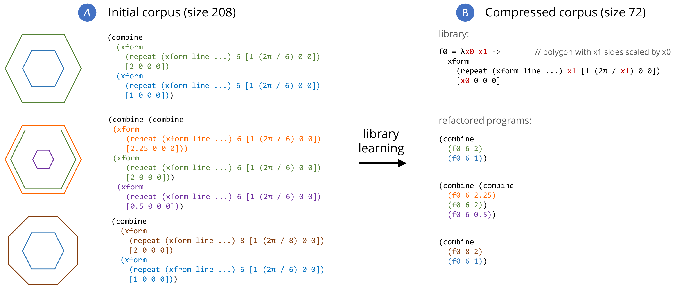

**Рисунок.** Пример обучения библиотек. Начальный корпус А содержит три графические программы из набора данных «гайки и болты» Вонга и др. (2022). Корпус B — это результат обучения библиотеки с единственной изученной функцией для масштабированного многоугольника, а также исходные программы, реорганизованные с использованием этой функции.


Изучение библиотеки можно сформулировать как задачу синтеза программы, состоящую из двух этапов: *генерация* абстракций-кандидатов, а затем *выбор* тех абстракций, которые создают лучший (наименьший) реорганизованный корпус. Современная технология, реализованная в DreamCoder (Эллис и др., 2021), страдает от двух основных ограничений, которые мешают масштабированию обучения библиотеки для получения более крупных и реалистичных входных данных.

- Генерация кандидатов не является ***точной***: DreamCoder генерирует множество абстракций кандидатов, которые бесполезны, что замедляет этап выбора и работу алгоритма в целом.

- Техника чисто синтаксическая и, следовательно, не ***устойчива*** к поверхностным вариациям. Например, программист-человек сразу поймет, что термины $2 + 1$ и $1 + 3$ можно реорганизовать с использованием абстракции $\lambda x \ \to\ x + 1$, поскольку сложение коммутирует; чисто синтаксический подход к изучению библиотек не может создать эту абстракцию.

В этой статье мы предлагаем *обучение библиотек по модулю (уравнений) теорий* (LLMT) — новый алгоритм обучения библиотек, который устраняет оба вышеупомянутых ограничения.

***Точная генерация кандидатов посредством антиунификации.*** Чтобы сделать генерацию кандидатов более точной, LLMT использует два ключевых наблюдения:

- Полезные абстракции должны использоваться в корпусе не менее двух раз. Например, в корпусе из двух программ $2 + 1$ и $3 + 1$ нет необходимости учитывать $\lambda x \ \to\ 3 + x$, поскольку его можно использовать только в одном месте и, следовательно, это только увеличит размер корпуса.

- Абстракции должны быть «максимально конкретными» для данного корпуса. Например, в одном корпусе с $2 + 1$ и $3 + 1$ абстракция $\lambda x \ \to\ x + 1$ превосходит более общую $\lambda x\ y \ \to\ x + y$, поскольку обе применяются к одним и тем же двум термам, но применение последнего обходится дороже (требуется два аргумента).

Другими словами, полезная абстракция соответствует наименее общему *шаблону*, который соответствует некоторой паре подтермов из исходного корпуса; такую ​​модель можно вычислить с помощью *антиунификации* (AU) (Плоткин 1970). Например, антиунификация $2 + 1$ и $3 + 1$ дает шаблон $X + 1$, а желаемая библиотечная функция-кандидат $\lambda x \ \to\ x + 1$ может быть получена путем абстрагирования переменной шаблона $X$. Аналогично, в 1 абстракция `f0` может быть получена путем антиунификации, например, синего и коричневого подтермов корпуса.

***Надежность с помощью e-графов.*** Чтобы сделать генерацию кандидатов более надежной, LLMT дополнительно принимает в качестве входных данных *эквациональную теорию, специфичную для предметной области*, и использует ее для поиска программ, которые семантически эквивалентны исходному корпусу, но имеют наиболее синтаксическую структуру. Например, в области арифметики мы ожидаем, что теория будет содержать уравнение $X + Y  \equiv Y + X$, которое утверждает, что сложение коммутативно. Учитывая корпус с термами $2 + 1$ и $1 + 3$, это правило можно использовать для перезаписи второго терма в $3 + 1$, что позволяет обнаружить общую абстракцию $\lambda x \ \to\ x + 1$.

Основная проблема при таком подходе — поиск в большом пространстве программ, семантически эквивалентных исходному корпусу. С этой целью LLMT опирается на структуру данных *e-граф* и метод *насыщения равенствами* (Tate et al. 2009; Willsey et al. 2021) для вычисления и представления пространства семантически эквивалентных программ. Чтобы обеспечить эффективное обучение библиотеки в этом пространстве, мы предлагаем новый алгоритм генерации кандидатов, который эффективно вычисляет набор всех антиунификаторов между парами подтермов, представленных e-графом, с использованием динамического программирования.

Наконец, *выбор* оптимальной библиотеки в этом случае сводится к проблеме *извлечения* наименьшего терма из e-графа при наличии общих подвыражений. В своей общей форме эта проблема требует чрезвычайно больших вычислительных ресурсов, а существующие подходы имеют ограниченную масштабируемость (Янг и др., 2021). Вместо этого мы предлагаем *целевое исключение подвыражений*: новый алгоритм извлечения e-графов, который использует знания, специфичные для предметной области, для сокращения пространства поиска и легко поддерживает аппроксимацию с помощью лучевого поиска, чтобы найти компромисс между точностью и эффективностью.


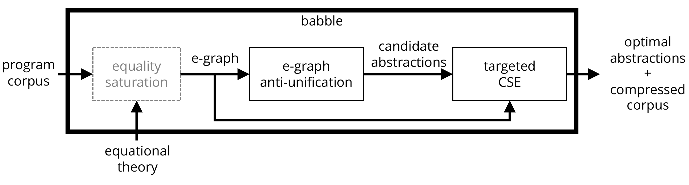

**Рисунок.** Обзор архитектуры `babble`


***babble.*** Мы реализовали LLMT в `babble`, инструменте, созданном на основе библиотеки e-графов egg (Willsey et al., 2021). Обзор рабочего процесса `babble` показан на рисунке 2: серые прямоугольники представляют существующие методы, а черные — наш вклад.

Мы оценивали `babble` по критериям из двух источников: задачи сжатия, извлеченные из запусков DreamCoder (Bowers 2022), и программы 2D CAD, используемые для оценки концептуального обучения у людей (Wong et al. 2022). Наша оценка показывает, что `babble` превосходит DreamCoder в собственных тестах, обеспечивая лучшее сжатие за на порядок меньшее время. Добавление перезаписи для конкретного домена еще больше улучшает сжатие. Мы также показываем, что `babble` масштабируется до более крупных корпусов 2D CAD, которые недоступны для DreamCoder. Мы также представляем и обсуждаем подборку абстракций, изученных с помощью `babble`, демонстрируя, что подход LLMT может изучать функции, соответствующие человеческой интуиции.

***Вклады.*** Вкратце, в данной статье представлены следующие материалы:

- *обучение библиотек по модулю эквациональной теории*: алгоритм обучения библиотек, который может включать в себя произвольную эквациональную теорию, специфичную для предметной области, чтобы сделать обучение устойчивым к синтаксическим вариациям;

- *антиунификация e-графов*: алгоритм, который эффективно генерирует набор абстракций-кандидатов, используя механизм антиунификации, расширенный от термов до e-графов;

- *целевое исключение общих подвыражений*: новый приближенный алгоритм для извлечения лучшего терма из e-графа при наличии общих подвыражений.

## 2. Обзор

Мы иллюстрируем LLMT на рабочем примере, построенном на 1. Входной корпус в 1 написан на DSL 2D CAD Wong et al. (2022), в котором представлены следующие примитивы:

|  |  | 
|---:|:---| 
| `line` | отрезок от начала координат (0, 0) до точки (1, 0) | 
| $\texttt{combine}(F_1,\ F_2)$ | объединение фигур $F_1$ и $F_2$ | 
| $\texttt{xform}(F,\ \tau)$ | применение преобразования $\tau$ к фигуре $F$ | 
| $\texttt{repeat}(F,\ 0,\ \tau)$ | пустая фигура | 
| $\texttt{repeat}(F,\ n+1,\ \tau)$ | $\texttt{combine}(F,\ \texttt{xform}(\texttt{repeat}(F,\ n,\ \tau),\ \tau))$, похожий на «складку» |

Преобразование $\tau$ представляет собой четырехкортежное преобразование $[s, \theta, t_x, t_y]$, обозначающее равномерное масштабирование с коэффициентом $s$, вращение на $\theta$ радиан и перемещение на $(t_x,\ t_y)$ в направлениях $x$ и $y$ соответственно. Например, зеленый шестиугольник в 1 реализован как:
``` math
\texttt{xform}(
    \texttt{repeat}(
      \texttt{xform}(
        \texttt{line}
      ,\ 
        [1, 0, -0.5, 0.5 / \tan(\pi / 6)]
      )
    ,\ 6,\ 
      [1, 2\pi/6, 0, 0]
    )
  ,\ 
    [2, 0, 0, 0]
  )
```
То есть сторона шестиугольника $\texttt{xform}(\texttt{line},\ [1, 0, -0.5, 0.5 / \tan(\pi / 6)])$ повторяется шесть раз, каждый раз поворачиваясь на еще один радиан $2\pi/6$, а полученный единичный шестиугольник масштабируется на $2$.

Однако, присмотревшись к двум синим шестиугольникам в цифре 1, мы замечаем кое-что необычное. Два появления $\texttt{xform}(\texttt{repeat} \ldots,\ [1, 0, 0, 0])$ в 1 являются no-op: они просто масштабируют фигуру $F$ в 1 раз, не поворачивая и не перемещая ее. Этих избыточных преобразований, скорее всего, не было бы, если бы код был написан вручную или декомпилирован из представления более низкого уровня (с помощью такого инструмента, как Салински (Нанди и др., 2020));[^1] и тем не менее, они имеют решающее значение, если мы надеемся обучить оптимальную абстракцию $f_0$ с помощью чисто синтаксической техники.

3 показана упрощенная и «более естественная» версия корпуса из 1, в которой исключены эти бездействующие преобразования. Как показано на рисунке, это приводит к тому, что чисто синтаксический метод изучает другую функцию, $f_1$, которая абстрагируется над *немасштабированным* единичным многоугольником. Поскольку преобразование масштабирования теперь находится за пределами абстракции, его необходимо повторить пять раз. В результате, хотя упрощенный входной корпус C из 3 *меньше* исходного корпуса A (196 узлов AST вместо 208), его сжатая версия D *больше* (81 узел AST вместо 72)! Другими словами, изучение синтаксической библиотеки не является устойчивым к вариантам кода, сохраняющим семантику.


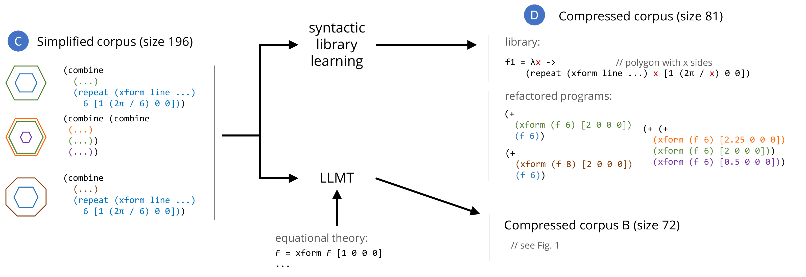

**Рисунок.** Разница между изучением синтаксической библиотеки и LLMT. Здесь исходный корпус C представляет собой упрощенную версию корпуса A из 1, с удаленными избыточными преобразованиями синих подтермов (неизмененные термины показаны эллипсами). С этой модификацией синтаксические методы будут изучать низшую абстракцию *f*_1, что приведет к корпусу D, в то время как LLMT по-прежнему обучает лучшую абстракцию *f*_0.


Напротив, наш инструмент `babble` может принять упрощенный корпус C в качестве входных данных и при этом за доли секунды обнаружить масштабированную полигональную абстракцию $f_0$, в результате чего получится сжатый корпус B размером 72. В оставшейся части этого раздела мы проиллюстрируем, как `babble` достигает этого с помощью нашего нового алгоритма *обучения библиотеки по модулю эквациональной теории* (LLMT).

***Упрощенный DSL.*** В оставшейся части этого раздела мы используем адаптированную версию DSL 2D CAD со следующими дополнительными конструкциями:

|  |  | 
|---:|:---| 
| $\texttt{scale}(F,\ s)$ | масштабировать $F$ в $s$ коэффициент | 
| $\texttt{repRot}(F,\ n,\ \theta)$ | особый случай `repeat`, который выполняет вращение только между итерациями | 
| $\texttt{side}(n)$ | сторона правильного $n$-угольника |

Их можно выразить в исходном DSL, и их можно даже обнаружить при изучении библиотеки при наличии соответствующего корпуса; здесь мы рассматриваем их как примитивы ради упрощения представления.

### 2.1. Представление эквивалентных термов с помощью e-графов

Чтобы использовать эквивалентности во время обучения библиотек, `babble` принимает в качестве входных данных теорию уравнений, специфичную для предметной области. Для нашего текущего примера предположим, что теория содержит одно уравнение:
``` math
  F \equiv\texttt{scale}(F,\ 1)
```
который предусматривает, что любая цифра $F$ эквивалентна самой себе, масштабированной на единицу. Имея это уравнение на руках, можно «переписать» корпус C в корпус A и оттуда изучить оптимальный сжатый корпус B чисто синтаксическими методами. Проблема в том, что существует бесконечно много альтернативных корпусов C, которые можно переписать; как нам узнать, что выбрать, чтобы максимизировать синтаксическое выравнивание и, следовательно, шанс найти оптимальную абстракцию?

Вместо того, чтобы пытаться угадать лучший эквивалентный корпус или перечислять их один за другим, `babble` использует *насыщение равенством* (Tate et al. 2009; Willsey et al. 2021). Насыщение равенства принимает в качестве входных данных терм $t$ и набор правил перезаписи и находит пространство всех термов, эквивалентное $t$ в соответствии с заданными правилами; это возможно благодаря высокой степени совместного использования, обеспечиваемой структурой данных *e-граф*, которая может компактно представлять результирующее пространство.

4 (слева) показан e-граф, построенный путем насыщения равенствами для синего терма в 3, представленного в упрощенном DSL как $\texttt{repRot}(\texttt{side}(6),\ 6,\ 2\pi/6)$, с использованием правила перезаписи [eq:unit-xform]. Синяя часть графа представляет исходный терм, а серая часть добавлена насыщением равенствами. Сплошные прямоугольники на e-графе обозначают *e-узлы* (которые аналогичны обычным узлам AST), а пунктирные прямоугольники обозначают *e-классы* (которые представляют классы эквивалентности термов). Важно отметить, что ребра e-графа идут от e-узлов к e-классам, что обеспечивает компактное представление программ с вариациями подтермов: например, если сделать e-класс $c_1$ первым дочерним элементом узла `repRot`, это позволит ему представлять оба терма $\texttt{repRot}(\texttt{side}(6),\ 6,\ 2\pi/6)$ и $\texttt{repRot}(\texttt{scale}(\texttt{side}(6),\ 1),\ 6,\ 2\pi/6)$ без дублирования их общих частей. Кроме того, поскольку e-графы могут иметь циклы, они также могут представлять бесконечные наборы термов: например, e-класс $c_1$ представляет все термы формы: $\texttt{side}(6)$, $\texttt{scale}(\texttt{side}(6),\ 1)$, $\texttt{scale}(\texttt{scale}(\texttt{side}(6),\ 1),\ 1)$ и т. д. Поскольку этот e-граф представляет пространство *всех* эквивалентных термов вплоть до перезаписи [eq:unit-xform], термин, который мы ищем для обучения библиотек, а именно $\texttt{scale}(\texttt{repRot}(\texttt{side}(6),\ 6,\ 2\pi/6),\ 1)$ также представлен в e-классе $c_0$.


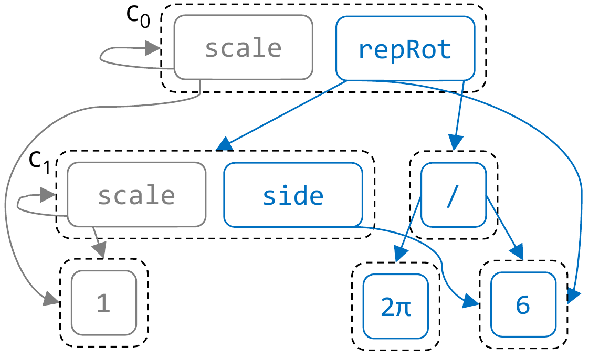

**Рисунок.** (Слева) E-граф, представляющий пространство всех программ, эквивалентных синему терму в 3 по правилу [eq:unit-xform]. (Справа) E-граф с синими и коричневыми термами из числа 3 после насыщения равенством. Все термины написаны на упрощенном DSL.


### 2.2. Генерация кандидатов с помощью антиунификации e-графов

После построения e-графа из данного корпуса путем насыщения равенствами с помощью данной эквациональной теории следующим шагом в изучении библиотеки является создание шаблонов-кандидатов, которые фиксируют синтаксические сходства во всем корпусе. Задача состоит в том, чтобы создать достаточно мало кандидатов, чтобы сделать обучение библиотек удобным, но достаточно много, чтобы добиться хорошего сжатия. Мы иллюстрируем генерацию кандидатов, используя e-граф на рисунке 4 (справа), который представляет часть нашего корпуса, состоящую из (насыщенных) синих и коричневых термов. Напомним, что оптимальный шаблон, соответствующий масштабированной полигональной абстракции $f_0$, выглядит следующим образом:
``` math
  P_0 = \texttt{scale}(\texttt{repRot}(\texttt{side}(X),\ X,\ 2\pi/X),\ Y)
```

Предыдущая работа над DreamCoder генерировала шаблоны, выбирая случайный фрагмент из корпуса, а затем заменяя произвольно выбранные подтермины переменными шаблона. Например, чтобы сгенерировать шаблон $P_0$, DreamCoder необходимо выбрать весь коричневый подтерм как фрагмент, а затем решить абстрагировать его подтермы $8$ и $2$. Этот подход успешно ограничивает набор кандидатов из всех синтаксически допустимых шаблонов только теми, которые имеют хотя бы одно совпадение в корпусе; однако, поскольку существует слишком много способов выбора подтермов для абстрагирования, это пространство все еще слишком велико, чтобы его можно было исчерпывающе исследовать за пределами небольших корпусов коротких программ. В `babble` эта проблема усугубляется насыщением равенствами, поскольку e-граф часто содержит экспоненциально или бесконечно больше программ, чем исходный корпус.

***Фильтры общности.*** Чтобы еще больше сократить набор жизнеспособных кандидатов в `babble`, мы определяем два класса шаблонов, которые можно безопасно отбросить либо потому, что они слишком конкретны, либо слишком абстрактны. Во-первых, такой шаблон, как $\texttt{repRot}(\texttt{side}(8),\ X,\ 2\pi/8)$, можно отбросить, поскольку он *слишком конкретен* для этого корпуса: соответствующая абстракция может быть применена только один раз, по существу заменяя единственный соответствующий термин, $\texttt{repRot}(\texttt{side}(8),\ 8,\ 2\pi/8)$, на $(\lambda x \ \to\ \texttt{repeat}(\texttt{side}(8),\ x,\ 2\pi/8))\ 8$, что только добавляет в корпус больше узлов AST. Во-вторых, такой шаблон, как $\texttt{repRot}(\texttt{side}(X),\ X,\ Y)$, можно отбросить, потому что он *слишком абстрактный* для этого корпуса: везде, где он совпадает, будет также соответствовать более конкретный шаблон $\texttt{repRot}(\texttt{side}(X),\ X,\ 2\pi/X)$; использование более конкретного шаблона приводит к лучшему сжатию, поскольку фактические аргументы в его приложениях меньше и меньше: `f 6 2pi/6` и `f 8 2pi/8` по сравнению с `f 6` и `f 8`.

Таким образом, наша ***первая ключевая идея*** состоит в том, чтобы ограничить набор кандидатов наиболее конкретными шаблонами, которые соответствуют некоторой паре подтермов в (насыщенном) корпусе.[^2] Например, шаблон $P_0$ является наиболее конкретным шаблоном, который соответствует двум термам.
``` math
\begin{gathered}
    \texttt{scale}(\texttt{repRot}(\texttt{side}(6),\ 6,\ 2\pi/6),\ 1)\\
    \texttt{scale}(\texttt{repRot}(\texttt{side}(8),\ 8,\ 2\pi/8),\ 2)
\end{gathered}
```
представлены в 4 e-классами $c_0$ и $c_2$ соответственно.

***Термин Антиунификация.*** Вычисление наиболее конкретного шаблона, соответствующего двум заданным термам, известно как *антиунификация* (AU) (Reynolds 1969; Plotkin 1970). AU работает путем простого обхода двух термов сверху вниз, заменяя любые несовпадающие конструкторы переменными шаблона. Например, чтобы антиунифицировать термины [eq:hex] и [eq:oct], мы начинаем с корня обоих термов; поскольку оба узла AST используют один и тот же конструктор `scale`, он становится частью шаблона, и мы возвращаемся к дочерним узлам. В конечном итоге мы сталкиваемся с несоответствием: терм слева — `6`, а терм справа — `8`; поэтому мы создаем новую переменную шаблона $X$ и запоминаем *анти-подстановку* $\sigma = \{(\texttt{6}, \texttt{8}) \mapsto X\}$. Когда мы сталкиваемся с несовпадением знаменателя угла, мы ищем пару несовпадающих термов $(\texttt{6}, \texttt{8})$ в $\sigma$; поскольку мы уже создали переменную для этой пары, мы просто возвращаем существующую переменную $X$. Последнее несоответствие — $(\texttt{1}, \texttt{2})$ во втором дочернем элементе `scale`; поскольку этой пары еще нет в $\sigma$, мы создаем вторую переменную шаблона $Y$. На этом этапе результирующим антиунификатором является шаблон $P_0$ [eq:p0].

Противодействовать объединению одной пары термов просто и эффективно. Однако в LLMT мы хотим антиунифицировать *все пары подтермов*, которые могут встречаться *в любом корпусе*, эквивалентном (по модулю данной эквациональной теории) оригиналу[^3]. Явное перечисление всех эквивалентных корпусов, представленных e-графом, а затем выполнение AU для каждой пары подтермов невозможно. Вместо этого `babble` выполняет антиунификация непосредственно на e-графе.

***От термов к e-классам.*** Сначала мы объясним, как антиунифицировать два e-класса. Эта операция принимает на вход пару e-классов и возвращает набор *доминирующих антиунификаторов*, *т.е.* набор шаблонов, которые (1) соответствуют обоим e-классам и (2) гарантированно включают лучшую абстракцию среди наиболее конкретных шаблонов, соответствующих парам термов, представленных двумя e-классами.

Рассмотрим вычисление $\mathsf{AU}(c_1, c_4)$ для e-классов $c_1$ и $c_4$ в e-графе из 4 (справа). AU по-прежнему выполняется как обход сверху вниз, но в этом контексте мы должны проверить, имеют ли два e-класса какие-либо *общие* конструкторы. В данном случае они есть: и конструктор `side`, и конструктор `scale`. Давайте сначала выберем два конструктора `side` и вернемся к их единственному дочернему элементу, вычислив $\mathsf{AU}(\{\texttt{6}\}, \{\texttt{8}\})$. Эти два e-класса не имеют соответствующих конструкторов, поэтому AU просто возвращает переменную шаблона, аналогично терму антиунификация; это дает первый шаблон для $c_1$ и $c_4$: $\texttt{side}\ X$.

Однако вспомните, что $c_1$ и $c_4$ также имеют соответствующие конструкторы `scale`. Здесь все становится интереснее: эти конструкторы участвуют в *цикле* (их первым дочерним элементом является сам родительский e-класс). Если мы позволим AU следовать этому циклу, множество антиунификаторов станет бесконечным:
``` math
\mathsf{AU}(c_1, c_4) = \{\texttt{side}\ X\} \cup \{\texttt{scale}\ p\ 1 \mid p \in \mathsf{AU}(c_1, c_4)\}
```
К счастью, мы можем показать, что $\texttt{side}\ X$ *доминирует* над всеми остальными шаблонами из этого набора, поскольку их переменные шаблона — в данном случае просто $X$ — соответствуют тем же e-классам, но они также больше (в разделе 4 мы показываем, как это отношение доминирования позволяет нам отсекать другие шаблоны, а не только те, которые вызваны циклами). Следовательно, $\mathsf{AU}(c_1, c_4)$ просто возвращает $\{\texttt{side}\ X\}$.

Следуя той же логике для корневых e-классов двух многоугольников, $c_0$ и $c_2$, $\mathsf{AU}(c_0, c_2)$ дает шаблон $P_0$ [eq:p0], который необходим для обучения оптимальной абстракции.

***От E-классов к E-графам.*** Чтобы получить набор всех абстракций-кандидатов, нам необходимо выполнить антиунификация для всех пар e-классов в e-графе. Очевидно, что эти вычисления имеют перекрывающиеся подзадачи (например, нам нужно вычислить $\mathsf{AU}(c_1, c_4)$ как часть $\mathsf{AU}(c_0, c_2)$ и $\mathsf{AU}(c_0, c_3)$). Чтобы избежать дублирования работы, `babble` использует эффективный алгоритм динамического программирования, который обрабатывает все пары e-классов восходящим способом.

### 2.3. Отбор кандидатов через целевое исключение общих подвыражений

Теперь мы проиллюстрируем последний этап обучения библиотек в babble: учитывая набор абстракций-кандидатов, сгенерированный антиунификацией e-графов, цель состоит в том, чтобы выбрать подмножество, которое обеспечивает наилучшее сжатие для корпуса в целом. Например, кандидаты, созданные для корпуса из 3, включают:
``` math
\begin{array}{rcll}
f_0 &=& \lambda x\ y \ \to\ \texttt{scale}(\texttt{repRot}(\texttt{side}(x),\ x,\ 2\pi/x),\ y) &\quad \text{scaled regular $x$-gon} \\[2pt]
f_1 &=& \lambda x \ \to\ \texttt{repRot}(\texttt{side}(x),\ x,\ 2\pi/x) &\quad \text{regular $x$-gon} \\[2pt]
f_2 &=& \lambda y \ \to\ \texttt{scale}(\texttt{repRot}(\texttt{side}(6),\ 6,\ 2\pi/6),\ y) &\quad \text{scaled hexagon}
\end{array}
```
Не сразу понятно, какая абстракция лучше: $f_0$ соответствует большему количеству термов, чем $f_2$, но $f_2$ требует меньше аргументов (поэтому, если у нас достаточно масштабированных шестиугольников в корпусе и только один восьмиугольник, возможно, лучше оставить восьмиугольник неабстрагированным). С другой стороны, $f_1$ может быть лучше, поскольку он не вносит избыточное преобразование в синие шестиугольники. Наконец, если мы выберем $f_0$ *и* $f_2$ вместе, мы также сможем абстрагировать определение $f_2$ как $f_0\ 6$, тем самым получив дополнительное повторное использование! Как видите, выбор кандидатов весьма нетривиален, поскольку необходимо учитывать выбор между различными эквивалентными программами в e-графе, а также тот факт, что одни абстракции могут быть определены с помощью других.


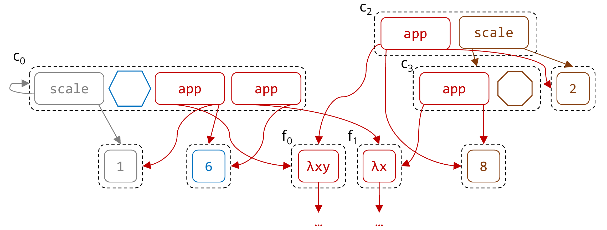

**Рисунок.** E-граф из 4 (справа) с применением *f*_0 и *f*_1 показан красным. Покажем неизмененные части графа, представляющие единичный шестиугольник и восьмиугольник, как соответствующие фигуры; мы также опускаем некоторые серые e-узлы, добавленные на предыдущем этапе.


***Сведение к извлечению e-графа.*** Чтобы преодолеть эту трудность, мы снова используем e-граф и насыщение равенствами. Наша ***вторая ключевая идея*** состоит в том, что выбор оптимального подмножества абстракций может быть сведен к проблеме извлечения наименьшего терма из e-графа при наличии общих подвыражений.

Чтобы проиллюстрировать это сокращение, давайте ограничим наше внимание только двумя абстракциями-кандидатами, $f_0$ и $f_1$, определенными выше. `babble` преобразует каждый из шаблонов-кандидатов и соответствующую ему абстракцию в правило перезаписи, которое вводит *локальную* $\lambda$-абстракцию с последующим применением в корпусе; для наших двух абстракций эти правила таковы:
``` math
\begin{aligned}
\texttt{scale}(\texttt{repRot}(\texttt{side}(X),\ X,\ 2\pi/X),\ Y) &\Rightarrow f_0\ X\ Y\\ 
  \texttt{repRot}(\texttt{side}(X),\ X,\ 2\pi/X) &\Rightarrow f_1\ X
\end{aligned}
```
Результат применения этих правил к e-графу из 4 (справа) показан в 5. Например, вы можете видеть, что e-класс $c_2$ (который представляет восьмиугольник масштаба 2) теперь хранит альтернативное представление: $f_0\  8\ 2$. E-класс $c_0$ (шестигранник) имеет представления с использованием $f_0$ или $f_1$, поскольку этот класс соответствует обоим правилам перезаписи [eq:rw1] и [eq:rw2], указанным выше. Также обратите внимание, что, поскольку определения абстракций $\lambda$ также хранятся в e-графе, насыщение равенствами может использовать приведенные выше правила перезаписи внутри их тел, чтобы заставить одну функцию использовать другую: например, один терм, сохраненный для определения $f_0$, равен
``` math
\lambda x\ y \ \to\ \texttt{scale}(f_1\ x,\ y).
```

После того, как мы построили версию e-графа с локальными лямбда-выражениями для всех абстракций-кандидатов, остается только извлечь из этого e-графа наименьший терм. Сложность заключается в том, что мы хотим посчитать размер дублированных лямбда-выражений только один раз. Например, в версии 5 $f_0$ применяется дважды (в $c_0$ и $c_2$); если при извлечении термов будут выбраны оба этих e-узла, мы хотим рассматривать их первого дочернего элемента (определение $f_0$) как общее подвыражение, размер которого вносит вклад в окончательное выражение только один раз. Интуитивно это происходит потому, что мы можем «переместить» эти лямбды в привязки `let` верхнего уровня, тем самым определяя $f_0$ только один раз и заменяя каждую локальную лямбду именем.

Извлечение с помощью общих подвыражений — известная, но общеизвестно сложная задача, которая традиционно сводится к целочисленному линейному программированию (ILP) (Янг и др., 2021; Ван и др., 2020). Поскольку масштабируемость подхода ILP очень ограничена, мы разработали специальный алгоритм извлечения, который лучше масштабируется за счет использования знаний и приближений, специфичных для предметной области.

***Алгоритм извлечения.*** Основная идея повышения эффективности извлечения заключается в том, что для обучения библиотек мы заинтересованы только в совместном использовании определенного типа подтермов, а именно, $\lambda$-абстракций. Следовательно, для каждого e-класса нам нужно отслеживать только лучший терм для каждой возможной библиотеки (*т.е.* каждого подмножества $\lambda$-абстракций). Точнее, для каждого e-класса и библиотеки мы отслеживаем (1) наименьший размер библиотеки (2) наименьший размер программы, рефакторизованной с использованием этой библиотеки (считая $\lambda$-абстракции как один узел). Мы вычисляем и распространяем эту информацию снизу вверх через e-граф. Как только эта информация вычислена для корневого e-класса (который представляет весь корпус), мы можем просто выбрать библиотеку с наименьшим общим размером.

Например, для e-класса $c_2$ из 5 с пустой библиотекой $\emptyset$ размер библиотеки равен 0, а размер самой маленькой программы ($\texttt{scale}(\texttt{repRot}(\texttt{side}(8),\ 8,\ 2\pi/8),\ 2)$) равен 9; с библиотекой $\{f_0\}$ размер библиотеки равен 9, а размер самой маленькой программы ($f_0\ 2\ 8$) — 3; в то время как в случае с библиотекой $\{f_1\}$ размер библиотеки равен 7, а размер наименьшей программы ($\texttt{scale}(f_1\ 8,\ 2)$) равен 4. Очевидно, что для этого e-класса введение библиотечных функций еще не окупается ($0 + 9 < 7 + 4 < 9 + 3$), поскольку каждую из них можно использовать только один раз. Однако эта ситуация меняется по мере продвижения к корню. Уже для родительского e-класса $c_0$ и $c_2$ стоимость внедрения $\{f_0\}$ и $\{f_1\}$ амортизируется: размер самой маленькой программы составляет 17 с пустой библиотекой и 7 с $\{f_0\}$ или $\{f_1\}$, поэтому $\{f_1\}$ уже стоит внедрять ($9 + 7 < 0 + 17$). Включение еще большего количества программ с масштабированными полигонами в конечном итоге делает библиотеку $\{f_0\}$ наиболее прибыльной из четырех подмножеств.

Поскольку в более крупном корпусе отслеживать все подмножества абстракций-кандидатов невозможно, `babble` предоставляет способ компромисса между масштабируемостью и точностью, используя подход *лучевого поиска*.

## 3. Обучение библиотек над термами

В этом разделе мы формализуем проблему изучения библиотек с помощью набора термов и мотивируем наш первый основной вклад: создание абстракций-кандидатов посредством антиунификации. 4 обобщает этот формализм на обучение библиотек через e-граф. Для простоты изложения наша формализация изучения библиотек является *первым порядком*, то есть исходный корпус сам по себе не содержит никаких $\lambda$-абстракций, а все изученные абстракции являются функциями первого порядка (реализация `babble` не имеет этого ограничения).

### 3.1. Предварительные сведения

***Термины.*** *подпись* $\Sigma$ представляет собой набор конструкторов, каждый из которых связан с арностью. $\mathcal{T}(\Sigma)$ обозначает набор *термов* в $\Sigma$, определяемый как наименьший набор, содержащий все $s(t_1,\dots,t_k)$, где $s \in \Sigma$, $k = \mathsf{arity}(s)$ и $t_1,\dots,t_k\in\mathcal{T}(\Sigma)$. Мы сокращаем нулевые термины формы $s()$ как $s$. *Размер* терма $\mathsf{size}(t)$ определяется обычным способом (как количество конструкторов в терме). Мы используем $\mathsf{subterms}(t)$ для обозначения набора всех подтермов $t$ (включая сам $t$). Мы предполагаем, что $\Sigma$ содержит специальный конструктор *вариативного* кортежа, записанный $\langle t_1, \ldots, t_n \rangle$, который мы используем для представления корпуса программ как одного терма ($\langle \rangle$ не влияет на размер терма).

***Шаблоны.*** Если $\mathcal{X}$ представляет собой счетный набор переменных, то $\mathcal{T}(\Sigma,\mathcal{X})$ представляет собой набор *шаблонов*, *т.е.* термов, которые могут содержать переменные из $\mathcal{X}$. Шаблон является *линейным*, если каждая из его переменных встречается только один раз: $\forall X \in \mathsf{vars}(p) . \mathsf{occurs}(X, p) = 1$. *Подстановка* $\sigma = [{X_1} \mapsto {p_1}, \ldots, {X_n} \mapsto {p_n}]$ — это преобразование переменных в шаблоны. Мы пишем ${\sigma}({p})$ для обозначения применения $\sigma$ к шаблону $p$, который определяется стандартным способом. Мы определяем размер замены $\mathsf{size}(\sigma)$ как сумму ее правых частей.

Шаблон $p$ является более общим, чем (или *совпадает*) $p'$, записанный $p' \sqsubseteq p$, если существует $\sigma$ такой, что $p' = {\sigma}({p})$; такой $\sigma$ мы будем обозначать $\mathsf{match}(p',p)$. Например $X + 1 \sqsubseteq X + Y$ с $\mathsf{match}(X + 1,X + Y) = [{Y} \mapsto {1}]$. Отношение $\sqsubseteq$ представляет собой частичный порядок шаблонов и порождает отношение эквивалентности $p_1 \sim p_2 \triangleq p_1 \sqsubseteq p_2 \wedge p_2 \sqsubseteq p_1$ (эквивалентность вплоть до переименования переменных). В дальнейшем мы всегда будем различать шаблоны только до этого отношения эквивалентности.

*Соединение* двух шаблонов $p_1 \sqcup p_2$, также называемое их *анти-объединителем*, является наименее общим шаблоном, который соответствует как $p_1$, так и $p_2$; объединение уникально до $\sim$. Обратите внимание, что $\langle \mathcal{T}(\Sigma,\mathcal{X}), \sqsubseteq, \sqcup, \top = X \rangle$ представляет собой полурешетку соединения (часть *решетки включения* Плоткина (Plotkin 1970)). Следовательно, соединение можно обобщить на произвольный набор шаблонов.

*Контекст* $\mathcal{C}$ — это шаблон с единственным появлением отличительной переменной $\circ$. Мы пишем $\mathcal{C}[p]$ — $p$ в контексте $\mathcal{C}$ — как синтаксический сахар для ${[{\circ} \mapsto {p}]}({\mathcal{C}})$. *Правило перезаписи* $R$ — это пара шаблонов, обозначаемая $p_1 \Rightarrow p_2$. Применяя правило перезаписи $R$ к терму или шаблону $p$, записанный ${R}({p})$ определяется стандартным способом: ${R}({p}) = {(\mathsf{match}(p,p_1))}({p_2})$, если $p \sqsubseteq p_1$, и неопределенным в противном случае. Шаблон $p$ может быть *переписан за один шаг* в $q$ с использованием правила $R$, записанного $p \rightarrow^{R}_1 q$, если существует контекст $\mathcal{C}$, такой как $p = \mathcal{C}[p']$ и $q = \mathcal{C}[{R}({p'})]$. Рефлексивно-транзитивным замыканием этого отношения является *отношение перезаписи* $\rightarrow^{\mathcal{R}}$, где $\mathcal{R}$ — набор правил перезаписи.

***Сжатые термины.*** Сжатые термины $\hat{\mathcal{T}}(\Sigma,\mathcal{X})$ имеют форму:
``` math
\hat{t} ::= X   \mid   s(\hat{t}_1,\ldots,\hat{t}_k)     \mid (\lambda X_1 \ldots X_n \ \to\ \hat{t})\ \hat{t}_1\ \ldots\ \hat{t}_n
```
Другими словами, сжатые термины могут содержать применения абстракции $\lambda$ с нулем или более связями с тем же количеством аргументов. Обратите внимание, что это язык первого порядка в том смысле, что все абстракции применяются полностью. Важно отметить, что мы определяем $\mathsf{size}(\hat{t})$ таким образом, что множественные вхождения абстракции $\lambda$ *учитываются только один раз*. Для простоты учета размер приложения $(\lambda \overline{X} \ \to\ \hat{t}_1)\ \overline{\hat{t}_2}$ определяется как $\mathsf{size}(\hat{t}_1) + \sum{\overline{\mathsf{size}(\hat{t}_2)}}$, то есть сами узлы абстракции не увеличивают размер.[^4]

*Бета-редукция* в сжатом виде, обозначаемая $\hat{t}_1 \rightarrow^{\beta}_1\hat{t}_2$, определяется обычным способом:
``` math
(\lambda \overline{X} \ \to\ \hat{t}_1)\ \overline{\hat{t}_2}  \rightarrow^{\beta}_1{[\overline{X \mapsto \hat{t}_2}]}({\hat{t}_1})
```
где замена в сжатых термах является стандартной заменой, позволяющей избежать захвата, для исчисления $\lambda$. Обратите внимание: поскольку наш язык является первопорядковым и не имеет встроенной рекурсии, он является строго нормализующим (доказательство этого утверждения, а также других доказательств, опущенных в этом разделе, можно найти в дополнительных материалах). Следовательно, порядок редукций $\beta$ не имеет значения, и без потери общности мы можем определить *оценку* в сжатых термах $\hat{t}_1 \rightarrow^{\beta}\hat{t}_2$, чтобы следовать аппликативному порядку, *т.е. сначала редуцируются самые внутренние редексы $\beta$. В результате любое приложение, сокращенное во время оценки, имеет форму $(\lambda \overline{X} \ \to\ p_1)\ \overline{p_2}$, то есть ни тело $p_1$, ни фактические аргументы $\overline{p_2}$ не содержат никаких редексов (и, следовательно, никаких $\lambda$-абстракций). Это упрощает некоторые аспекты нашей формализации; например, нет необходимости переименовывать $\alpha$, поскольку без привязок в $p_1$ захват переменных невозможен.

***Постановка задачи.*** Теперь мы можем формализовать *задачу обучения библиотеки* следующим образом: учитывая терм $t \in \mathcal{T}(\Sigma)$, цель состоит в том, чтобы найти наименьший сжатый терм $\hat{t} \in \hat{\mathcal{T}}(\Sigma,\mathcal{X})$, который оценивается как $t$ (*т.е. *$\hat{t} \rightarrow^{\beta}t$). Причина, по которой такой $\hat{t}$ может быть меньше $t$, заключается в том, что он может содержать несколько вхождений одной и той же абстракции $\lambda$ (примененной к разным аргументам), размер которых учитывается только один раз. Пример показан на рисунке 6.

Хотя в целом решение может включать вложенные лямбды со свободными переменными (определенными во внешних лямбдах), в остальной части статьи мы ограничиваем наше внимание *обучением глобальных библиотек*, где все лямбды являются закрытыми термами. Это мотивировано целью обучения библиотеки найти абстракцию многократного использования для данной проблемной области. Решение в 6 уже имеет такой вид.


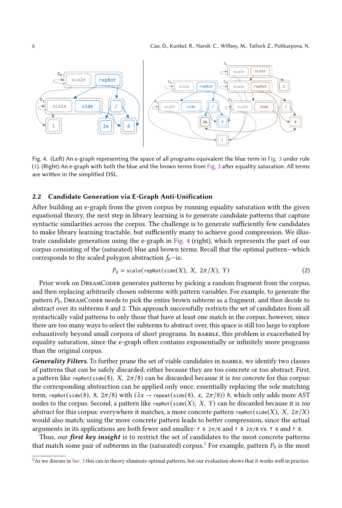

**Рисунок.** Обучение библиотек. Слева: начальный срок (размер 29). Справа: оптимальное решение с двумя абстракциями, одна из которых использует другую (размер 26). Решение с $\hat{f}_2 = \lambda X\ Y\ Z \ \to\ f(g(X) + g(X)) + \hat{f}_1\ Y\ Z$ также имеет размер 26.


### 3.2. Обучение библиотек на основе шаблонов

На высоком уровне наш подход к изучению библиотек заключается в использовании *шаблонов*, встречающихся в исходном корпусе, в качестве тел-кандидатов для $\lambda$-абстракций в сжатом корпусе. Глядя на пример 6, не сразу становится очевидным, что достаточно использовать только шаблоны из исходного корпуса, поскольку тело $f_2$ содержит приложение $f_1$. Возможно, это не является проблемой: ключевая идея заключается в том, что мы можем сжать $t$ в $\hat{t}$, инвертировав оценку $\hat{t} \rightarrow^{\beta}t$, а поскольку порядок оценки является аппликативным, переписанный подтерм на каждом этапе не будет содержать никаких $\beta$-редексов.

***Сжатие.*** Более формально, учитывая шаблон $p$, давайте определим его *правило сжатия* (или для краткости $\kappa$-правило) как правило перезаписи.
``` math
\kappa(p) \; \triangleq \; p \Rightarrow (\lambda \overline{X} \ \to\ p)\ \overline{X} \quad \text{where}\quad \overline{X} = \mathsf{vars}(p)
```
Другими словами, $\kappa(p)$ заменит любой термин, соответствующий $p$, применением функции, тело которой *точно* $p$. Например, если $p = g(Y) + h(Z)$, его правило $\kappa$ — $g(Y) + h(Z) \Rightarrow (\lambda Y\ Z \ \to\ g(Y) + h(Z))\ Y\ Z$. Обратите внимание, что в правой части этого правила во время перезаписи будут заменены только *свободные* вхождения $Y$ и $Z$; связанные $Y$ и $Z$ останутся неизменными, следуя обычной семантике замены для $\lambda$-исчисления. Например, это правило может переписать третий терм числа 6 (слева) следующим образом:
``` math
g(5) + h(6) \;\rightarrow^{\kappa(g(Y) + h(Z))}_1\; (\lambda Y\ Z \ \to\ g(Y) + h(Z))\ 5\ 6
```
Последовательность $\kappa$-перезаписывает $t \rightarrow^{\kappa(p_1)}_1 \dots \rightarrow^{\kappa(p_n)}_1 \hat{t}$, где все $p_i \in \mathcal{P}$, называется *сжатием* $t$ в $\hat{t}$ с использованием шаблонов $\mathcal{P}$ и записи $t \rightarrow^{\kappa(\mathcal{P})} \hat{t}$. Теперь мы можем показать, что проблема обучения библиотеки эквивалентна поиску наименьшего сжатия $t$, используя только шаблоны, встречающиеся в $t$.


Для любого терма $t \in \mathcal{T}(\Sigma)$ и сжатого терма $\hat{t} \in \hat{\mathcal{T}}(\Sigma,\mathcal{X})$:


Если $t$ сжимается в $\hat{t}$, то $\hat{t}$ оценивается как $t$: $\forall \mathcal{P}. t \rightarrow^{\kappa(\mathcal{P})} \hat{t} \Longrightarrow \hat{t} \rightarrow^{\beta}t$.

Если $\hat{t}$ является решением (глобальной) проблемы обучения библиотеки, то $t$ сжимается в $\hat{t}$, используя только шаблоны, соответствующие $t$: $\hat{t} \in \mathop{\mathrm{arg\,min}}_{\hat{t}' \rightarrow^{\beta}t} \mathsf{size}(\hat{t}') \Longrightarrow t \rightarrow^{\kappa(\mathcal{P})} \hat{t}$, где $\mathcal{P}= \{p \in \mathcal{T}(\Sigma,\mathcal{X}) \mid t' \in \mathsf{subterms}(t) , t' \sqsubseteq p\}$.


Доказательство можно найти в дополнительных материалах.

***Пример.*** Рассмотрим еще раз задачу обучения библиотеки из 6. Здесь набор шаблонов, используемых для сжатия исходного корпуса в решение справа, следующий:
``` math
p_1 = g(Y) + h(Z)\quad\quad\quad
  p_2 = f(X + X) + g(Y) + h(Z)
```
Перезапись первого терма корпуса происходит в два этапа (выделены редексы $\kappa$-шагов):
``` math
\begin{gathered}
  f(g(a) + g(a)) + (g(1) + h(2))    \;\rightarrow^{\kappa(p_2)}_1\\     
  (\lambda X\ Y\ Z \ \to\ f(X + X) + g(Y) + h(Z))\ g(a)\ g(a)\ (g(1) + h(2))\;\rightarrow^{\kappa(p_1)}_1\\ 
  (\lambda X\ Y\ Z\ \ \to\ f(X + X) + (\lambda Y\ Z \ \to\ g(Y) + h(Z))\ Y\ Z)\ g(a)\ g(a)\ (g(1) + h(2))
\end{gathered}
```
Другими словами, мы сначала переписываем весь термин, используя $p_2$, а затем переписываем тело введенной абстракции, используя $p_1$ (обратите внимание, что этот порядок сжатия является обратным порядку аппликативного вычисления). Аналогично сжимается второй терм корпуса; третий терм сжимается за один шаг с использованием $p_1$. Хотя это и не очевидно из приведенной выше последовательности перезаписи, полученный сжатый корпус действительно меньше исходного благодаря совместному использованию обеих абстракций $\lambda$, как показано справа от цифры 6.

***Обучение библиотекам как переписывание термов.*** Теорема [thm:pat-lib-learning] сводит изучение библиотек к проблеме *переписывания* термов. А именно, учитывая терм $t$ и конечный набор правил перезаписи $\mathcal{R}= \{\kappa(p) \mid  t' \in \mathsf{subterms}(t) , t' \sqsubseteq p\}$, наша цель — найти терм $\hat{t}$ минимального размера, такой, что $t \rightarrow^{\mathcal{R}} \hat{t}$, что является стандартной формулировкой при переписывании термов. К сожалению, эта конкретная проблема чрезвычайно сложна, поскольку (а) набор правил $\mathcal{R}$ очень велик для любого нетривиального терма $t$ и (б) наша функция $\mathsf{size}$ нелокальна (она учитывает совместное использование). В оставшейся части этого раздела мы обсудим, как мы можем сократить набор правил $\mathcal{R}$, чтобы уменьшить его до приемлемого размера. 5 обсуждается, как мы решаем оставшуюся проблему переписывания термов, используя технику *насыщения равенствами* (Tate et al. 2009; Willsey et al. 2021).

### 3.3. Отсечение шаблонов-кандидатов

В этом разделе мы обсудим, какие шаблоны можно исключить из рассмотрения при построении набора $\kappa$-правил $\mathcal{R}$ для задачи переписывания термов.

***Стоимость шаблона.*** Рассмотрим сжатие $t \rightarrow^{\kappa(\mathcal{P})} \hat{t}$, где каждый шаблон $p \in \mathcal{P}$ используется некоторое число $n$ раз с заменами $\sigma^p_1, \ldots, \sigma^p_n$. Мы можем разбить общий объем сжатия на вклады отдельных шаблонов:
``` math
\mathsf{size}(\hat{t}) - \mathsf{size}(t) = \sum_{p \in \mathcal{P}} \mathsf{cost}(p, \{\sigma^p_1, \dots \sigma^p_n\})
```
Стоимость паттерна $p$, в свою очередь, состоит из трех составляющих. Стоимостью *введения* абстракции является размер ее тела, *т.е.*$\mathsf{size}(p)$. Стоимость использования абстракции — $\textsf{use}(p, \sigma)$ [eq:use] — включает само приложение и размер аргументов. Стоимость, сэкономленная за счет использования абстракции — $\textsf{save}(p, \sigma)$ [eq:save] — это всего лишь стоимость терма, соответствующего $p$ (*т. е.* редекс соответствующего шага $\kappa$). ``` math
\begin{aligned}
\textsf{use}(p, \sigma) &= 1 + \sum_{X \in \mathsf{vars}(p)} \mathsf{size}(\sigma(X)) \\
  \textsf{save}(p, \sigma) &= \mathsf{size}({\sigma}({p})) = 
  \mathsf{size}(p) + \sum_{X \in \mathsf{vars}(p)} \mathsf{occurs}(X, p) \cdot (\mathsf{size}(\sigma(X)) - 1)
\end{aligned}
```
Общая стоимость $p$ — это стоимость внедрения абстракции, оплачиваемая единовременно, плюс стоимость каждого использования минус то, что вы экономите для каждого приложения:
``` math
  \textsf{cost}(p, \{\sigma_1,\ldots,\sigma_n\}) 
  = \mathsf{size}(p) + \sum_{\sigma_i} (\textsf{use}(p, \sigma_i) - \textsf{save}(p, \sigma_i))
```
Когда $p$ является линейным (все $\mathsf{occurs}(X, p) = 1$), стоимость зависит только от $n$, но не от замен $\sigma_i$:
``` math
\begin{aligned}
  \textsf{cost}(p, \{\sigma_1,\ldots,\sigma_n\}) 
  &= \mathsf{size}(p) + \sum_{\sigma_i} \left(
    1 - \mathsf{size}(p) + |\mathsf{vars}(p)|
  \right) \\
  &= \mathsf{size}(p) + n \cdot \left(
    1 - \mathsf{size}(p) + |\mathsf{vars}(p)|
  \right)
\end{aligned}
```
Мы можем показать, что шаблон $p$ с *неотрицательной* стоимостью можно безопасно отбросить, то есть существует другое сжатие, использующее только $\mathcal{P}\setminus \{p\}$, результат которого, по крайней мере, столь же мал.

***Тривиальные шаблоны.*** На основании этого анализа любой линейный шаблон $p$ с $\mathsf{skeleton}(p) \leq 1$ может быть отброшен, где $\mathsf{skeleton}(p) = \mathsf{size}(p) - |\mathsf{vars}(p)|$ — это размер «скелета» $p$, *т.е.* его тела без переменных. Интуитивно понятно, что скелет $p$ слишком мал, чтобы платить за внедрение приложения. В данном случае $\mathsf{cost}(p,\_) > 0$ *независимо* от того, сколько раз он используется. Мы называем такие шаблоны *тривиальными*. Примерами тривиальных шаблонов являются $X$ и $X + Y$.

***Шаблоны с одним совпадением.*** Мы можем показать, что шаблоны, имеющие только одно совпадение в корпусе, также можно отбросить. Если $p$ имеет единственное совпадение с $t$, то оно может появиться *не более одного раза* при любом сжатии $t$. Если $p$ является линейным, $\mathsf{cost}(p, \_) = 1 + |\mathsf{vars}(p)|$ всегда положителен, поэтому $p$ можно отбросить. А как насчет нелинейных шаблонов, где даже один шаг $\kappa$ может уменьшить размер благодаря повторному использованию переменных? Оказывается, любой нелинейный шаблон с единственным совпадением всегда можно заменить нулевым шаблоном (без переменных), который является более оптимальным.

Без ограничения общности предположим, что $p$ имеет одну переменную $X$, которая встречается $m > 1$ раза, и пусть ее единственным шагом $\kappa$ будет ${\sigma}({p}) \rightarrow^{\kappa(p)}_1  (\lambda X \ \to\ p)\  {\sigma}({X})$. Размер правой части — $\mathsf{size}(p) + 1 + \mathsf{size}({\sigma}({X}))$ или, переписанный в термах скелета $p$: $1 + (\mathsf{skeleton}(p) + m) + \mathsf{size}({\sigma}({X}))$. Вместо этого мы можем переписать тот же редекс ${\sigma}({p}) \rightarrow^{\{R\}} p'$, используя $m$ приложения правила $R \;\triangleq\; {\sigma}({X}) \Rightarrow (\lambda \epsilon \ \to\ {\sigma}({X}))\ \epsilon$. Это правило $\kappa$ для *нулевого* шаблона ${\sigma}({X})$ без переменных (следовательно, соответствующая абстракция $\lambda$ не имеет привязок). Размер полученного таким образом $p'$ равен $\mathsf{size}({\sigma}({X})) + m + \mathsf{skeleton}(p)$ (где первый — это размер общей $\lambda$-абстракции, $m$ — количество приложений, а $\mathsf{skeleton}(p)$ — размер терма вокруг приложений). Как видите, этот терм на единицу меньше того, который мы получаем, применяя $p$. Интуитивно этот результат говорит о том, что вместо использования нелинейного шаблона, который встречается только один раз, лучше выполнить исключение общих подвыражений.

***Решетка параметризации.*** Исключение из рассмотрения всех шаблонов с менее чем двумя совпадениями в корпусе предлагает алгоритм для генерации полного набора $\mathcal{P}$ шаблонов-кандидатов: (1) начать с набора $\mathcal{P}^2(t) = \{t_1 \sqcup t_2 \mid t_i \in \mathsf{subterms}(t)\}$ всех попарных объединений подтермов входной программы, (2) исследовать все элементы полурешетки включения над этими шаблонами, постепенно заменяя подшаблоны переменными, пока не достигнем тривиальных шаблонов в верхней части решетка. Мы будем называть эту полурешетку выше $\mathcal{P}^2(t)$ *решеткой параметризации* $t$, обозначенной $\mathcal{P}(t)$. Фрагмент $\mathcal{P}(t)$ для $t = \langle f(a+b), f(a+c), f(b+c)\rangle$ показан на рисунке 7 (слева).


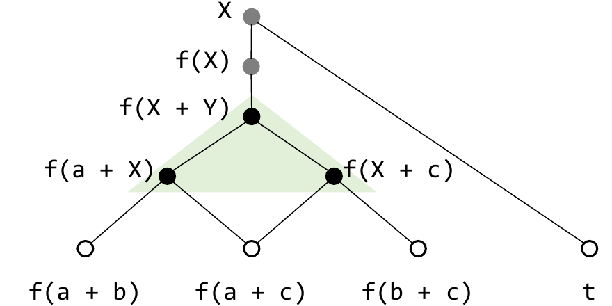

**Рисунок.** Слева: фрагмент решетки параметризации терма *t* = ⟨*f*(*a* + *b*), *f*(*a* + *c*), *f*(*b* + *c*)⟩; только закрашенные черные кружки соответствуют шаблонам-кандидатам: пустые кружки соответствуют менее чем двум термам, а серые кружки тривиальны. Справа: пример, когда недостаточно учитывать парные соединения для получения оптимального шаблона.


***Приближение.*** На практике вычисление набора $\mathcal{P}^2(t)$ возможно: хотя существует квадратичное число пар подтермов, большинство из них не имеют общего конструктора в корне, и, следовательно, их соединение тривиально $X$. Примером может служить объединение $t$ с любым из его подтермов в 7 (слева). К сожалению, обобщение паттернов из $\mathcal{P}^2(t)$ по решетке параметризации (7) обходится дорого. По этой причине `babble` использует приближение и просто использует $\mathcal{P}^2(t)$ в качестве набора кандидатов.

Такое приближение делает нашу генерацию шаблонов теоретически неполной. Рассмотрим шаблон $p \in \mathcal{P}(t)\setminus \mathcal{P}^2(t)$; Есть две причины, по которым нам может понадобиться $p$ при оптимальном сжатии $t$:

1. *нет* $p' \in \mathcal{P}^2(t)$ с тем же набором совпадений, что и $p$, или

2. есть такой $p'$, но у него *достаточно мало совпадений*, поэтому его больший размер не окупается.

Первый вид неполноты возникает, когда $p$ соответствует набору подтермов $t_1, \ldots, t_n$ ($n > 2$), соединение которых отличается от всех их парных объединений (в противном случае некоторые $t_i \sqcup t_j \in \mathcal{P}^2(t)$ также соответствовали бы всем $t_1, \ldots, t_n$). Пример показан на рисунке 7 (справа), где речь идет о трех подтермах: $f(a+a)$, $f(a+c)$ и $f(c+c)$. В этом случае оптимальное сжатие может использовать шаблон $f(X+Y)$ для перезаписи всех трех подтермов, но наше приближение будет включать только шаблоны $f(a+X)$, $f(X+X)$ и $f(X+c)$, каждый из которых может перезаписать только два из трех подтермов.

Второй вид неполноты возникает, когда существует $p' \in \mathcal{P}^2(t)$, который имеет тот же набор совпадений, что и $p$, несмотря на то, что он строго более конкретен, но использование $p'$ вместо $p$ по-прежнему не окупается. Чтобы понять, когда это произойдет, учтите разницу в стоимости между $p$ и $p'$, предполагая, что они оба используются для перезаписи одних и тех же подтермов $n$ (*т.е.* их стоимость save одинакова):
``` math
\begin{aligned}
  \mathsf{cost}(p', \overline{\sigma'}) - \mathsf{cost}(p, \overline{\sigma}) &= \mathsf{size}(p') - \mathsf{size}(p) + \sum_i (\mathsf{use}(p', \sigma'_i) - \mathsf{use}(p, \sigma_i))\\
  &= \mathsf{size}(p') - \mathsf{size}(p) + \sum_i (\mathsf{size}(\sigma'_i) - \mathsf{size}(\sigma_i))
\end{aligned}
```
Поскольку $p'$ строго более специфичен, чем $p$, мы знаем, что $\mathsf{size}(p') \geq \mathsf{size}(p)$, но все его замены $\sigma'_i$ должны быть строго меньше, чем $\sigma_i$. Следовательно, при достаточном количестве использований $p'$ обязательно станет более сжимающим, чем $p$; однако, когда вариантов использования всего несколько, $p$ может быть более оптимальным. Например, рассмотрим корпус $\langle \mathcal{C}[f(1,2,3)],  \mathcal{C}[f(4,5,6)]\rangle$, где $\mathcal{C}$ — некоторый достаточно большой контекст. Здесь более общий шаблон $p = \mathcal{C}[X]$ более оптимален, чем более конкретный $p' = \mathcal{C}[f(X,Y,Z)]$, поскольку в $\mathsf{size}(p') - \mathsf{size}(p) = 3$ каждое использование $p'$ обходится дешевле всего на один узел, а вариантов использования только два.

Несмотря на отсутствие теоретических гарантий полноты, мы утверждаем, что ограничение шаблонов-кандидатов до $\mathcal{P}^2(t)$ является разумным компромиссом. Обратите внимание, что приведенные выше контрпримеры весьма надуманны и перестают применяться, если корпус содержит достаточно много и достаточно разнообразных экземпляров шаблона (например, добавление $f(b,b)$ к первому корпусу приведет к появлению $f(X,Y)$ в $\mathcal{P}^2(t)$, а добавление всего лишь еще одного появления $p'$ во второй корпус сделает его таким же оптимальным, как $p$). Наша эмпирическая оценка подтверждает, что это приближение хорошо работает на практике.

## 4. Обучение библиотек по модулю эквациональной теории


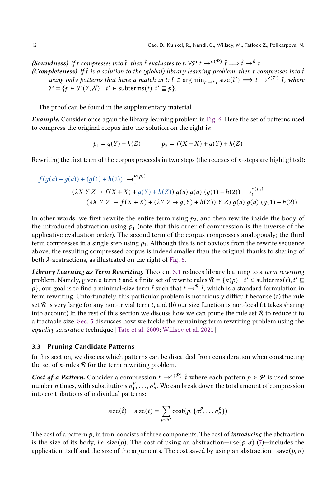

**Рисунок.** Синтаксис, метапеременные и обозначения компонентов e-графа. Здесь *s* ا *Σ* и *k* = arity(*s*).


***Электронные графики.*** Пусть $\mathcal{I}$ — счетный набор *идентификаторов e-классов*. *E-граф* $\mathcal{G}$ — это тройка $\langle C, M, r\rangle$, где $C$ — это набор *e-классов*, $M\colon \mathcal{I} \to C$ — это *карта e-классов*. а $r\in \mathcal{I}$ — это идентификатор корневого класса. *e-класс* $c \in C$ — это набор *e-узлов* $n \in N$, а e-node — это конструктор, применяемый к идентификаторам e-класса. Синтаксис e-классов и e-узлов обобщен в 8 (слева). E-граф должен удовлетворять *конгруэнтному инварианту*, который гласит, что e-граф не имеет двух одинаковых е-узлов (или, альтернативно, все e-классы не пересекаются).[^5]

*Обозначение* *e-графа* — набор термов, которые он представляет, — это обозначение его корневого e-класса $\llbracket M(r) \rrbracket$, где обозначение e-классов и e-узлов определяется взаимно-рекурсивно в 8 (справа). Обратите внимание, что обозначение может быть бесконечным, если в e-графе есть циклы. E-граф порождает отношение эквивалентности $\equiv^{\mathcal{G}}$, где $t_1 \equiv^{\mathcal{G}}t_2$ тогда и только тогда, когда существует e-класс $c \in C$ такой, что $t_1 \in \llbracket c \rrbracket \wedge t_2\in \llbracket c \rrbracket$.

Электронные графики предоставляют средства *извлечения* самого дешевого терма из e-класса в соответствии с некоторой функцией стоимости: $\mathsf{extract}_{\mathsf{cost}}(a) = \mathop{\mathrm{arg\,min}}_{t\in \llbracket M(a) \rrbracket} \mathsf{cost}(t)$. Если $\mathsf{cost}$ является *локальным*, что означает, что стоимость терма может быть вычислена на основе стоимости его непосредственных дочерних элементов, извлечение может быть эффективно выполнено с помощью жадного алгоритма, который рекурсивно извлекает лучший терм из каждого e-класса.

***Электронное сопоставление.*** Электронное сопоставление — это обобщение сопоставления с образцом для e-графов, где сопоставление e-класса $c$ с образцом $p$ дает набор *замен e-класса* $\theta\colon \mathcal{X}\to \mathcal{I}$, так что ${\theta}({p})$ является «подграфом» $c$. Чтобы формализовать это понятие, мы вводим *частичные термины* $\pi \in \mathcal{T}(\Sigma,\mathcal{I})$, которые представляют собой термины, листьями которых могут быть идентификаторы e-класса (или, альтернативно, шаблоны с идентификаторами e-класса для переменных). Отношение включения ${\pi} \prec {a}$ для некоторого идентификатора e-класса $a$ определяется следующим образом:
``` math
{a} \prec {a} \quad\quad\quad
{s(\pi_1, \ldots, \pi_k)} \prec {a}\ \text{iff}\ s(a_1, \ldots, a_k) \in M(a) \wedge {\pi_i} \prec {a_i}
```
Согласно этому определению, шаблон $p$ соответствует e-классу $a$, $a \sqsubseteq p$, если существует замена e-класса $\theta$, такая как ${{\theta}({p})} \prec {a}$. Совокупность таких замен обозначим как $\mathsf{matches}(a,p)$.

***Переписывание и насыщение равенствами.*** Насыщение равенства (EqSat) (Tate et al. 2009; Willsey et al. 2021) принимает в качестве входных данных терм $t$ и набор уравнений, которые вызывают отношение эквивалентности $\equiv$, и создает e-граф $\mathcal{G}$ такой, что $\llbracket \mathcal{G} \rrbracket = \{t' \mid t \equiv t'\}$ и $t \equiv t'$ если только $t \equiv^{\mathcal{G}}t'$. Основная идея EqSat состоит в том, чтобы преобразовать уравнения в правила перезаписи и применить их к e-графу неразрушающим образом: так, чтобы исходный терм и переписанные термины были представлены в одном и том же e-классе. Применение правила перезаписи $p_1 \Rightarrow p_2$ к e-классу $a$ работает следующим образом: для каждого $\theta \in \mathsf{matches}(a,p_1)$ мы получаем переписанный частичный терм $\pi' = {\theta}({p_2})$, а затем добавляем этот частичный терм к тому же e-классу $a$, восстанавливая инвариант конгруэнтности (*т.е.* объединяя e-классы, которые теперь имеют идентичные e-узлы).

### 4.1. Алгоритм верхнего уровня


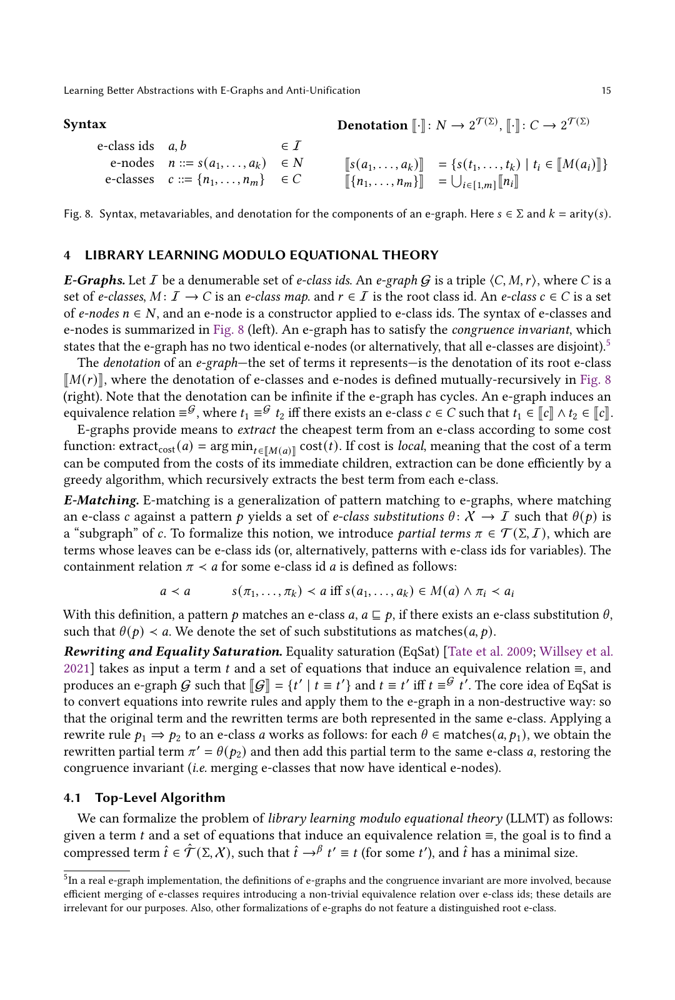

**Рисунок.** Алгоритм LLMT верхнего уровня.


Мы можем формализовать задачу *обучения библиотек по модулю эквациональной теории* (LLMT) следующим образом: учитывая терм $t$ и набор уравнений, которые вызывают отношение эквивалентности $\equiv$, цель состоит в том, чтобы найти сжатый терм $\hat{t} \in \hat{\mathcal{T}}(\Sigma,\mathcal{X})$, такой, что $\hat{t} \rightarrow^{\beta}t' \equiv t$ (для некоторого $t'$) и $\hat{t}$ имеет минимальный размер.

Наш алгоритм верхнего уровня `LLMT` изображен на рис. 9. Этот алгоритм принимает в качестве входных данных исходный корпус $t$ и эквациональную теорию, представленную в виде набора требуемых правил $\mathcal{R}_\equiv$ (еще одним входным параметром алгоритма является максимальный размер библиотеки; этот параметр введен ради эффективности, как мы объясняем в разделе 5). В качестве первого шага (строки 4–5) `LLMT` применяет EqSat для получения e-графа $\mathcal{G}$, который представляет все термины $t'$, такие как $t' \equiv t$. Это сводит задачу LLMT к обучению библиотеки по e-графу: *т.е.* цель состоит в том, чтобы найти сжатый терм минимального размера $\hat{t}$, такой, чтобы $\hat{t} \rightarrow^{\beta}t'$ для некоторого $t' \in \llbracket \mathcal{G} \rrbracket$. Как и в пункте 3, мы применяем подход к этой проблеме на основе шаблонов, то есть мы выбираем набор $\mathcal{P}$ из *шаблонов-кандидатов*, а затем выполняем перезапись сжатия с использованием этих шаблонов.

Остальная часть алгоритма разделена на две фазы: *генерация кандидата* и *отбор кандидата*. Генерация кандидатов (строки 8–10) сначала вычисляет набор шаблонов кандидатов $\mathcal{P}$, используя механизм антиунификации, расширенный до e-графов. Затем он создает правило сжатия (правило $\kappa$, см. 3) из каждого шаблона-кандидата и еще раз применяет EqSat для получения нового e-графа $\mathcal{G}'$. Этот новый e-граф представляет все возможные способы сжатия термов из $\mathcal{G}$ с использованием шаблонов из $\mathcal{P}$. Наконец, на этапе выбора кандидатов (строки 13–15) выбирается оптимальное подмножество правил сжатия $\mathcal{R}'$, строится e-граф $\mathcal{G}''$, который представляет все возможные сжатия с использованием только выбранных правил сжатия, и, наконец, извлекается наименьший сжатый терм из этого e-графа.

Оставшаяся часть этого раздела посвящена генерации кандидатов посредством антиунификации e-графов (строка 8). Функции выбора кандидатов `select\_library` и `extract` обсуждаются в разделе 5.

### 4.2. Генерация кандидатов с помощью антиунификации e-графов

Целью генерации кандидатов является поиск набора шаблонов, полезных для сжатия. После обсуждения в разделе 3 мы ограничим наше внимание шаблонами $\mathsf{AU}(t_1, t_2)$, где $t_1$ и $t_2$ являются подтермами некоторого $t \in \llbracket \mathcal{G} \rrbracket$. Наивный подход состоит в том, чтобы перечислить все такие $t$ и для каждого выполнить антиунификацию для всех пар подтермов; в лучшем случае это неоптимально, а в худшем невозможно (когда $\llbracket \mathcal{G} \rrbracket$ бесконечен). Следовательно, в этом разделе мы покажем, как вычислить конечный набор шаблонов-кандидатов непосредственно на e-графе, не отбрасывая никаких оптимальных шаблонов.

***Антиунификация E-класса.*** Давайте сначала рассмотрим антиунификацию двух e-классов, $\mathsf{AU}(a,b)$, который принимает в качестве входных данных идентификаторы e-классов $a$ и $b$ и возвращает набор шаблонов. Определим $\mathsf{AU}(a,b) = \mathsf{AU}(\epsilon \vdash a,b)$, где $\mathsf{AU}(\Gamma \vdash a,b)$ — вспомогательная функция, дополнительно учитывающая *контекст* $\Gamma$. Контекст — это список пар e-классов, которые были посещены при вычислении AU, и необходим для предотвращения бесконечной рекурсии в случае циклов в e-графе.


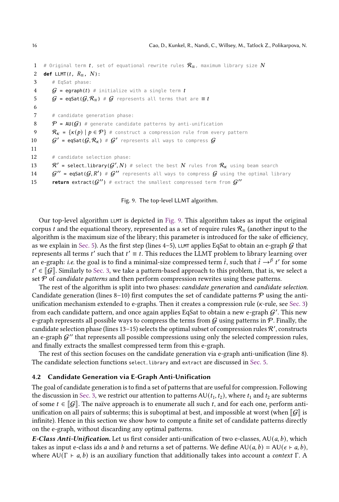

**Рисунок.** Антиунификация E-класса определяется как две взаимно-рекурсивные функции e-узлов и идентификаторов e-класса.


10 определяет эту операцию с использованием двух взаимно рекурсивных функций, которые антиунифицируют e-классы и e-узлы. Обратите внимание, что AU e-узла всегда вызывается в непустом контексте. Первое уравнение антиунифицирует два e-узла с помощью одного и того же конструктора: в этом случае мы рекурсивно антиунифицируем их дочерние e-классы и возвращаем векторное произведение результатов. Второе уравнение применимо к e-узлам с разными конструкторами: как и в случае с термом AU, это приводит к переменной шаблона. Приятным побочным эффектом работы с e-графами является то, что нам не нужно отслеживать антиподстановку, чтобы гарантировать, что каждая пара подтермов отображается в одну и ту же переменную: поскольку любые повторяющиеся термины представлены одним и тем же e-классом, мы можем просто использовать идентификаторы e-класса $a$ и $b$ в имени шаблонной переменной $X_{a,b}$.

Второй блок уравнений определяет антиунификацию e-классов (давайте сначала проигнорируем доминирующий , который будет объяснен позже). Первое уравнение применяется, когда $a$ и $b$ уже посещены: в этом случае мы разрываем цикл и возвращаем пустой набор. В противном случае последнее уравнение антиунифицирует все пары e-узлов из двух e-классов в обновленном контексте и объединяет результаты. Обратите внимание, что это добавит переменную шаблона, если только все e-узлы в обоих e-классах не имеют один и тот же конструктор; мы опустили эту деталь в пункте 2 для простоты, но она реализована в `babble` и часто дает более оптимальные шаблоны. Например, рассмотрим антиунификацию $c_1$ и $c_2$ из 4 (справа): хотя они имеют общий конструктор `scale`, $X$ на самом деле является лучшим шаблоном для абстрагирования этих двух e-классов, чем $\texttt{scale}\  X\ Y$, поскольку общий размер фактических аргументов шаблона $X$ ($\texttt{side}(6)$ и $\texttt{scale}(\texttt{repRot}(\texttt{side}(8),\ 8,\ 2\pi/8),\ 2)$) такой же, как и для шаблона $\texttt{scale}\  X\ Y$ ($\texttt{side}(6)$, $1$, $\texttt{repRot}(\texttt{side}(8),\ 8,\ 2\pi/8)$ и $2$), а сам шаблон $X$ меньше. Это происходит потому, что класс $c_1$ представляет несколько разных термов, и терм «совместимый с» $X$ в данном случае меньше, чем терм «совместимый с» $\texttt{scale}\  X\ Y$.

***Доминантные шаблоны.*** Напомним, что $\mathsf{AU}(a,b)$ создает шаблоны с именами переменных $X_{a_i,b_i}$, которые записывают идентификаторы e-классов, которые они абстрагируют; давайте будем называть такой шаблон $p$ *уникально совпадающим* и определим $\theta_l(p) = \{\overline{X_{a_i,b_i} \mapsto a_i}\}$ и $\theta_r(p) = \{\overline{X_{a_i,b_i} \mapsto b_i}\}$; эти замены обязательно находятся среди $\mathsf{matches}(a,p)$ и $\mathsf{matches}(b,p)$ соответственно. Учитывая два уникально совпадающих шаблона $p_1,p_2 \in \mathsf{AU}(a,b)$, мы говорим, что $p_1$ *доминирует* $p_2$ в контексте $(a,b)$, если (1) $\mathsf{vars}(p_1) \subseteq \mathsf{vars}(p_2)$ и (2) $\mathsf{size}(p_1) \leq \mathsf{size}(p_2)$. Мы можем показать, что если $p_1$ доминирует над $p_2$, то мы можем безопасно исключить $p_2$ из набора шаблонов-кандидатов. Во-первых, поскольку $p_1$ не больше $p_2$, определение его абстракции $\lambda$ также не больше. Во-вторых, учитывая терм $t_a\in \llbracket a \rrbracket$, сжатие этого терма с помощью $p_1$ вместо $p_2$ требует выбора фактических аргументов из $\mathsf{range}(\theta_l(p_1))$ и $\mathsf{range}(\theta_l(p_2))$; поскольку первое является подмножеством второго, первое приложение всегда можно сделать не больше (симметричный аргумент применим для $t_b\in \llbracket b \rrbracket$).

Следовательно, достаточно, чтобы $\mathsf{AU}(a,b)$ возвращал только набор *доминантных шаблонов* (*т.е.* шаблон, в котором доминирует любой шаблон в наборе, может быть отброшен). Именно это делает функция $\mathsf{dominant}$ в последнем уравнении из 10. Этот метод сокращения особенно полезен при наличии эквациональных теорий. Предположим, что наша теория содержит уравнение $X + Y \equiv Y + X$, а исходный терм $t$ содержит подтермы $1 + 2$ и $3 + 1$. После насыщения e-граф будет представлять $1 + 2$ и $2 + 1$ в одном e-классе $a$, а также $3 + 1$ и $1 + 3$ в другом e-классе $b$; $\mathsf{AU}(a,b)$ тогда создаст оба шаблона $X + 1$ и $1 + X$, но явно избыточно иметь оба, поскольку они соответствуют одним и тем же e-классам с одинаковыми заменами $\theta$. Отсечение доминирующих шаблонов устранит один из них.

***Избежание циклов.*** Интересно, что то же самое понятие доминирующих шаблонов объясняет, почему нам не нужно следовать циклам в e-графе при вычислении $\mathsf{AU}(a,b)$ или, альтернативно, почему конечного набора шаблонов-кандидатов достаточно для сжатия любого терма в $\llbracket \mathcal{G} \rrbracket$, даже если этот набор бесконечен. Удаление первого уравнения, заключающегося в сокращении циклов, может привести только к решениям $p'$ вида
``` math
p' = {[X \mapsto p]}({q})
```
где $p \in \mathsf{AU}(a,b)$ — другое решение, а $q$ — некоторый контекст, добавленный циклом. Понятно, что любой такой $p'$ доминирует над $p$ и, следовательно, может быть отброшен.

***Антиунификация e-графа.*** Алгоритм $\mathsf{AU}(a,b)$ вычисляет набор шаблонов, которые можно использовать для сжатия термов, представленных e-классами $a$ и $b$. Однако наша конечная цель — вычислить шаблоны-кандидаты для абстрагирования *всех подтермов* некоторого $t \in \llbracket \mathcal{G} \rrbracket$. Самый простой способ добиться этого — применить $\mathsf{AU}(a,b)$ ко всем парам e-классов в $\mathcal{G}$. Однако мы можем добиться большего: некоторые пары e-классов не нужно учитывать, поскольку они не могут встречаться вместе в одном терме $t$. В качестве примера рассмотрим следующий e-граф с $\mathcal{I} = \mathbb{N}$ и $r = 0$:
``` math
0 \mapsto \{f(1),g(2)\}\quad 1\mapsto\{g(3)\} \quad 2\mapsto \{f(3)\} \quad 3\mapsto \{a\}
```
Такой e-граф можно получить, например, переписав терм $f(g(a))$ с помощью уравнения $f(g(X)) \equiv g(f(X))$. В этом e-графе e-классы $1$ и $2$ (представляющие $g(a)$ и $f(a)$ соответственно) явно не могут *совпадать* в одном терме: поскольку e-граф представляет только два терма, $f(g(a))$ и $g(f(a))$.

Чтобы формализовать эту интуицию, мы определяем отношение совместного появления между двумя идентификаторами e-класса следующим образом. E-класс $a$ является *родным* $b$, если существует e-узел, у которого и $a$, и $b$ являются дочерними. E-класс $a$ является *предком* $b$, если $a = b$ или $b$ является дочерним элементом некоторого e-узла $n \in M(c)$, а $a$ является предком $c$; $a$ является *собственным предком* $b$, если $a$ является предком $b$ и $a \neq b$. Два e-класса $a$ и $b$ *совпадают*, если (1) один из них является собственным предком другого, или (2) у них есть предки, которые являются братьями и сестрами.

Наконец, чтобы вычислить набор $\mathsf{AU}(\mathcal{G})$ всех шаблонов-кандидатов для e-графа $\mathcal{G}$, `LLMT` сначала вычисляет отношение совместного появления между всеми e-классами в $\mathcal{G}$, а затем вычисляет $\mathsf{AU}(a,b)$ для всех пар e-классов, которые встречаются одновременно. Как упоминалось в пункте 2, мы используем алгоритм динамического программирования, который запоминает результаты $\mathsf{AU}(a,b)$, чтобы избежать повторных вычислений.

## 5. Отбор кандидатов через извлечение из e-графа

После создания абстракций-кандидатов алгоритм `LLMT` вызывает `select_library` для выбора подмножества шаблонов-кандидатов, которые лучше всего можно использовать для сжатия входного корпуса. В этом разделе описывается наш подход к выбору оптимальной библиотеки, получившей название *целевое устранение общих подвыражений*.

***Выбор библиотеки как извлечение e-графа.*** Напомним, что выбор кандидатов начинается с e-графа $\mathcal{G}'$, который представляет все способы сжатия исходного корпуса и его эквивалентных термов с использованием шаблонов кандидатов $\mathcal{P}$. Мы будем называть подмножество $\mathcal{L}\subset \mathcal{P}$ *библиотекой*. Оптимальный размер e-класса $c$, сжатого с помощью $\mathcal{L}$, можно вычислить как сумму размеров (1) наименьшего терма $t\in \llbracket c \rrbracket$, используя только библиотечные функции из $\mathcal{L}$ и где абстракции $\lambda$ не учитываются при расчете размера $t$, и (2) наименьшей версии каждого $p \in \mathcal{L}$. Обратите внимание, что стоимость определения абстракции в $\mathcal{L}$ учитывается только один раз и что абстракции в $\mathcal{L}$ могут использоваться для сжатия других абстракций в $\mathcal{L}$. Наша цель — найти $\mathcal{L}$ такой, чтобы корневой e-класс, сжатый с помощью $\mathcal{L}$, имел наименьший размер.

Учитывая *конкретную* библиотеку, мы можем найти размер наименьшего терма посредством относительно простого обхода e-графа сверху вниз. Следовательно, наивным подходом к выбору библиотеки было бы перебор всех подмножеств $\mathcal{P}$ и выбор того, которое дает наименьший терм в корне. К сожалению, этот подход становится трудноразрешимым по мере роста размера $\mathcal{P}$.


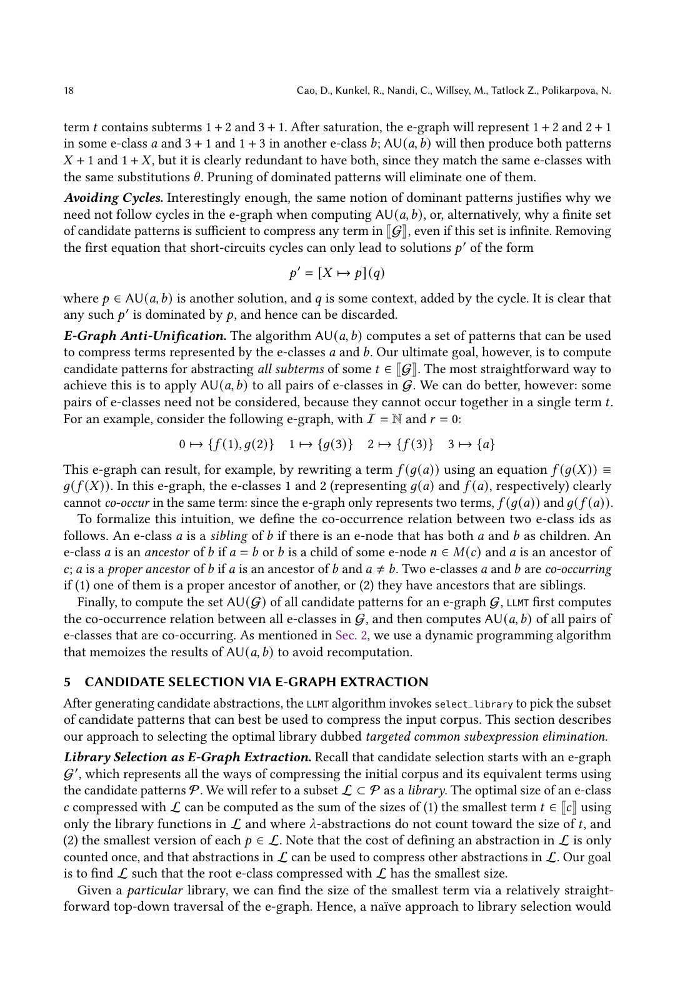

**Рисунок.** Распространение набора затрат, определяемое как две взаимно рекурсивные функции. Синий текст соответствует оптимизации уменьшения частичного порядка, а красный текст соответствует лучевой аппроксимации. top_k(*S*, *K*) — вспомогательная функция, которая возвращает верхние элементы *K* из отсортированного набора *S*.


***Использование частичной общей структуры.*** Вместо этого `babble` выбирает оптимальную библиотеку, используя восходящий алгоритм динамического программирования. С этой целью он связывает каждый e-узел и e-класс с *набором стоимости*, который представляет собой набор пар $(\mathcal{L}, u)$, где $\mathcal{L}$ — это библиотека, а $u$ — это *стоимость использования* этой библиотеки, *т. сам $\mathcal{L}$). Наборы затрат распространяются вверх по e-графу с использованием правил, показанных на рис. 11. Базовым случаем является нулевой e-узел $s()$, который не может использовать какие-либо библиотечные функции и размер которого всегда равен $1$. Для e-узла, имеющего дочерние узлы, `babble` вычисляет произведение $\mathsf{cross}$ по наборам затрат всех его дочерних e-классов. Наконец, для e-узла приложения $(\lambda \overline{X} \ \to\ a)\ b$ набор стоимости *должен включать* библиотечную функцию $a$ (в дополнение к некоторой комбинации библиотек из наборов стоимости $a$ и $b$); Обратите внимание, что стоимость использования узла абстракции включает только стоимость использования $b$, поскольку тела абстракции исключаются из стоимости использования.

Чтобы вычислить набор затрат e-класса, `babble` объединяет наборы затрат всех его e-узлов. Однако если делать это наивно, размер набора затрат будет расти в геометрической прогрессии. Чтобы смягчить это, мы определяем *частичное сокращение заказов* ($\mathsf{reduce}$), которое сокращает только доказуемо неоптимальные наборы затрат. Учитывая две пары $(\mathcal{L}_1, u_1)$ и $(\mathcal{L}_2, u_2)$ в наборе стоимости e-класса, если $\mathcal{L}_1 \subset \mathcal{L}_2$ и $u_1 \leq u_2$, то $\mathcal{L}_2$ включается в состав $\mathcal{L}_1$ и может быть удален из набора стоимости интуитивно, поскольку $\mathcal{L}_1$ может сжать этот e-класс еще лучше и с меньшим количеством библиотечных функций. На практике эта оптимизация сокращает библиотеки с избыточной абстракцией, где две разные абстракции могут использоваться для сжатия одних и тех же подтермов.

***Лучевое приближение.*** Даже при частичном уменьшении порядка вычисление набора затрат для каждого e-узла и e-класса может вырасти в геометрической прогрессии. Чтобы смягчить это, `babble` предоставляет возможность ограничить как *размер каждой библиотеки* внутри набора стоимости, так и *размер набора стоимости*, хранящегося для каждого e-класса. В результате получается алгоритм в стиле *лучевого поиска*, где набор стоимости каждого e-класса равен $\mathsf{prune}$, как показано на рисунке 11. Эта операция сокращения сначала отфильтровывает библиотеки, которые имеют более $N$ шаблонов, затем ранжирует остальные по общей стоимости (*т. е.* сумме стоимости использования и размера библиотеки) и, наконец, возвращает лучшие библиотеки $K$ из этого набора.

## 6. Оценка

Мы оценили `babble` и лежащий в его основе алгоритм LLMT с помощью двух количественных исследовательских вопросов и третьего качественного:

1. Может ли `babble` сжимать программы лучше, чем современный инструмент для изучения библиотек?

2. Важны ли основные методы LLMT (антиунификации и эквациональные теории) для производительности алгоритма?

3. Имеют ли функции, которые изучает `babble`, интуитивный смысл?

***Выбор эталонного теста.*** Мы используем два набора тестов для оценки `babble`, оба показаны на рисунке 2. Первый набор основан на работе DreamCoder (Эллис и др., 2021) и доступен в виде общедоступного репозитория (Бауэрс, 2022). DreamCoder — это современный инструмент обучения библиотекам, и использование этих тестов позволяет нам проводить прямое сравнение. Тесты DreamCoder разделены на пять доменов (каждый со своим DSL); мы выбрали две области — «Список» и «Физика», которые мы понимали лучше всего, чтобы добавить эквациональную теорию.

Второй пакет тестов, называемый 2D CAD, разработан Wong et al. (2022). В данной работе собран большой набор программ в графическом DSL с целью изучения связей между сгенерированными объектами и их описаниями на естественном языке. В разделе «Чертежи» этого набора данных содержится 1000 программ, разделенных на четыре поддомена (перечислены в разделе 2) по 250 программ в каждом.

Мы запускали `babble` во всех тестах на процессоре AMD EPYC 7702P с частотой 2,0 ГГц. Каждый тест проводился на одном ядре. Результаты DreamCoder были взяты из репозитория тестов (Bowers 2022); DreamCoder работал на 8 ядрах процессора AMD EPYC 7302 с частотой 3,0 ГГц.

**Таблица 1.** Домены бенчмарков выбраны из двух предыдущих работ: DreamCoder (Ellis et al., 2021) и 2D CAD (Wong et al., 2022). Каждый домен DreamCoder содержит несколько бенчмарков; каждый домен 2D CAD содержит один большой бенчмарк. Для части доменов `babble` дополнительно получает эквациональную теорию; последний столбец показывает число уравнений.

| Набор | Домен | Бенчмарков | Уравнений |
| --- | --- | ---: | ---: |
| DreamCoder | List | 59 | 14 |
| DreamCoder | Physics | 18 | 8 |
| DreamCoder | Text | 66 | - |
| DreamCoder | Logo | 12 | - |
| DreamCoder | Towers | 18 | - |
| 2D CAD | Nuts & Bolts | 1 | 7 |
| 2D CAD | Vehicles | 1 | 9 |
| 2D CAD | Gadgets | 1 | 17 |
| 2D CAD | Furniture | 1 | 9 |


### 6.1. Сравнение с DreamCoder


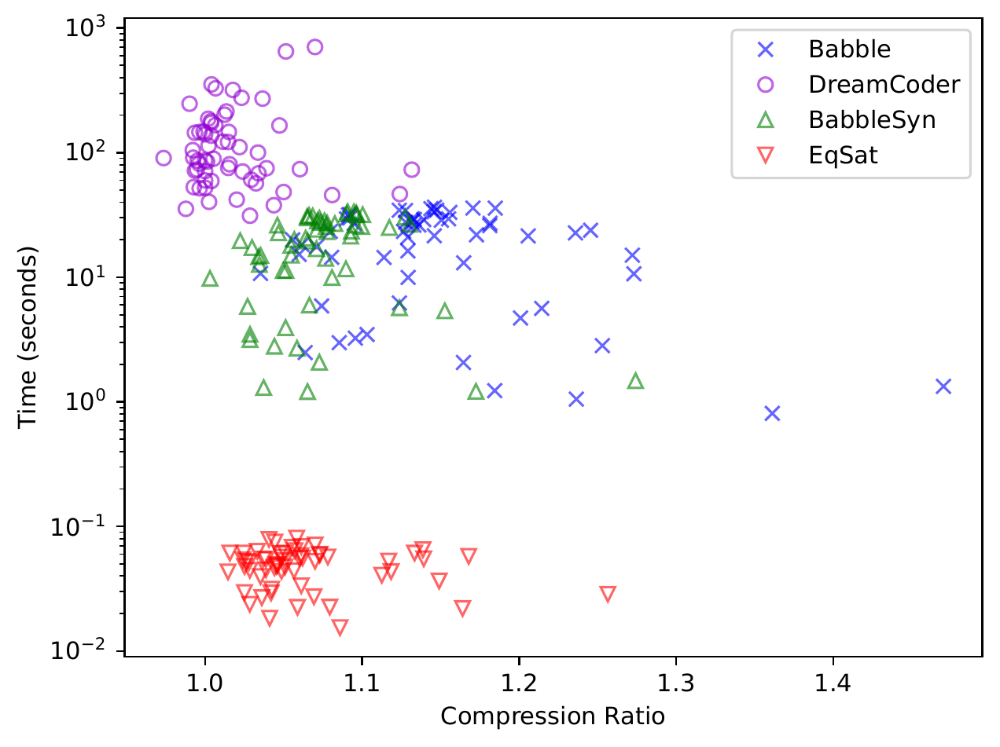

**Рисунок.** Список доменов


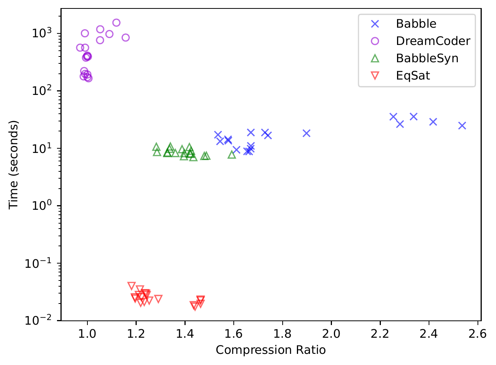

**Рисунок.** Область физики


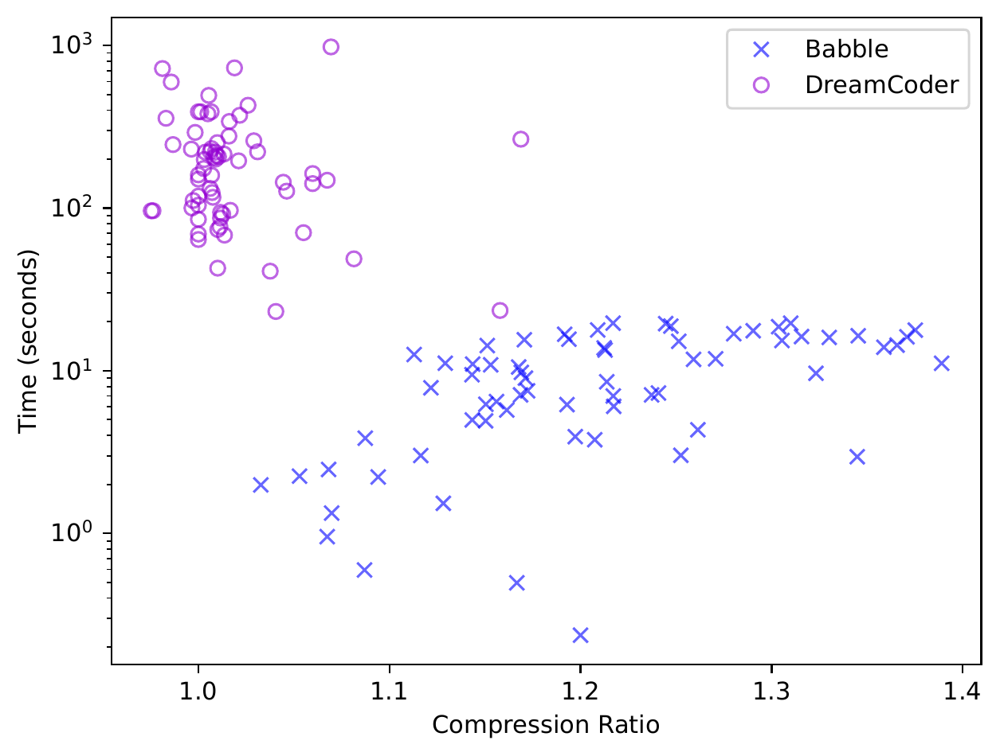

**Рисунок.** Текстовый домен


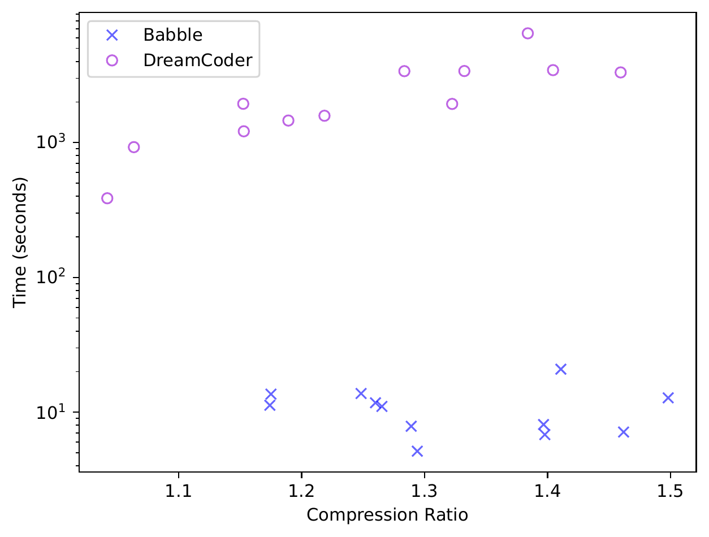

**Рисунок.** Домен логотипа


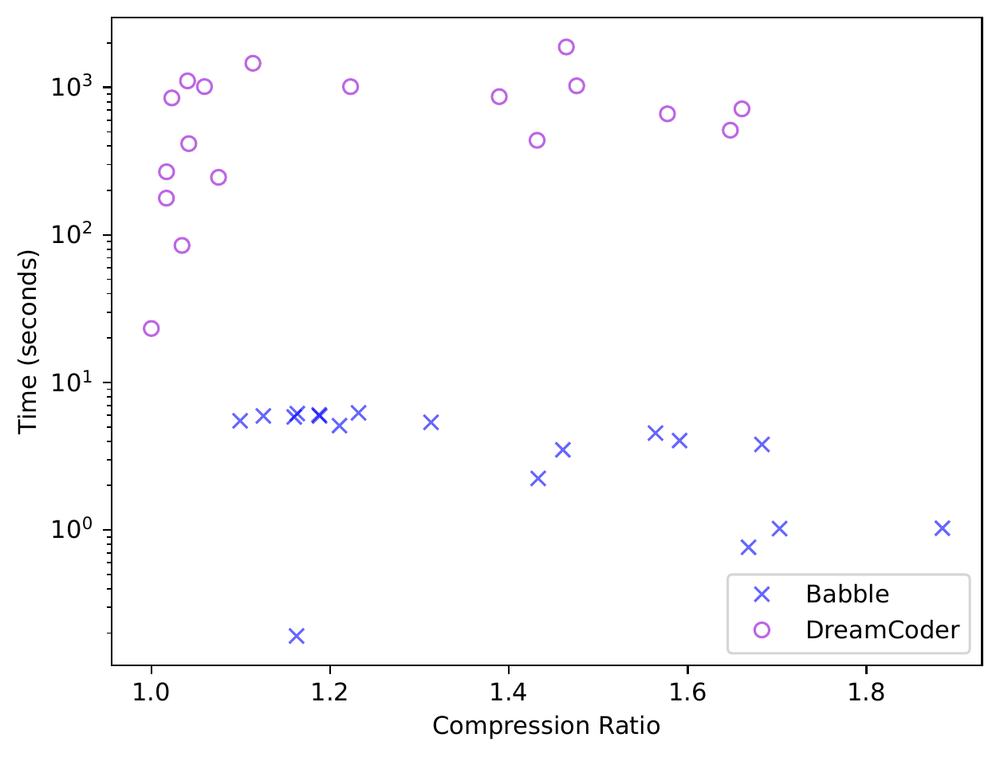

**Рисунок.** Домен Башни

**Рисунок.** `babble` стабильно достигает лучших коэффициентов сжатия, чем DreamCoder, на бенчмарках из доменов DreamCoder, и делает это на 1-2 порядка быстрее. Каждый маркер показывает коэффициент сжатия (ось X) и время выполнения (ось Y) одного бенчмарка. Ниже и правее - лучше. В доменах, где `babble` получает эквациональную теорию (List и Physics), дополнительные маркеры показывают чисто синтаксический вариант ``babble`Syn` и вариант `EqSat`, где используется только насыщение равенствами без обучения библиотек.

Чтобы ответить [rq:1], мы сравниваем его с современным инструментом DreamCoder (Эллис и др., 2021) по его собственным критериям. Тесты DreamCoder подходят для его рабочего процесса; в то время как входные данные для задачи обучения библиотек концептуально представляют собой набор программ (или просто одну большую программу), каждый вход в DreamCoder представляет собой набор *групп* программ. Каждая группа представляет собой набор программ, которые являются результатом одной и той же задачи синтеза программ (из более ранней части конвейера DreamCoder). При сжатии программы посредством обучения библиотек DreamCoder минимизирует стоимость созданной программы путем объединения наиболее сжатой программы из каждой группы, другими словами:
``` math
\sum_{\textsf{group $g$}}
  \min_{\textsf{program $p \in g$}}
  \textsf{cost}(p)
```
DreamCoder использует этот подход, чтобы предоставить своему библиотечному компоненту обучения множество вариантов одной и той же программы, чтобы ввести более общую структуру между программами решения различных задач синтеза.

Чтобы реализовать тесты DreamCoder в `babble`, мы используем e-граф, чтобы отразить понятие вариантов программы в группе. Поскольку каждая программа в группе является результатом одной и той же задачи синтеза, `babble` считает их эквивалентными и помещает их в один и тот же e-класс.

***Результаты.*** Мы запустили `babble` на пяти доменах из набора тестов DreamCoder. Результаты показаны на рисунке 14. Таким образом, `babble` стабильно достигает более высоких коэффициентов сжатия, чем DreamCoder, в тестах из доменов DreamCoder, и делает это на 1–2 порядка быстрее.

***Роль теории уравнений.***  Чтобы ответить на [rq:2], мы снова обратимся к тестам DreamCoder, сосредоточив внимание на областях, в которых мы предоставили `babble` эквациональную теорию: список и физика. В этих доменах мы запускали `babble` в двух дополнительных конфигурациях:

- «`babble`Syn» игнорирует эквациональную теорию, просто изучая синтаксическую библиотеку.

- «EqSat» просто оптимизирует программу, используя насыщение равенствами с переработками эквациональной теории. Эта конфигурация *не* выполняет какое-либо обучение библиотек.

12 и 13 показаны результаты для этих дополнительных конфигураций, а также DreamCoder и обычной конфигурации `babble`. Все конфигурации `babble` основаны на целевом исключении подвыражений для выбора окончательной изученной библиотеки. Конфигурация «EqSat», что неудивительно, очень быстрая, но выполняет относительно небольшое сжатие, поскольку не изучает никакие библиотечные абстракции. Конфигурация «`babble`Syn» действительно сжимает входные данные, фактически она все же лучше, чем DreamCoder в обеих областях. Однако добавление эквациональной теории (маркеры «babble» на графиках) значительно улучшает сжатие и увеличивает относительно небольшое время выполнения, в пределах порядка величины.

### 6.2. Крупномасштабные бенчмарки 2D CAD

**Таблица 2.** Результаты запуска `babble` на четырех крупных примерах из набора 2D CAD, без эквациональной теории и с ней. В строках указаны размер входного и выходного AST, коэффициент сжатия (CR) и время работы `babble` в секундах.

| Бенчмарк | Размер входа | Без уравнений: выход | Без уравнений: CR | Без уравнений: время, с | С уравнениями: выход | С уравнениями: CR | С уравнениями: время, с |
| --- | ---: | ---: | ---: | ---: | ---: | ---: | ---: |
| Nuts & Bolts | 19009 | 2059 | 9.23 | 18.74 | 1744 | 10.90 | 40.75 |
| Vehicles | 35427 | 6477 | 5.47 | 79.50 | 5505 | 6.44 | 78.03 |
| Gadgets | 35713 | 6798 | 5.25 | 75.07 | 5037 | 7.09 | 82.29 |
| Furniture | 42936 | 10539 | 4.07 | 133.25 | 9417 | 4.56 | 110.00 |
| Nuts & Bolts (clean) | 18259 | 2215 | 8.24 | 18.12 | 1744 | 10.47 | 40.91 |


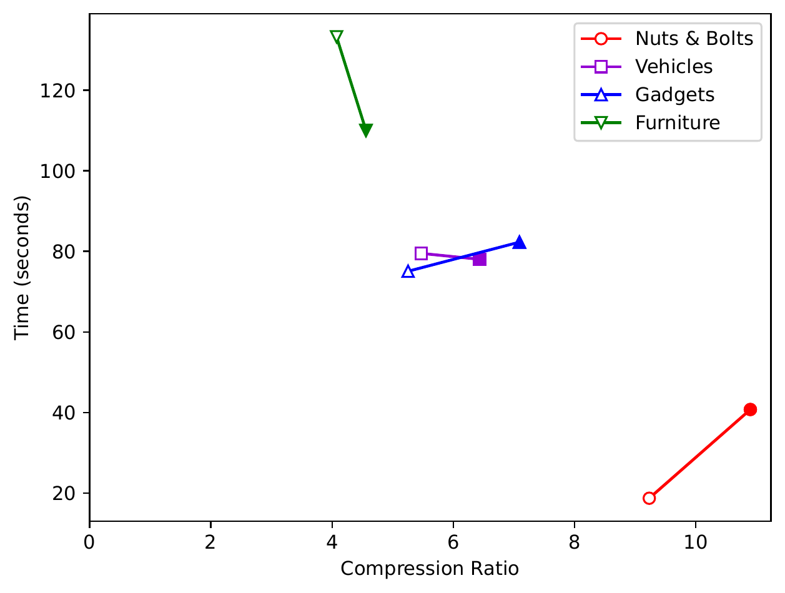

**Рисунок.** Данные из 3 на точечной диаграмме. Каждый сегмент линии показывает степень сжатия и время выполнения для области без (пустой маркер) и с (сплошной маркер) эквациональной теорией. Использование эквациональной теории улучшает сжатие во всех случаях, а в двух случаях даже сокращает время выполнения.


Предыдущий раздел продемонстрировал, что производительность `babble` намного превосходит state of the art. В этом разделе мы представляем и обсуждаем результаты запуска `babble` на тестах из области 2D CAD. Эти критерии, взятые из Wong et al. (2022), значительно больше (примерно в 10–100 раз), чем данные из набора данных DreamCoder, и недоступны для DreamCoder.

***Количественные результаты.*** 3 и 15 показывают результаты запуска `babble` на тестах из области 2D CAD. Рисунок 15 проясняет два наблюдения. Во-первых, что актуально для [rq:2], добавление эквациональной теории улучшило все четыре показателя (сплошной маркер всегда находится справа от пустого маркера). Во-вторых, что, возможно, удивительно, эквациональные теории иногда могут ускорить `babble`! Это согласуется с предыдущими наблюдениями о насыщении равенства (Willsey et al. 2021): хотя насыщение равенством обычно увеличивает e-граф, иногда оно может объединить два соответствующих e-класса в один и уменьшить объем работы, которую должна выполнить какая-либо операция над e-графом.

Мы также заметили, что набор данных «Гайки и болты» содержит несколько избыточных преобразований, таких как «масштабирование на 1», представленное в текущем примере 2. Эти избыточности могут быть полезны для поиска абстракций в отсутствие эквациональной теории. Однако они не должны требоваться в `babble`, поскольку LLMT может вводить избыточность там, где это необходимо. Поэтому мы удалили все существующие избыточные преобразования из Nuts and Bolts и запустили `babble` на преобразованном наборе данных. Результаты находятся в последней строке из 3. В модифицированном наборе данных `babble` достигает идентичного сжатия при использовании эквациональной теории, но без уравнений он работает хуже, чем в немодифицированном наборе данных.

***Качественная оценка.*** 


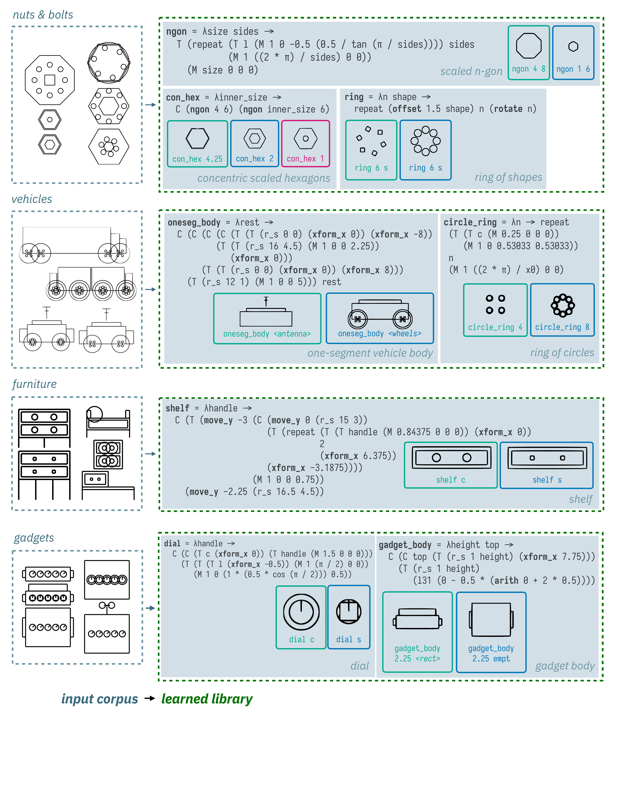

**Рисунок.** Подборка оцененных программ из каждой области набора данных 2D CAD, а также набор функций, которые `babble` изучает в течение первых десяти раундов для каждой области. Функции, выделенные жирным шрифтом, представляют изученные абстракции. Обратите внимание, что на этом рисунке используется конкретный синтаксис из набора данных 2D CAD; она аналогична упрощенной форме, показанной в обзоре. Для наглядности мы назвали изученные функции и их параметры.


16 показан пример абстракций, обнаруженных `babble` в ходе тестов 2D CAD. Мы запустили `babble` на каждом из тестов и применили изученные абстракции к нескольким программам ввода, чтобы визуализировать их использование. На вопросы об удобстве использования и читабельности изученных библиотек трудно ответить без тщательного изучения пользователей, которое мы оставляем для будущей работы. Тем не менее, 16 показывает, что `babble` идентифицирует общие структуры, схожие в разных тестах, что упрощает повторное использование и интерпретацию результатов.

Во-первых, мы вернемся к примеру «Гайки и болты» из 1:16, который показывает, что `babble` обучает абстракцию масштабированного многоугольника (`ngon`), которая применима к нескольким программам в наборе данных. Мы также видим, что `babble` последовательно находит аналогичную абстракцию, представляющую «кольцо форм» как для гаек и болтов, так и для транспортных средств. Наконец, как показывает пример с гаджетами, `babble` находит абстракции как для всей модели, так и для ее компонентов. В данном случае была изучена функция `gadget_body`, которая абстрагирует всю внешнюю фигуру, а также `dial`, которая абстрагирует маркеры внешней фигуры.

## 7. Связанные работы

babble вдохновлен работой по изучению библиотек, в частности направлением работы DreamCoder, а также синтезом и декомпиляцией программ на основе насыщения равенствами.

***DreamCoder.*** DreamCoder (Эллис и др., 2021 г.) — это программный синтезатор, который обучает библиотеку абстракций на основе решений набора связанных задач синтеза. Библиотека предназначена для решения других подобных задач синтеза. DreamCoder использует пространства версий (Mitchell 1977; Lau et al. 2001) для компактного хранения большого набора программ и использует идеи из e-графов (например, e-matching), но только для изучения пространства рефакторинга исходной программы с использованием библиотек-кандидатов, а не для обеспечения устойчивости обучения к синтаксическим вариациям. Наша оценка показывает, что `babble` может находить более оптимальные абстракции быстрее, чем DreamCoder.

DreamCoder положил начало нескольким направлениям последующей работы, направленной на повышение эффективности процедуры обучения библиотеки и качества изучаемых абстракций. Один из них принадлежит Wong et al. (2021), в котором для управления обучением библиотек используются аннотации на естественном языке и нейронная сеть. Еще один — Stitch (Bowers et al. 2023), который был разработан *одновременно* с этой работой и наиболее тесно связан с babbleом; мы обсудим Stitchа более подробно ниже.

***Stitch.*** Основное различие между этими двумя подходами заключается в том, что Stitch фокусируется на повышении *эффективности* чисто синтаксического изучения библиотек, тогда как `babble` пытается улучшить его *выразительность* путем добавления эквациональных теорий. В то время как `babble` разделяет обучение библиотек на две фазы — генерацию кандидатов посредством антиунификации и отбор кандидатов посредством извлечения e-графа, — алгоритм Stitch *чередует* фазы генерации и выбора в нисходящем поиске по принципу ветвей и границ. Начиная с «верхнего» узора $X$, Stitch постепенно совершенствует его до тех пор, пока дальнейшее уточнение не перестанет окупаться. Чтобы быстро отсеять неоптимальные шаблоны-кандидаты, Stitch вычисляет верхнюю границу их сжатия, суммируя сжатие при каждом совпадении этого шаблона в корпусе (эта граница неточна, поскольку не учитывается, что совпадения могут перекрываться). Для кандидатов, которые не отсекаются таким образом, Stitch вычисляет их истинное сжатие, ища оптимальное подмножество совпадений для перезаписи, так называемую «стратегию перезаписи». Алгоритм извлечения `babble` можно рассматривать как обобщение стратегии перезаписи Stitchа: в то время как первый ищет оба подмножества шаблонов и способы их применения к корпусу одновременно, второй рассматривает по одному шаблону за раз и ищет только лучший способ его применения. Поскольку пространство поиска в первом случае намного больше, `babble` использует приближение лучевого поиска, тогда как в Stitch стратегия перезаписи является точной. Подводя итог, основные плюсы и минусы двух подходов таковы:

- `babble` может обучать библиотеки по модулю эквациональных теорий, а Stitch - нет;

- Stitch обеспечивает гарантии оптимальности для изучения одной лучшей абстракции за раз, в то время как `babble` может изучать несколько абстракций одновременно, но жертвует теоретической оптимальностью.

***Другие методы обучения библиотек.*** Knorf (Думанчич и др., 2021) — это библиотечный инструмент обучения логическим программам, который, как и `babble`, проходит в два этапа. Фаза генерации кандидатов аналогична вычислению верхней границы в Stitch, а на этапе выбора используется готовый решатель ограничений. Было бы интересно изучить, можно ли распространить их технику, основанную на ограничениях, за пределы логических программ.

Другая работа развивает ограниченные формы обучения библиотек, из которых можно абстрагировать только определенные виды подтермов. Например, ShapeMod (Джонс и др., 2021) изучает макросы для трехмерных фигур, представленных в DSL под названием ShapeAssembly, и поддерживает абстрагирование только над числовыми параметрами, такими как размеры фигур. Наша предыдущая работа (Ванг и др., 2021) извлекает общую структуру из графических программ, но поддерживает только абстрагирование примитивных форм и применение абстракции на верхнем уровне программы. Такие ограничения делают проблему обучения библиотеки более вычислительно разрешимой, но ограничивают выразительность изученных абстракций.

Существует несколько инструментов синтеза нейронных программ (Shin et al. 2019; Iyer et al. 2019; Dechter et al. 2013; Lázaro-Gredilla et al. 2018), которые изучают *идиомы программирования* с использованием статистических методов. Некоторые из этих инструментов используют алгоритмы «исследования-сжатия» (Дехтер и др., 2013) для итеративного перечисления набора программ из грамматики и поиска решения, которое раскрывает абстракции, которые делают набор программ максимально сжимаемым. Это похоже на обычное исключение подвыражений, которое `babble` использует для управления извлечением.

***Перестановка цикла.*** Перестановка цикла связана с обучением библиотек, поскольку она также направлена ​​на обнаружение скрытой структуры в программе, за исключением того, что эта структура имеет форму циклов. В различных областях используется перестановка циклов для вывода абстракций из программ с плоским вводом. В аппаратном обеспечении перестановка циклов используется для оптимизации программ по размеру кода (Rocha et al. 2022; Stiff and Vahid 2005; Su et al. 1984). Во многих из этих инструментов компилятор сначала разворачивает цикл, применяет оптимизацию, а затем повторяет его — таким образом, у компилятора есть структурная информация о цикле, которую можно использовать для повторного развертывания (Rocha et al. 2022). Графическая область использовала перемотку цикла для обнаружения скрытой структуры из представлений низкого уровня. CSGNet (Шарма и др., 2017) и Shape2Prog (Тиан и др., 2019) использовали генераторы нейронных программ для обнаружения циклов из входных представлений на основе пикселей и вокселей. (Эллис и др., 2017) использовали программный синтез и машинное обучение, чтобы вывести циклы из нарисованных от руки изображений. Салински (Нанди и др., 2020) использовал насыщение равенством для автоматического изучения циклов в виде карт и складок из плоских 3D-программ САПР, которые синтезируются с помощью инструментов декомпиляции сетки (Нанди и др., 2018). WebRobot (Донг и др., 2022) использовал спекулятивное переписывание для вывода циклов на основе следов веб-взаимодействий. Подобно `babble` (и в отличие от Салински), WebRobot находит абстракции по *множеству* входных трассировок.

***Применение антиунификации.*** Антиунификация — это хорошо зарекомендовавший себя метод обнаружения общей структуры в программах. Это основная идея восходящего индуктивного логического программирования (Кроппер и Думанцик, 2022), а также она используется для обнаружения клонов программного обеспечения (Булычев и др., 2010), программирования на примерах (Раза и др., 2014) и обучения повторяющемуся редактированию кода  (Мэн и др., 2013; Ролим и др., 2017). Вполне возможно, что эти приложения также могут извлечь выгоду из идеи `babble` об антиунификации e-графов, чтобы сделать их более устойчивыми к преобразованиям, сохраняющим семантику.

***Синтез и оптимизация с использованием e-графов.*** Хотя e-графы традиционно использовались в решателях SMT для облегчения связи между различными теориями, несколько инструментов продемонстрировали их использование для оптимизации и синтеза. Тейт и др. (2009) впервые использовали e-графы для насыщения равенствами: метод перезаписи для оптимизации программ Java с циклами. С тех пор несколько инструментов использовали насыщение равенствами для поиска программ, эквивалентных некоторой входной программе, но лучше ее (Willsey et al. 2021; Panchekha et al. 2015; Yang et al. 2021; Nandi et al. 2020; VanHattum et al. 2021; Wang et al. 2020; Wu et al. 2019). `babble` использует алгоритм антиунификации e-графов (вместе с перезаписью для конкретной предметной области), чего в предыдущих работах не было показано. Кроме того, в предыдущей работе использовались либо жадные стратегии извлечения, либо стратегии извлечения на основе ILP, тогда как в `babble` используется новый целенаправленный подход исключения общих подвыражений, который, по нашему мнению, может быть использован во многих других приложениях насыщения равенствами, особенно с учетом его возможности аппроксимации посредством поиска луча.

## 8. Заключение и будущая работа

Мы представили теорию обучения библиотек по модулю (LLMT), метод изучения абстракций из корпуса программ по модулю эквациональной теории, предоставленной пользователем. Мы реализовали LLMT в `babble`. Наша оценка показала, что `babble` обеспечивает лучшее сжатие на несколько порядков быстрее, чем современные технологии. На более крупном наборе тестов 2D-CAD-программ `babble` изучает разумные функции, которые сжимают набор данных, который до сих пор был слишком большим для методов обучения библиотек.

LLMT и `babble` открывают множество возможностей для будущей работы. Во-первых, наша оценка показала, что эквациональные теории важны для достижения высокой степени сжатия, но их должны обеспечивать эксперты в данной области. Недавние работы по автоматизированному синтезу теорий, такие как Ruler (Nandi et al. 2021) или TheSy (Singher and Itzhaky 2021), могут помочь пользователю в решении этой задачи. Во-вторых, LLMT использует антиунификацию e-графов для генерации многообещающих кандидатов на абстракцию, но этот подход является неполным и упускает некоторые шаблоны, которые могли бы обеспечить лучшее сжатие. Интересным направлением будущей работы является объединение LLMT с более эффективным поиском сверху вниз от Stitch (Бауэрс и др., 2023). Это сложная задача, поскольку Stitch в первую очередь полагается на способность быстро вычислить верхнюю границу сжатия данного шаблона путем суммирования локального сжатия при каждом его совпадении в корпусе. Эта верхняя граница не распространяется напрямую на e-графы, поскольку в e-графе разные совпадения шаблона могут происходить из разных синтаксических вариантов корпуса, и необходимо найти компромисс между сжатием абстракций и разницей в размерах между различными синтаксическими вариантами.


Мы благодарны анонимным рецензентам за их содержательные комментарии. Мы хотели бы поблагодарить Мэтью Бауэрса за множество полезных обсуждений и особенно за публикацию теста сжатия DreamCoder: мы знаем, что собрать его было очень сложно! Работа поддержана Национальным научным фондом в рамках грантов № 1911149 и 1943623.


## A. Доказательства


Язык сжатых термов сильно нормализует.


*Доказательство.* Рассмотрим вычисление $\hat{t}$ в аппликативном порядке (самый левый и самый внутренний). В этом случае любой левый размер редукции $\beta$ не имеет внутренних редексов $\beta$. Поскольку в нашем языке $\lambda$-абстракция может находиться только в левой части $\beta$-редекса, это означает, что сокращаемое выражение не имеет внутренних $\lambda$-абстракций. По этой причине количество $\lambda$-абстракций в выражении строго уменьшается с каждым шагом $\beta$ (единственная в сокращенном редексе исчезает, а все остальные $\lambda$-абстракции находятся за пределами сокращенного редекса и, следовательно, не изменяются). ◻


Для шага $\kappa$ $\hat{t}_1 \rightarrow^{\kappa(p')}_1 \hat{t}_2$, если шаблон $p$ имеет совпадения $N$ в $\hat{t}_2$, он также имеет как минимум совпадения $N$ в $\hat{t}_1$. 


*Доказательство.* Есть четыре случая, когда $p$ может соответствовать $\hat{t}_2$:

- подтерм, который не пересекается с недавно введенным $\beta$-redex: в этом случае на совпадение не влияет шаг $\kappa$;

- подтерм внутри фактического аргумента $\beta$-redex: этот фактический аргумент становится подтермом $\hat{t}_1$;

- подтерм внутри тела $\beta$-redex: $\hat{t}_1$ имеет подтермин, который более конкретен, чем тело, и, следовательно, по-прежнему соответствует $p$;

- подтермин, включающий в себя весь $\beta$-редекс: поскольку $p$ является первым порядком, в нем не может упоминаться редекс, поэтому редекс должен полностью содержаться внутри замены; следовательно, шаг $\kappa$ не влияет на совпадение.

 ◻


Для любого терма $t \in \mathcal{T}(\Sigma)$ и сжатого терма $\hat{t} \in \hat{\mathcal{T}}(\Sigma,\mathcal{X})$:


Если $t$ сжимается в $\hat{t}$, то $\hat{t}$ оценивается как $t$: $\forall \mathcal{P}. t \rightarrow^{\kappa(\mathcal{P})} \hat{t} \Longrightarrow \hat{t} \rightarrow^{\beta}t$.

Если $\hat{t}$ является решением (глобальной) проблемы обучения библиотеки, то $t$ сжимается в $\hat{t}$, используя только шаблоны, соответствующие $t$: $\hat{t} \in \mathop{\mathrm{arg\,min}}_{\hat{t}' \rightarrow^{\beta}t} \mathsf{size}(\hat{t}') \Longrightarrow t \rightarrow^{\kappa(\mathcal{P})} \hat{t}$, где $\mathcal{P}= \{p \in \mathcal{T}(\Sigma,\mathcal{X}) \mid t' \in \mathsf{subterms}(t) , t' \sqsubseteq p\}$.


*Доказательство.* Правильность тривиальна, поскольку инвертирование любой перезаписи $\kappa$ дает допустимое сокращение $\beta$.

Другое направление (полнота) является более сложным. Сначала докажем, что $\hat{t}$ можно получить любым сжатием, независимо от того, встречаются ли шаблоны в $t$. Это нетривиально, поскольку инвертирование $\beta$-редукции $(\lambda \overline{X} \ \to\ \hat{t}_1)\ \overline{\hat{t}_2}  \rightarrow^{\beta}_1\hat{t}'$ не всегда соответствует правильному шагу $\kappa$ по двум причинам: (a) $\hat{t}_1$ сам по себе содержит $\lambda$-абстракции (и, следовательно, не соответствует шаблону); (б) $\overline{X} \neq \mathsf{vars}(\hat{t}_1)$. Чтобы обойти пункт (a), обратите внимание, что при аппликативной оценке как $\hat{t}_1$, так и $\hat{t}_2$ не содержат $\beta$-редексов (и, следовательно, никаких $\lambda$-абстракций). Следовательно, $\hat{t}_1$ является допустимым шаблоном.

Для пункта (b) возможны два случая: либо (1) $\mathsf{vars}(\hat{t}_1) \subsetneq \overline{X}$, либо (2) $\mathsf{vars}(\hat{t}_1) \supsetneq \overline{X}$. Рассмотрим случай (1). В этом случае сжатый терм $\hat{t}$ имеет привязки $\lambda$, которые не используются в их телах. Такой срок не может быть минимальным. Удаление неиспользуемых привязок уменьшает размер каждого отдельного редекса $\beta$ и не может удалить совместное использование, поэтому всегда уменьшается и общий термин.

Теперь рассмотрим случай (2). Это означает, что $\lambda \overline{X} \ \to\ \hat{t}_1$ имеет свободные переменные, которые должны быть определены во внешних абстракциях $\lambda$. Однако использование такой абстракции $\lambda$ противоречит предположению, что нас интересует только глобальное обучение библиотек.

Наконец, давайте докажем, что все шаблоны, использованные при сжатии, имеют совпадения в $t$. Рассмотрим сжатие $t = \hat{t}_0 \rightarrow^{\kappa(p_1)}_1 \hat{t}_1 \dots \rightarrow^{\kappa(p_n)}_1  \hat{t}_n = \hat{t}$. Очевидно, что каждому шаблону $p_i$ соответствует (сжатый) терм $\hat{t}_{i-1}$ по определению перезаписи $\kappa$. Следовательно, это также происходит в $t$ по индукции с использованием леммы [lem:pat-match]. ◻


## B. Дополнительные эксперименты

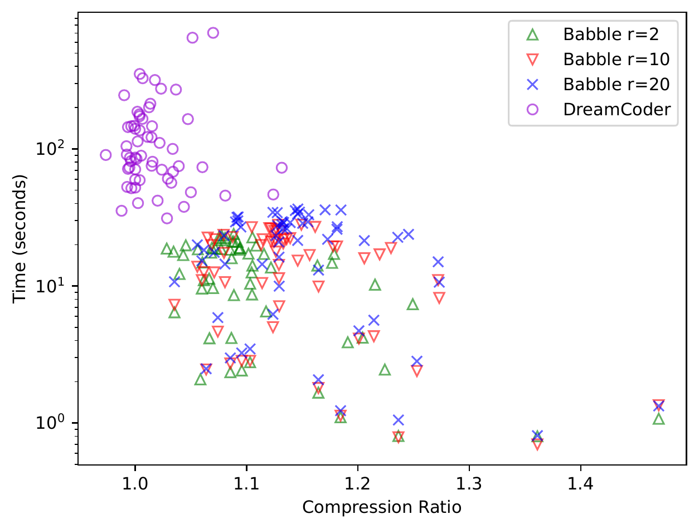

**Рисунок.** Список доменов


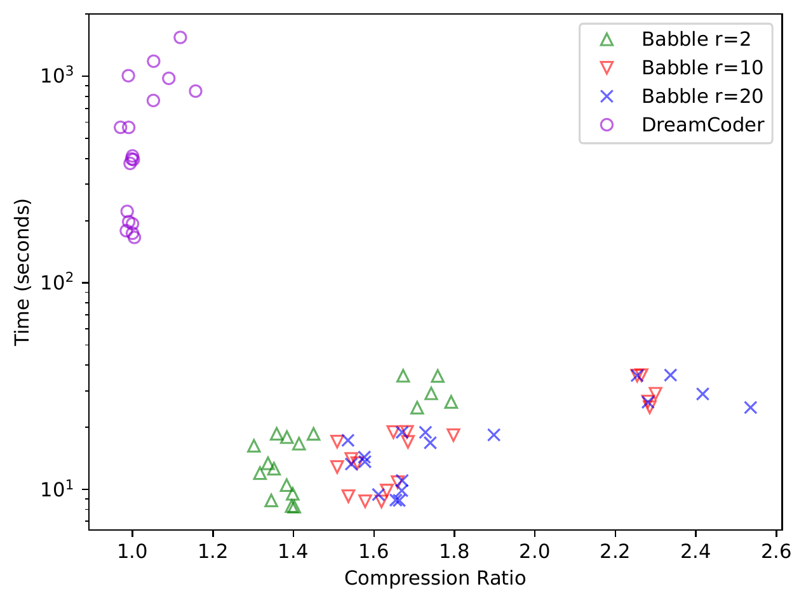

**Рисунок.** Область физики


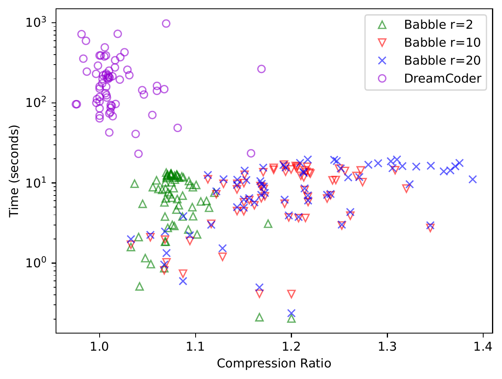

**Рисунок.** Текстовый домен


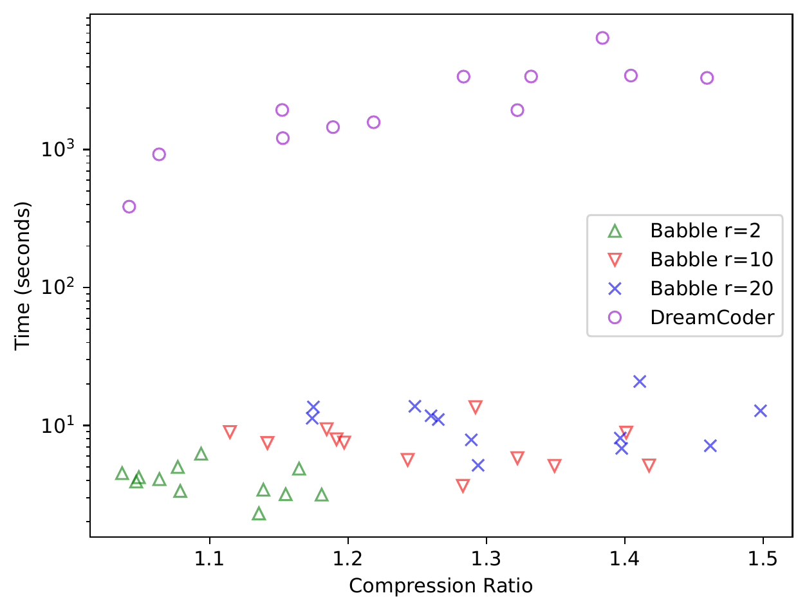

**Рисунок.** Домен логотипа


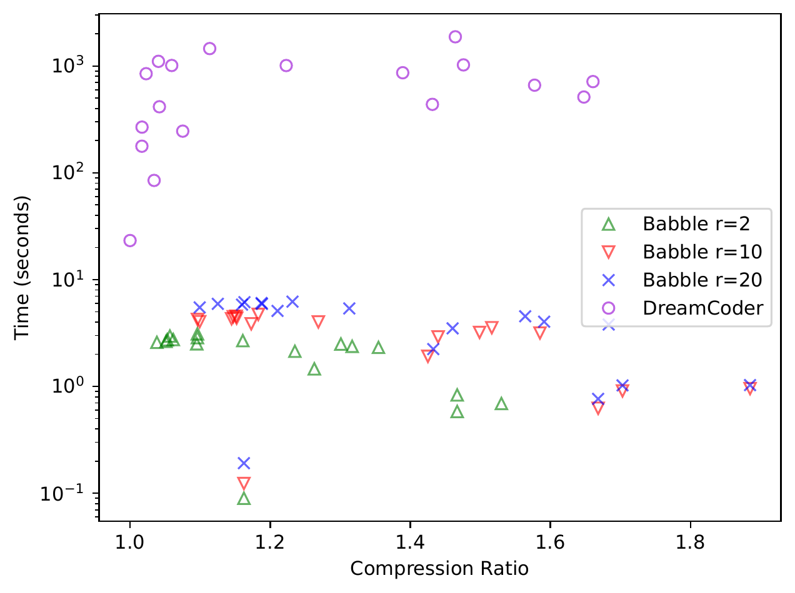

**Рисунок.** Домен Башни

**Рисунок.** Конфигурация `babble` по умолчанию выполняется в течение 20 раундов (r=20) для изучения дополнительных функций библиотеки. На этом графике показаны данные из 14, но с дополнительной конфигурацией `babble`, выполняющей меньшее количество раундов. При меньшем количестве раундов `babble` работает быстрее, но сжимается хуже.


Бауэрс, Мэтт. 2022. *Бенчмарк сжатия*. [https://github.com/mlb2251/compression_benchmark](https://github.com/mlb2251/compression_benchmark).


Бауэрс, Мэтью, Тео X. Олауссон, Кэтрин Вонг и др. 2023. «Нисходящий синтез для обучения библиотек». *Труды ACM по языкам программирования* 7 (POPL). <https://doi.org/10.1145/3571234>.


Булычев, Петр Е., Егор В. Костылев и Владимир А. Захаров. 2010. «Алгоритмы против унификации и их применение в анализе программ». В книге *Перспективы системной информатики* под редакцией Амира Пнуэли, Ирины Вирбицкайте и Андрея Воронкова. Шпрингер Берлин Гейдельберг.


Кроппер, Эндрю и Себастьян Думанчич. 2022. «Индуктивное логическое программирование в 30 лет: новое введение». *Дж. Артиф. Интел. Рез.* 74: 765–850. <https://doi.org/10.1613/jair.1.13507>.


Дектер, Эял, Джон Малмо, Райан П. Адамс и Джошуа Б. Тененбаум. 2013. «Начальное обучение посредством обнаружения модульных концепций». *Материалы двадцать третьей международной совместной конференции по искусственному интеллекту* (Пекин, Китай), IJCAI '13, 1302–9.


Донг, Руй, Чжичэн Хуан, Ян Ионг Лам, Ян Чен и Синьюй Ван. 2022. «WebRobot: автоматизация веб-роботизированных процессов с использованием интерактивного программирования путем демонстрации». *Материалы 43-й Международной конференции ACM SIGPLAN по разработке и реализации языков программирования* (Нью-Йорк, Нью-Йорк, США), PLDI 2022, 152–67. <https://doi.org/10.1145/3519939.3523711>.


Думанчич, Себастьян, Тиас Ганс и Эндрю Кроппер. 2021. «Рефакторинг знаний для индуктивного синтеза программ». *Тридцать пятая конференция AAAI по искусственному интеллекту, AAAI 2021, Тридцать третья конференция по инновационным применениям искусственного интеллекта, IAAI 2021, Одиннадцатый симпозиум по достижениям в области образования в области искусственного интеллекта, EAAI 2021, виртуальное мероприятие, 2–9 февраля 2021 г. *, 7271–78. <https://ojs.aaai.org/index.php/AAAI/article/view/16893>.


Эллис, Кевин, Дэниел Ричи, Армандо Солар-Лезама и Джошуа Б. Тененбаум. 2017. *Учимся выводить графические программы из нарисованных от руки изображений*. arXiv. <https://doi.org/10.48550/ARXIV.1707.09627>.


Эллис, Кевин, Кэтрин Вонг, Максвелл И. Най и др. 2021. «DreamCoder: начальный индуктивный синтез программ с обучением библиотеки бодрствования и сна». В *PLDI '21: 42-я Международная конференция ACM SIGPLAN по разработке и реализации языков программирования, виртуальное мероприятие, Канада, 20–25 июня 2021 г. *, под редакцией Стивена Н. Фройнда и Эрана Яхава. АКМ. <https://doi.org/10.1145/3453483.3454080>.


Айер, Шринивасан, Элвин Чунг и Люк Зеттлмойер. 2019. *Изучение программных идиом для масштабируемого семантического анализа*. arXiv. <https://doi.org/10.48550/ARXIV.1904.09086>.


Джонс, Р. Кенни, Дэвид Чаратан, Пол Герреро, Нилой Дж. Митра и Дэниел Ричи. 2021. «ShapeMOD: обнаружение макроопераций для программ 3D-фигур». *АКМ Транс. График.* (Нью-Йорк, штат Нью-Йорк, США) 40 (4). <https://doi.org/10.1145/3450626.3459821>.


Лау, Тесса, Стивен А. Вольфман, Педро Домингос и Дэниел С. Уэлд. 2001. *Программирование путем демонстрации использования алгебры пространства версий*.


Лазаро-Гредилья, Мигель, Дианхуан Линь, Дж. Сваруп Гунтупалли и Дилип Джордж. 2018. *За пределами имитации: нулевая передача задач роботам с помощью концепций обучения как когнитивных программ*. arXiv. <https://doi.org/10.48550/ARXIV.1812.02788>.


Мэн, На, Мирьюнг Ким и Кэтрин С. МакКинли. 2013. «Lase: поиск и применение систематических изменений на основе примеров». *35-я Международная конференция по программной инженерии (ICSE), 2013 г.*, 502–11. <https://doi.org/10.1109/ICSE.2013.6606596>.


Митчелл, Том Майкл. 1977. «Пространства версий: подход к исключению кандидатов при изучении правил». *ИДЖКАИ*.


Нанди, Чандракана, Джеймс Р. Уилкокс, Павел Панчека, Тейлор Блау, Дэн Гроссман и Закари Тэтлок. 2018. «Функциональное программирование для компиляции и декомпиляции систем автоматизированного проектирования». *Проц. Программа АКМ. Язык.* (Нью-Йорк, штат Нью-Йорк, США) 2 (ICFP). <https://doi.org/10.1145/3236794>.


Нанди, Чандракана, Макс Уилси, Адам Андерсон и др. 2020. «Синтез структурированных моделей САПР с равным насыщением и обратными преобразованиями». В *Материалах 41-й Международной конференции ACM SIGPLAN по проектированию и реализации языков программирования, PLDI 2020, Лондон, Великобритания, 15–20 июня 2020 г. *, под редакцией Аластера Ф. Дональдсона и Эмины Торлак. АКМ. <https://doi.org/10.1145/3385412.3386012>.


Нанди, Чандракана, Макс Уилси, Эми Чжу и др. 2021. «Переписать вывод правил с использованием насыщения равенствами». *Проц. Программа АКМ. Язык.* (Нью-Йорк, штат Нью-Йорк, США) 5 (OOPSLA). <https://doi.org/10.1145/3485496>.


Панчеха, Павел, Алекс Санчес-Штерн, Джеймс Р. Уилкокс и Закари Тэтлок. 2015. «Автоматическое повышение точности выражений с плавающей запятой». *SIGPLAN Not.* (Нью-Йорк, штат Нью-Йорк, США) 50 (6): 1–11. <https://doi.org/10.1145/2813885.2737959>.


Плоткин, Гордон. 1970. *Теоретико-решеточные свойства включения*. Эдинбургский университет, факультет машинного интеллекта; Восприятие. <https://books.google.com/books?id=2p09cgAACAAJ>.


Раза, Мохаммад, Натаса Милич-Фрайлинг и Сумит Гулвани. 2014. «Программирование на примерах с использованием наименьших общих обобщений». <https://www.microsoft.com/en-us/research/publication/programming-by-example-using-least-general-generalizations/>.


Рейнольдс, Джон К. 1969. «Системы трансформации и алгебраическая структура атомных формул».


Роча, Родриго К.О., Павлос Петуменос, Бьорн Франке, Прамод Бхатотиа и Майкл О'Бойл. 2022. «Прокрутка цикла для уменьшения размера кода». На *Международном симпозиуме IEEE/ACM по генерации и оптимизации кода (CGO)* 2022 года под редакцией Дже В. Ли, Себастьяна Хака и Татьяны Шпейсман. IEEE. <https://doi.org/10.1109/CGO53902.2022.9741256>.


Ролим, Реудизмам, Густаво Соарес, Лорис Д’Антони и др. 2017. «Изучение синтаксических преобразований программ на примерах». *Материалы 39-й Международной конференции по разработке программного обеспечения* (Буэнос-Айрес, Аргентина), ICSE '17, 404–15. <https://doi.org/10.1109/ICSE.2017.44>.


Шарма, Гопал, Ришаб Гоял, Дифан Лю, Евангелос Калогеракис и Субхрансу Маджи. 2017. *CSGNet: анализатор нейронных форм для конструктивной твердотельной геометрии*. arXiv. <https://doi.org/10.48550/ARXIV.1712.08290>.


Шин, Юи Чул, Милтиадис Алламанис, Марк Брокшмидт и Алекс Полозов. 2019. «Синтез программы и семантический анализ с использованием изученных идиом кода». В *Достижениях в области нейронных систем обработки информации*,  под редакцией Х. Уоллаха, Х. Ларошеля, А. Бейгельзимера, Ф. д'Альше-Бюка, Э. Фокса и Р. Гарнетта, vol. 32. Curran Associates, Inc. <https://proceedings.neurips.cc/paper/2019/file/cff34ad343b069ea6920464ad17d4bcf-Paper.pdf>.


Сингхер, Эйтан и Шачар Ицхаки. 2021. «Теория, основанная на дедуктивном синтезе». В *Компьютерной проверке* под редакцией Александры Сильвы и К. Рустана М. Лейно. Международное издательство Спрингер.


Стифф, Г. и Ф. Вахид. 2005. «Новые методы декомпиляции для генерации сопроцессора двоичного уровня». *Материалы Международной конференции IEEE/ACM по компьютерному проектированию 2005 г.* (США), ICCAD '05, 547–54.


Су, Богонг, Шиюань Дин и Лань Цзинь. 1984. «Улучшение планирования трассировки для глобального сжатия микрокода». *SIGMICRO Newsl.* (Нью-Йорк, Нью-Йорк, США) 15 (4): 78–85. <https://doi.org/10.1145/384281.808217>.


Тейт, Росс, Майкл Степп, Закари Тэтлок и Сорин Лернер. 2009. «Насыщение равенством: новый подход к оптимизации». *Материалы 36-го ежегодного симпозиума ACM SIGPLAN-SIGACT по принципам языков программирования*, 264–76.


Тянь, Юнлун, Эндрю Луо, Синъюань Сунь и др. 2019. *Учимся делать выводы и выполнять программы 3D-форм*. arXiv. <https://doi.org/10.48550/ARXIV.1901.02875>.


ВанХаттум, Алекса, Рахит Нигам, Винсент Т. Ли, Джеймс Борнхольт и Адриан Сэмпсон. 2021. «Векторизация процессоров цифровых сигналов посредством насыщения равенствами». *Материалы 26-й Международной конференции ACM по архитектурной поддержке языков программирования и операционных систем* (Нью-Йорк, штат Нью-Йорк, США), ASPLOS 2021, 874–86. <https://doi.org/10.1145/3445814.3446707>.


Ван, Хаолян, Надя Поликарпова и Джудит Э. Фан. 2021. «Изучение абстракций на основе частей для концепций визуальных объектов». *Материалы ежегодного собрания Общества когнитивных наук* 43. <https://escholarship.org/uc/item/9009w415>.


Ван, Ису Реми, Шана Хатчисон, Джонатан Лианг, Билл Хоу и Дэн Сучиу. 2020. «СПОРЫ: оптимизация суммы произведений посредством насыщения реляционным равенством для крупномасштабной линейной алгебры». *Проц. ВЛДБ Эндоу.* 13 (12): 1919–32. <https://doi.org/10.14778/3407790.3407799>.


Уиллси, Макс, Чандракана Нанди, Йису Реми Ван, Оливер Флэтт, Закари Тэтлок и Павел Панчеха. 2021. «egg: быстрое и расширяемое достижение равенства». *Труды ACM по языкам программирования* 5 (POPL): 1–29.


Вонг, Кэтрин, Кевин Эллис, Джошуа Б. Тененбаум и Джейкоб Андреас. 2021. *Использование языка для изучения абстракций программ и эвристики поиска*. arXiv. <https://doi.org/10.48550/ARXIV.2106.11053>.


Вонг, Кэтрин, Уильям П. Маккарти, Габриэль Гранд и др. 2022. «Идентификация библиотек понятий на основе языка об объектной структуре». *Материалы ежегодного собрания Общества когнитивных наук*.


Ву, Ченмин, Хайсен Чжао, Чандракана Нанди, Джеффри И. Липтон, Закари Тэтлок и Адриана Шульц. 2019. «Столярный составитель». *АКМ Транс. График.* (Нью-Йорк, штат Нью-Йорк, США) 38 (6). <https://doi.org/10.1145/3355089.3356518>.


Ян, Ичен, Пхитчайя Фотилимтана, Ису Ван, Макс Уилси, Судип Рой и Жак Пиенаар. 2021. «Насыщение равенства для супероптимизации тензорных графов». В *Proceedings of Machine Learning and Systems* под редакцией А. Смолы, А. Димакиса и И. Стойки, том. 3. <https://proceedings.mlsys.org/paper/2021/file/65ded5353c5ee48d0b7d48c591b8f430-Paper.pdf>.


[^1]: Мы подозреваем, что эти преобразования оказались в наборе данных Wong et al. (2022), поскольку он был создан программно на основе абстракций, созданных человеком, таких как «масштабированный многоугольник».

[^2]: Как мы обсуждали в пункте 3, теоретически это может исключить оптимальные шаблоны, но наша оценка показывает, что на практике это хорошо работает.

[^3]: Внимательный читатель может задаться вопросом, нужно ли нам вычислять бесконечное количество антиунификаторов, поскольку эквивалентных корпусов может быть бесконечно много. Как мы вскоре объясним, существует лишь конечное число шаблонов, которые являются жизнеспособными кандидатами на абстракцию.

[^4]: Здесь и далее $\overline{a}$ обозначает последовательность элементов синтаксического класса $a$, а $\epsilon$ обозначает пустую последовательность.

[^5]: В реальной реализации e-графа определения e-графов и инварианта конгруэнтности более сложны, поскольку эффективное слияние e-классов требует введения нетривиального отношения эквивалентности над идентификаторами e-классов; эти детали не имеют значения для наших целей. Кроме того, другие формализации e-графов не имеют выделенного корневого e-класса.
